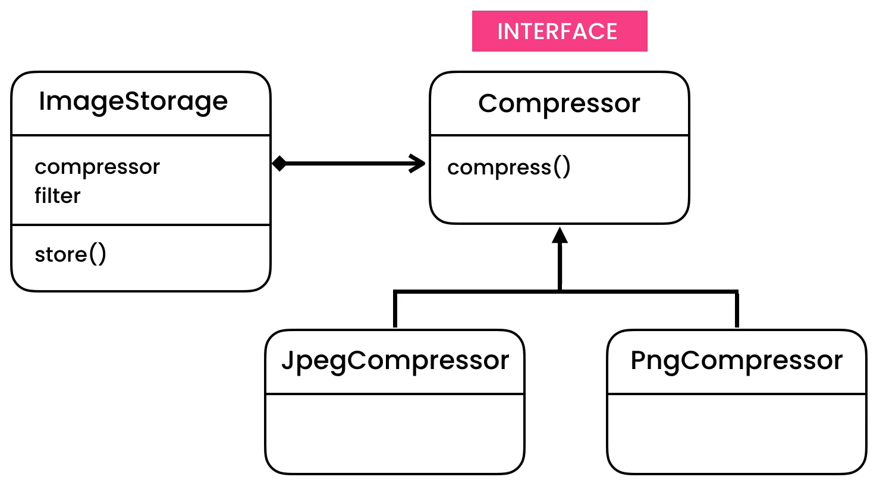

Strategy
========
* EN: Strategy
* PL: Strategia
* Type: object

Pattern
-------
* Similar to `State Pattern`
* No single states
* Can have multiple states
* Different behaviors are represented by strategy objects
* Store images with compressor and filters

.. figure:: img/designpatterns-strategy-pattern-1.png
.. figure:: img/designpatterns-strategy-pattern-2.png

    Strategy vs State Pattern

.. literalinclude:: uml/designpatterns-strategy-pattern.md
    :language: md

Problem
-------

.. figure:: img/designpatterns-strategy-solution-2.png

.. literalinclude:: uml/designpatterns-strategy-problem.md
    :language: md

.. literalinclude:: src/designpatterns-strategy-problem.py
    :language: python

Solution
--------
.. figure:: img/designpatterns-strategy-solution.png

.. literalinclude:: uml/designpatterns-strategy-solution.md
    :language: md

.. literalinclude:: src/designpatterns-strategy-solution.py
    :language: python

Assignments
-----------
.. todo:: Assignments
