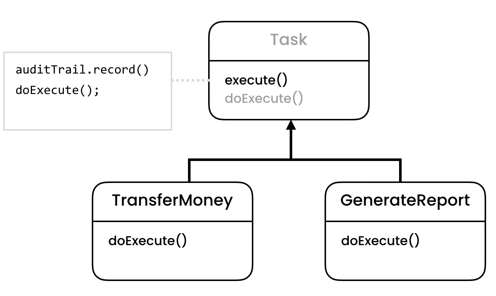
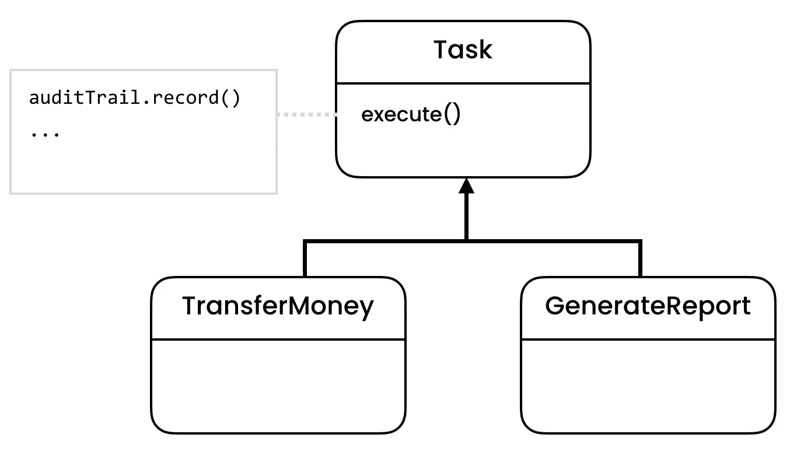

Template Method
===============

Rationale
---------
* EN: Template Method
* PL: Metoda szablonowa
* Type: class

Use Cases
---------
* Bank application with audit trail (all actions)
* Record task history
* Audits

Problem
-------
* Duplicated code
* Not enforced to record in audit trail

.. code-block:: python

    from dataclasses import dataclass

    class AuditTrail:
        def record(self) -> None:
            print('Audit')

    @dataclass
    class TransferMoneyTask:
        __audit_trail: AuditTrail

        def execute(self):
            self.__audit_trail.record()
            print('Transfer Money')

    @dataclass
    class GenerateReportTask:
        __audit_trail: AuditTrail

        def execute(self):
            self.__audit_trail.record()
            print('Generate Report')

    if __name__ == '__main__':
        audit_trail = AuditTrail()
        task = TransferMoneyTask(audit_trail)
        task.execute()
        # Audit
        # Transfer Money

Design
------

.. figure:: ../_img/designpatterns-templatemethod-vs-strategy.png
.. figure:: ../_img/designpatterns-templatemethod-gof.png
.. figure:: ../_img/designpatterns-templatemethod-gof-hooks.png

Implementation
--------------
.. literalinclude:: ../_src/designpatterns-templatemethod.py
    :language: python

Assignments
-----------
.. todo:: Create assignments
