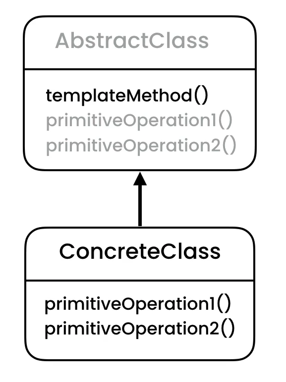
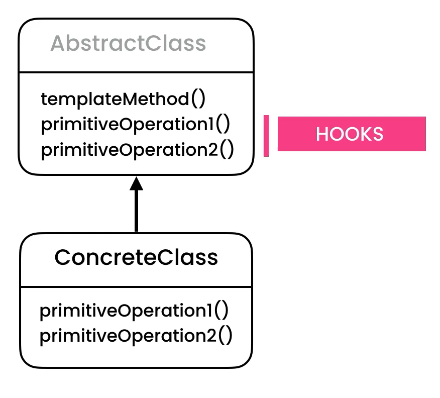

Template Method
===============
* EN: Template Method
* PL: Metoda szablonowa
* Type: class

Pattern
-------
* Bank application with audit trail (all actions)
* Record task history
* Audits

.. literalinclude:: uml/designpatterns-templatemethod-pattern.md
    :language: md

Problem
-------
* Duplicated code
* Not enforced to record in audit trail

.. figure:: img/designpatterns-templatemethod-problem.png

.. literalinclude:: uml/designpatterns-templatemethod-problem.md
    :language: md

.. literalinclude:: src/designpatterns-templatemethod-problem.py
    :language: python

Solution
--------
.. figure:: img/designpatterns-templatemethod-solution.png
.. figure:: img/designpatterns-templatemethod-vs-inheritance.png
.. figure:: img/designpatterns-templatemethod-vs-strategy.png

.. literalinclude:: uml/designpatterns-templatemethod-solution.md
    :language: md

.. literalinclude:: src/designpatterns-templatemethod-solution.py
    :language: python

Assignments
-----------
.. todo:: Assignments
