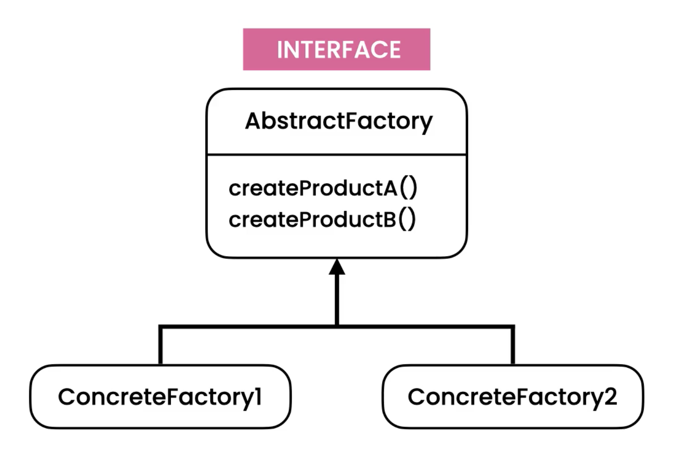
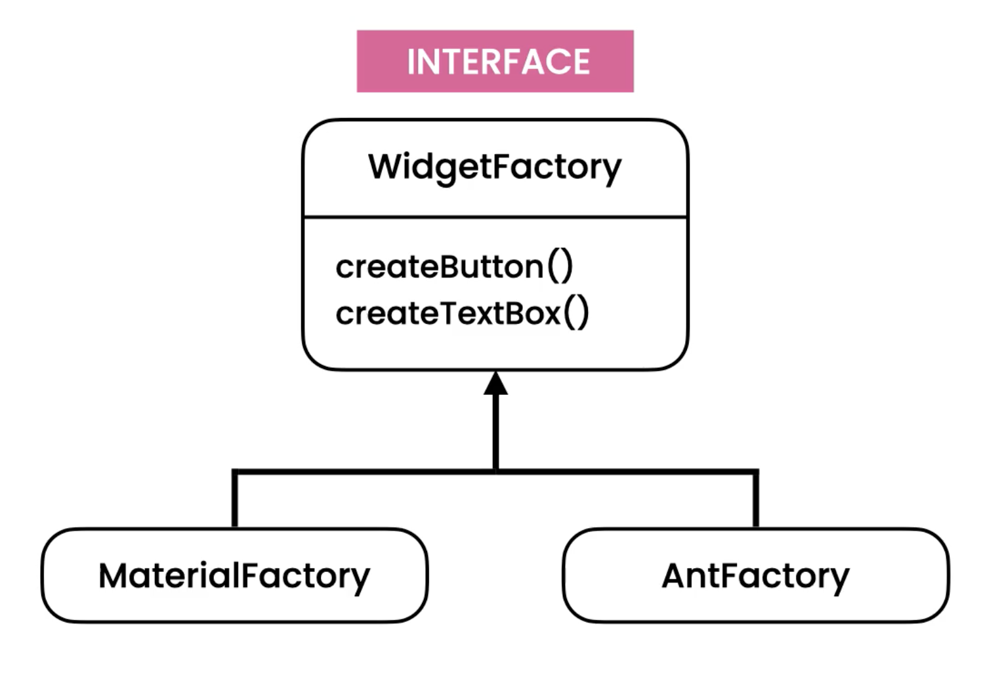

Abstract Factory
================
* EN: Abstract Factory
* PL: Fabryka Abstrakcyjna
* Type: object

The Abstract Factory pattern differs from the Factory Pattern
in that it returns Factories, rather than objects of concrete class.

Pattern
-------
* Provide an interface for creating families of related objects
* Factory Method is a method
* Abstract Factory is an abstraction (interface)
* Used for theme support (which generates buttons, inputs etc)

.. literalinclude:: uml/designpatterns-abstractfactory-pattern.md
    :language: md

Problem
-------
* Violates Open/Close Principle
* Hard to add a new theme
* Easy to accidentally use Material widget inside of Flat theme block

.. literalinclude:: uml/designpatterns-abstractfactory-problem.md
    :language: md

.. literalinclude:: src/designpatterns-abstractfactory-problem.py
    :language: python

Solution
--------
.. figure:: img/designpatterns-abstractfactory-solution.png

.. literalinclude:: uml/designpatterns-abstractfactory-solution.md
    :language: md

.. literalinclude:: src/designpatterns-abstractfactory-solution.py
    :language: python

Assignments
-----------
.. todo:: Assignments
          You’re building a weight loss app. Your app currently supports two kinds of goals: Weight Loss and Build Muscle. There’s a plan to support other kinds of goals like Strength Training, Getting Active and so on in the near future.
          Look at the implementation of the HomePage class in the abstractFactory package of the Exercises project. Depending on the goal the user selects, they’ll see a different mean plan and workout routine.
          What are the problems with this design? Refactor this design using the abstract factory pattern.
