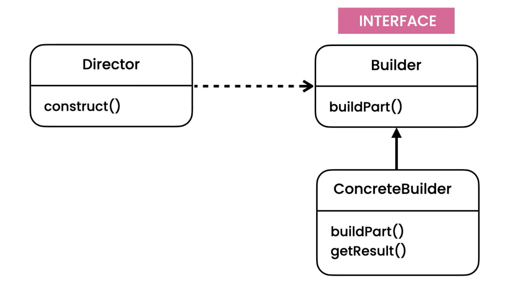
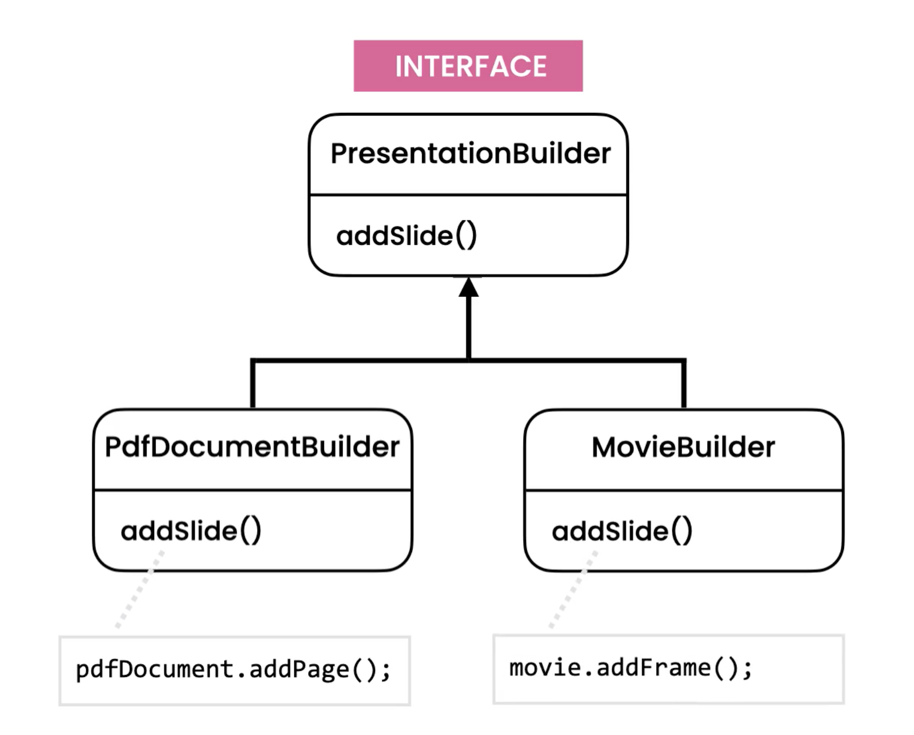
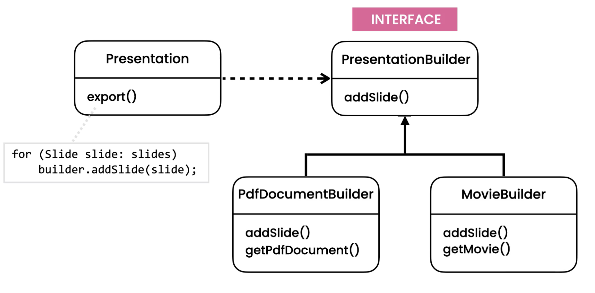

Builder
=======
* EN: Builder
* PL: Budowniczy
* Type: object
* Why: To separate the construction of an object from its representation
* Why: The same construction algorithm can be applied to different representations
* Usecase: Export data to different formats

Pattern
-------

.. literalinclude:: src/designpatterns-builder-pattern.md
    :language: md

Problem
-------
* Violates Open/Close Principle
* Tight coupling between Presentation class with formats
* PDF has pages, Movies has frames, this knowledge belongs to somewhere else
* Duplicated code
* Magic number

.. literalinclude:: src/designpatterns-builder-problem.md
    :language: md

.. literalinclude:: src/designpatterns-builder-problem.py
    :language: python

Solution
--------
* Use the builder pattern to separate the exporting logic from the presentation format
* The same exporting logic belongs to the different formats

.. literalinclude:: src/designpatterns-builder-solution.md
    :language: md

.. literalinclude:: src/designpatterns-builder-solution.py
    :language: python

Use Case - 0x01
---------------
.. literalinclude:: src/designpatterns-builder-usecase-1.py
    :language: python

Use Case - 0x02
---------------
* When language does not have keyword arguments to functions and methods
* https://pandas.pydata.org/pandas-docs/stable/reference/api/pandas.read_csv.html

>>> def read_csv(filepath_or_buffer, sep=', ', delimiter=None, header='infer',
...              names=None, index_col=None, usecols=None, squeeze=False,
...              prefix=None, mangle_dupe_cols=True, dtype=None, engine=None,
...              converters=None, true_values=None, false_values=None,
...              skipinitialspace=False, skiprows=None, nrows=None,
...              na_values=None, keep_default_na=True, na_filter=True,
...              verbose=False, skip_blank_lines=True, parse_dates=False,
...              infer_datetime_format=False, keep_date_col=False,
...              date_parser=None, dayfirst=False, iterator=False,
...              chunksize=None, compression='infer', thousands=None,
...              decimal=b'.', lineterminator=None, quotechar='"',
...              quoting=0, escapechar=None, comment=None, encoding=None,
...              dialect=None, tupleize_cols=None, error_bad_lines=True,
...              warn_bad_lines=True, skipfooter=0, doublequote=True,
...              delim_whitespace=False, low_memory=True, memory_map=False,
...              float_precision=None): ...

>>> data = read_csv('myfile.csv', ', ', None, 'infer', None, None, None,
...                 False, None, True, None, None, None, None, None, False,
...                 None, None, None, True, True, False, True, False, False,
...                 False, None, False, False, None, 'infer', None, b'.',
...                 None, '"', 0, None, None, None, None, None, True, True,
...                 0, True, False, True, False, None)

>>> data = read_csv('myfile.csv',
...     chunksize=10_000,
...     delimiter=',',
...     encoding='utf-8')

Use Case - 0x02
---------------
>>> class Person:
...     def __init__(self, firstname, lastname, email, age, height, weight):
...         self.firstname = firstname
...         self.lastname = lastname
...         self.email = email
...         self.age = age
...         self.height = height
...         self.weight = weight

>>> mark = Person( 'Mark', 'Watney', 'mwatney@nasa.gov', 40, 185, 75)

>>> mark = Person(
...     firstname='Mark',
...     lastname='Watney',
...     email='mwatney@nasa.gov',
...     age=40,
...     height=185,
...     weight=75,
... )

Use Case - 0x02
---------------
>>> class Person:
...     def __init__(self, firstname, lastname, is_astronaut, is_retired,
...                  is_alive, friends, assignments, missions, assigned):
...         ...

>>> mark = Person('Mark', 'Watney', True, False, True, None, 1, 17, False)

>>> mark = Person(
...     firstname = 'Mark',
...     lastname = 'Watney',
...     is_astronaut = True,
...     is_retired = False,
...     is_alive = True,
...     friends = None,
...     assignments = 1,
...     missions = 17,
...     assigned = False,
... )

>>> class Person:
...     def __init__(self):
...         ...
...
...     def withFirstname(self, firstname):
...         self.firstname = firstname
...         return self
...
...     def withLastname(self, lastname):
...         self.lastname = lastname
...         return self
...
...     def withIsAstronaut(self, is_astronaut):
...         self.is_astronaut = is_astronaut
...         return self
...
...     def withIsRetired(self, is_retired):
...         self.is_retired = is_retired
...         return self
...
...     def withIsAlive(self, is_alive):
...         self.is_alive = is_alive
...         return self
...
...     def withFriends(self, friends):
...         self.friends = friends
...         return self
...
...     def withAssignments(self, assignments):
...         self.assignments = assignments
...         return self
...
...     def withMissions(self, missions):
...         self.missions = missions
...         return self
...
...     def withAssigned(self, assigned):
...         self.assigned = assigned
...         return self
>>>
>>>
>>> mark = (
...     Person()
...     .withFirstname('Mark')
...     .withLastname('Watney')
...     .withIsAstronaut(True)
...     .withIsRetired(False)
...     .withIsAlive(True)
...     .withFriends(None)
...     .withAssignments(1)
...     .withMissions(17)
...     .withAssigned(False)
... )

Assignments
-----------
.. todo:: Assignments
          You’re building a word processor similar to Word. The user can add text or image elements to a document and then export it to a variety of different formats such as HTML, text, and so on.
          Look at the implementation of the Document class in the builder package.
          Note that if the selected format is HTML, all text and image elements are written to an HTML document. If the selected format is text, however, only text elements are written to a text file. You can run the code in the Demo class to see this in action.
          What are the problems with the current design? Refactor this design using the builder pattern.
