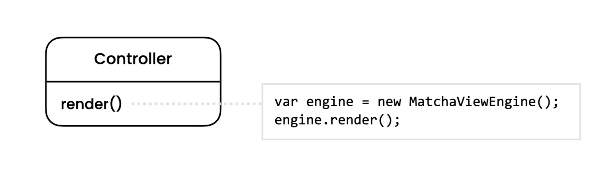
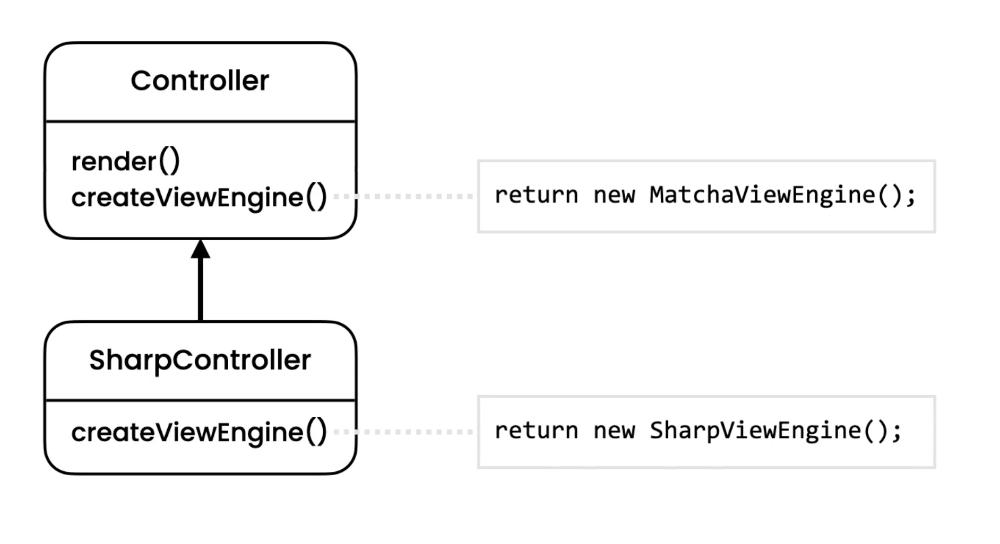

Factory Method
==============
* EN: Factory Method
* PL: Metoda wytwórcza
* Type: class

Pattern
-------
* Defer the creation of an object to subclasses
* Relays on inheritance and polymorphism
* Adds flexibility to the design

.. figure:: img/designpatterns-factorymethod-pattern.png

.. literalinclude:: uml/designpatterns-factorymethod-pattern.md
    :language: md

Problem
-------
* Tightly coupled with MatchaEngine
* What if we have better templating engine

.. literalinclude:: uml/designpatterns-factorymethod-problem.md
    :language: md

.. literalinclude:: src/designpatterns-factorymethod-problem.py
    :language: python

Solution
--------

.. literalinclude:: uml/designpatterns-factorymethod-solution.md
    :language: md

.. literalinclude:: src/designpatterns-factorymethod-solution.py
    :language: python

Use Case - 0x01
---------------
.. literalinclude:: src/designpatterns-factorymethod-usecase-1.py
    :language: python

Use Case - 0x02
---------------
.. literalinclude:: src/designpatterns-factorymethod-usecase-2.py
    :language: python

Use Case - 0x03
---------------
.. literalinclude:: src/designpatterns-factorymethod-usecase-3.py
    :language: python

Use Case - 0x04
---------------
.. literalinclude:: src/designpatterns-factorymethod-usecase-4.py
    :language: python

Use Case - 0x05
---------------
.. literalinclude:: src/designpatterns-factorymethod-usecase-5.py
    :language: python

Use Case - 0x06
---------------
.. literalinclude:: src/designpatterns-factorymethod-usecase-6.py
    :language: python

Use Case - 0x07
---------------
.. literalinclude:: src/designpatterns-factorymethod-usecase-7.py
    :language: python

Use Case - 0x08
---------------
.. literalinclude:: src/designpatterns-factorymethod-usecase-8.py
    :language: python

Assignments
-----------
.. todo:: Assignments
          You're building a framework for scheduling tasks. Look at the classes in the factory package of the Exercises project. The Scheduler class is tightly coupled to the Calendar class which represents the Gregorian calendar. With this design, this framework cannot be effectively used in Arabian countries. Use the factory method to add flexibility to this design.

.. literalinclude:: assignments/designpatterns-factorymethod.py
    :caption: :download:`Solution <assignments/designpatterns-factorymethod.py>`
    :end-before: # Solution
