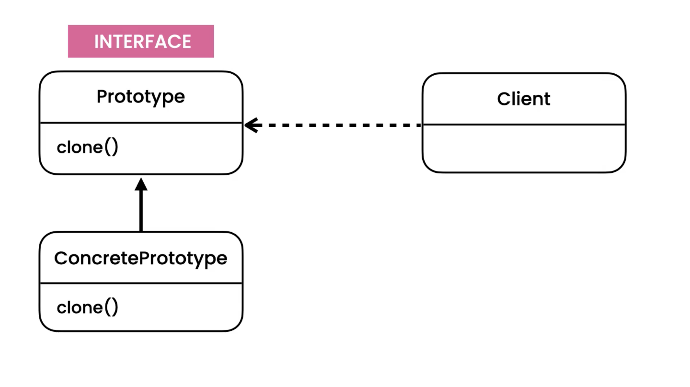
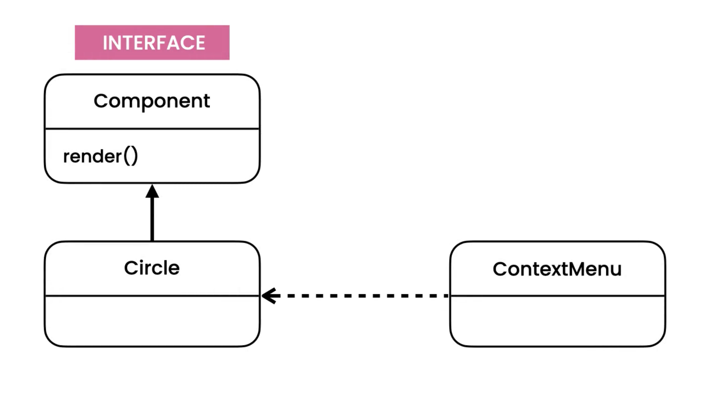
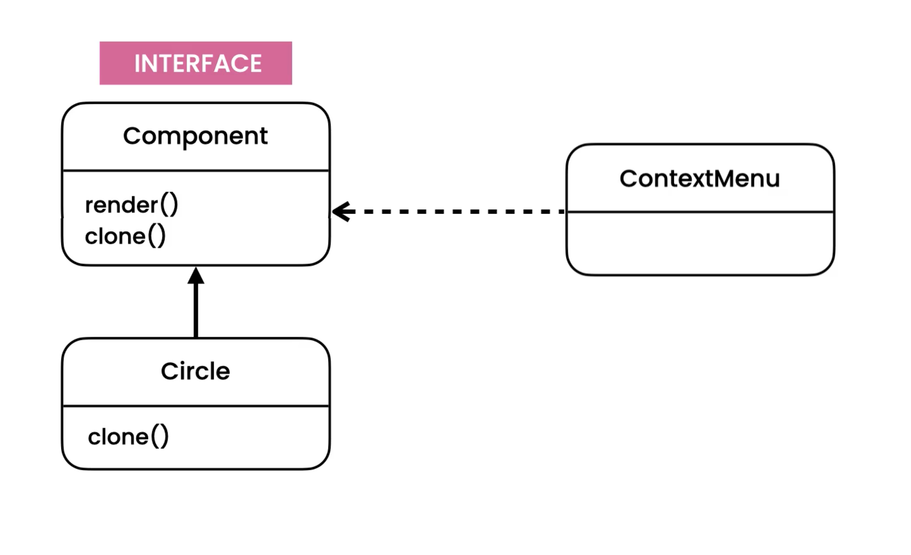

Prototype
=========
* EN: Prototype
* PL: Prototyp
* Type: object

Pattern
-------
* Create new object by copying an existing object

.. literalinclude:: src/designpatterns-prototype-pattern.md
    :language: md

Problem
-------
* Violates Open/Close Principle

.. literalinclude:: src/designpatterns-prototype-problem.md
    :language: md

.. literalinclude:: src/designpatterns-prototype-problem.py
    :language: python

Solution
--------

.. literalinclude:: src/designpatterns-prototype-solution.md
    :language: md

.. literalinclude:: src/designpatterns-prototype-solution.py
    :language: python

Assignments
-----------
.. todo:: Assignments
          You're building a video editor similar to Adobe Premier. The editor contains a timeline of various types of components such as text, clips, audio, and so on. The user should be able to duplicate any component. The duplicated component should be added to the timeline.Look at the implementation of the ContextMenu class in the prototype package of the Exercises project.What are the problems in the current implementation?Refactor the code using the prototype pattern. What have you achieved?
