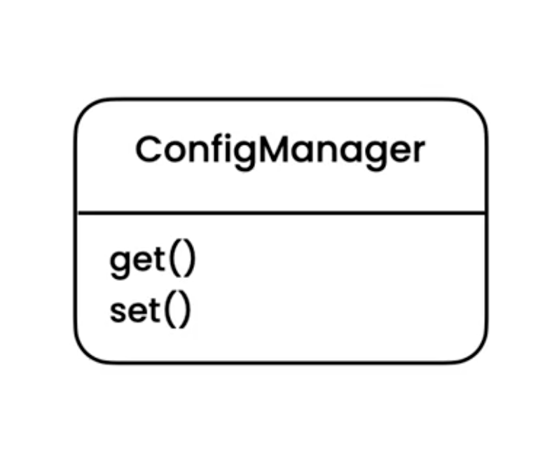
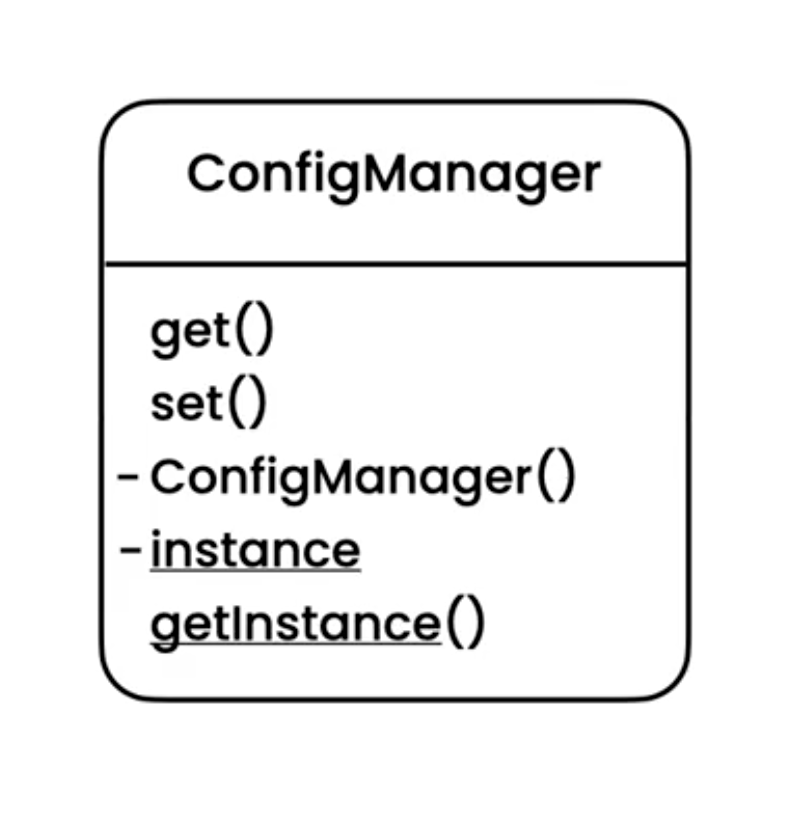

Singleton
=========
* EN: Singleton
* PL: Singleton
* Type: object

Pattern
-------
* To ensure a class has a single instance
* Database connection pool
* HTTP Gateway
* Settings
* Main game/program window

.. figure:: img/designpatterns-singleton-pattern.png

.. literalinclude:: src/designpatterns-singleton-pattern.md
    :language: md

Problem
-------

.. literalinclude:: src/designpatterns-singleton-problem.md
    :language: md

.. literalinclude:: src/designpatterns-singleton-problem.py
    :language: python

Solution
--------

.. literalinclude:: src/designpatterns-singleton-solution.md
    :language: md

.. literalinclude:: src/designpatterns-singleton-solution.py
    :language: python

Use Case - 0x01
---------------
.. literalinclude:: src/designpatterns-singleton-usecase-1.py
    :language: python

Use Case - 0x02
---------------
.. literalinclude:: src/designpatterns-singleton-usecase-2.py
    :language: python

Use Case - 0x03
---------------
.. literalinclude:: src/designpatterns-singleton-usecase-3.py
    :language: python

Use Case - 0x04
---------------
.. literalinclude:: src/designpatterns-singleton-usecase-4.py
    :language: python

Assignments
-----------
.. todo:: Assignments
          Look at the Logger class in the singleton package of the Exercises project. With the current implementation, we can create multiple loggers writing to the same log file in parallel.Use the singleton pattern to ensure only a single logger can be instantiated for a given file.
