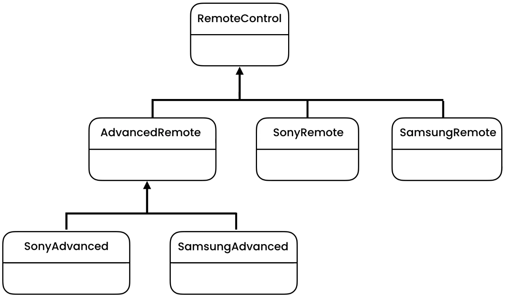

Bridge
======
* EN: Bridge
* PL: Most
* Type: object

Rationale
---------
* Nested hierarchies of classes

Problem
-------
* Every time you want to add new manufacturers remote control, you need to add two classes of ``ManufacturerRemoteControl`` and ``ManufacturerAdvancedRemoteControl``
* If you add new another type of remote control, such as ``MovieRemoteControl`` you now has to implement three classes

.. code-block:: text

    Basic Remote Control (turnOn, turnOff)
    Advanced Remote Control (setChannel)
    Movie Remote Control (play, pause, rewind)

.. code-block:: text

    RemoteControl
        SonyRemoteControl
        SamsungRemoteControl
        AdvancedRemoteControl
            SonyAdvancedRemoteControl
            SamsungAdvancedRemoteControl

.. literalinclude:: ../_src/designpatterns-bridge-problem.py
    :language: python

Pattern
-------

Solution
--------
* Hierarchy grows in two different directions
* We can split complex hierarchy into two hierarchies which grows independently

.. figure:: img/designpatterns-bridge-usecase1.png
.. figure:: img/designpatterns-bridge-usecase2.png

.. literalinclude:: ../_src/designpatterns-bridge-impl.py
    :language: python

Assignments
-----------
.. todo:: Assignments
