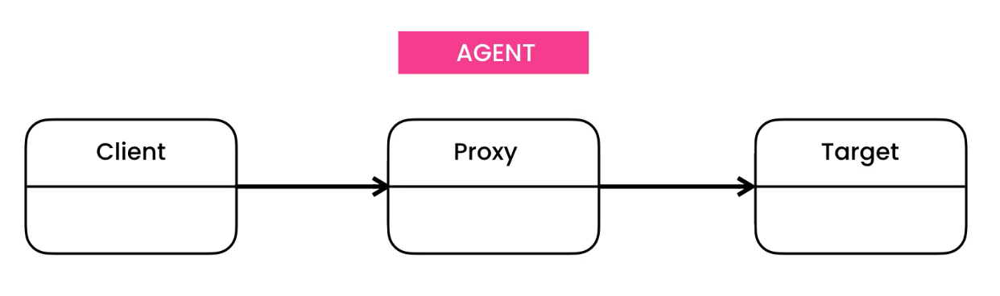
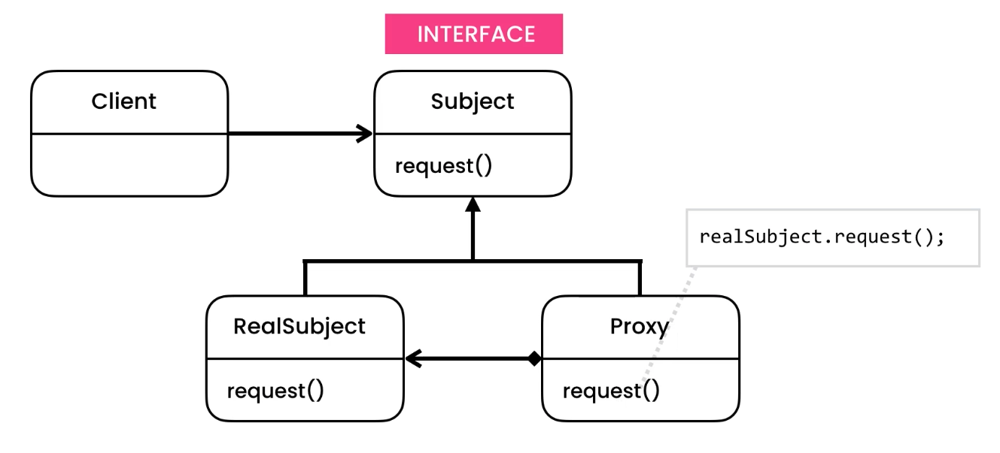

Proxy
=====
* EN: Proxy
* PL: Pełnomocnik
* Type: object

Pattern
-------
* Create a proxy, or agent for a remote object
* Agent takes message and forwards to remote object
* Proxy can log, authenticate or cache messages

.. literalinclude:: uml/designpatterns-proxy-pattern.md
    :language: md

Problem
-------
* Creating Ebook object is costly, because we have to read it from the disk and store it in memory
* It will load all ebooks in our library, just to select one

.. figure:: img/designpatterns-proxy-problem.png

.. literalinclude:: uml/designpatterns-proxy-problem.md
    :language: md

.. literalinclude:: src/designpatterns-proxy-problem.py
    :language: python

Solution
--------
* Lazy evaluation
* Open/Close Principle

.. figure:: img/designpatterns-proxy-solution.png

.. literalinclude:: uml/designpatterns-proxy-solution.md
    :language: md

.. literalinclude:: src/designpatterns-proxy-solution-1.py
    :language: python

Proxy with Authorization and Logging:

.. literalinclude:: src/designpatterns-proxy-solution-2.py
    :language: python

Assignments
-----------
.. todo:: Assignments
