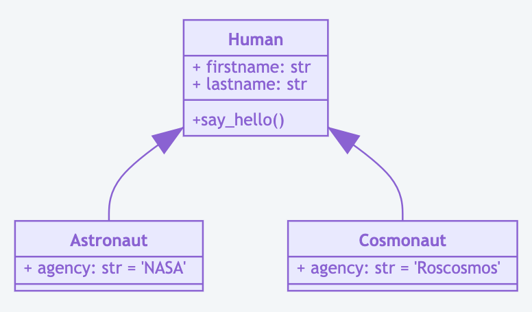

UML About
=========

Rationale
---------
* Unified Modeling Language

Class Diagram
-------------
* Class relationship

Sequence Diagram
----------------
* Conversation over time

.. figure:: ../_img/uml-mermaid-sequencediagram-web.png

Entity Relationship Diagram
---------------------------
* Entity Relationship
* Database

.. figure:: ../_img/uml-mermaid-erd.png
