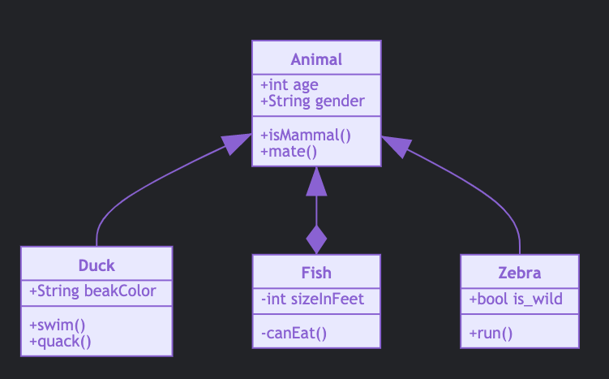

UML About
=========


Rationale
---------
* Unified Modeling Language


Mermaid
-------
* ``mermaid`` - Markdown extension
* https://mermaid-js.github.io/mermaid/#/classDiagram

.. code-block:: md

    ```mermaid
    classDiagram
          Animal <|-- Duck
          Animal <|--* Fish
          Animal <|-- Zebra

          class Animal {
              +int age
              +String gender
              +isMammal()
              +mate()
          }

          class Duck{
              +String beakColor
              +swim()
              +quack()
          }

          class Fish{
              -int sizeInFeet
              -canEat()
          }

          class Zebra{
              +bool is_wild
              +run()
          }
    ```


