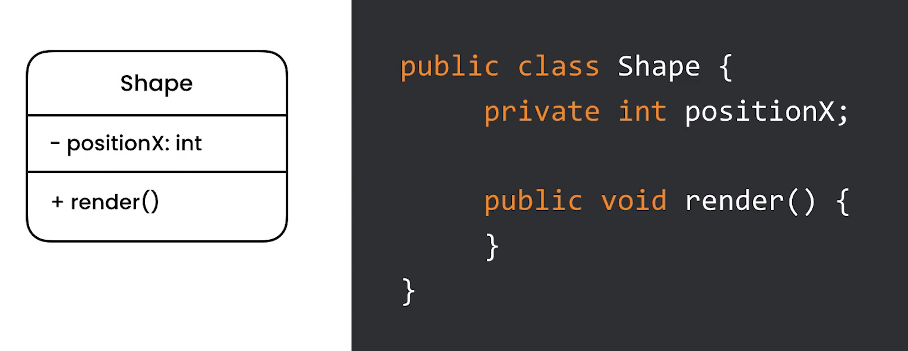

UML Class Diagram
=================

Syntax
------
Before:

    * ``+`` Public
    * ``-`` Private
    * ``#`` Protected
    * ``~`` Package/Internal

After:
    * Field ``- name: int`` - private field ``name`` of type ``int``
    * Method ``+ render(): int`` - public method ``render()`` which returns ``int``
    * ``*`` Abstract e.g.: ``someAbstractMethod()*``
    * ``$`` Static e.g.: ``someStaticMethod()$``

Relationship
------------
* Arrow with empty triangle (but on picture is filled)
* ``<|--`` - Inheritance
* ``*--`` - Composition
* ``o--`` - Aggregation
* ``-->`` - Association
* ``--``  - Link (Solid)
* ``..>`` - Dependency
* ``..|>`` - Realization
* ``..`` - Link (Dashed)

.. figure:: ../_img/uml-mermaid-classdiagram-relations.png

Cardinality
-----------
* ``1`` - Only 1
* ``0..1`` - Zero or One
* ``1..*`` - One or more
* ``*`` - Many
* ``n n`` - {where n>1}
* ``0..n`` - zero to n {where n>1}
* ``1..n`` - one to n {where n>1}

Boxes and Arrows
----------------
.. figure:: ../_img/uml-classdiagram-1.jpg

UML Class Diagram
-----------------
.. figure:: ../_img/uml-classdiagram-2.png
.. figure:: ../_img/uml-classdiagram-3.png
.. figure:: ../_img/uml-classdiagram-4.png
.. figure:: ../_img/uml-classdiagram-5.png
.. figure:: ../_img/uml-classdiagram-6.png
.. figure:: ../_img/uml-classdiagram-7.png
.. figure:: ../_img/uml-classdiagram-8.jpg
.. figure:: ../_img/uml-classdiagram-9.jpg
.. figure:: ../_img/uml-classdiagram-10.png
