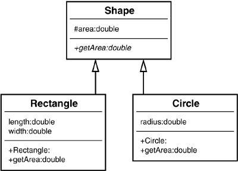

UML Class Diagram
=================


Attributes
----------
.. code-block:: md

    ```mermaid
    class Astronaut {
        firstname
        lastname
    }
    ```

Methods
-------
Without parameters:

    .. code-block:: md

        ```mermaid
        class Astronaut {
            say_hello()
        }
        ```

With parameters:

    .. code-block:: md

        ```mermaid
        class Astronaut {
            say_hello(firstname, lastname)
        }
        ```

Abstract Methods:

    .. code-block:: md

        ```mermaid
        class Astronaut {
            say_hello()*
        }
        ```

Static Method:

    .. code-block:: md

        ```mermaid
        class Astronaut {
            say_hello()$
        }
        ```


Types
-----
.. code-block:: md

    ```mermaid
    class Astronaut {
        firstname: str
        lastname: str
        say_hello(firstname: str, lastname: str): str
    }
    ```


Access Modifiers
----------------
* ``+`` - Public
* ``-`` - Private
* ``#`` - Protected
* ``~`` - Package/Internal

Public:

    .. code-block:: md

        ```mermaid
        class Astronaut {
            + firstname: str
            + lastname: str
        }
        ```

Protected:

    .. code-block:: md

        ```mermaid
        class Astronaut {
            # firstname: str
            # lastname: str
        }
        ```

Private:

    .. code-block:: md

        ```mermaid
        class Astronaut {
            - firstname: str
            - lastname: str
        }
        ```


Access Modifiers in Python
-------------------------
* Python code

Public:

    .. code-block:: python

        class Astronaut:
            firstname: str
            lastname: str

Protected:

    .. code-block:: python

        class Astronaut:
            _firstname: str
            _lastname: str

Private:

    .. code-block:: python

        class Astronaut:
            __firstname: str
            __lastname: str


Use Case
--------
.. figure:: ../_img/uml-classdiagram-syntax.png


Relationship
------------
* Arrow with empty triangle (but on picture is filled)
* ``<|--`` - Inheritance
* ``*--`` - Composition
* ``o--`` - Aggregation
* ``-->`` - Association
* ``--``  - Link (Solid)
* ``..>`` - Dependency
* ``..|>`` - Realization
* ``..`` - Link (Dashed)

.. figure:: ../_img/uml-mermaid-classdiagram-relations.png



Cardinality
-----------
* ``1`` - Only 1
* ``0..1`` - Zero or One
* ``1..*`` - One or more
* ``*`` - Many
* ``n n`` - {where n>1}
* ``0..n`` - zero to n {where n>1}
* ``1..n`` - one to n {where n>1}


Boxes and Arrows
----------------
.. figure:: ../_img/uml-classdiagram-1.jpg


UML Class Diagram
-----------------
.. figure:: ../_img/uml-classdiagram-2.png
.. figure:: ../_img/uml-classdiagram-3.png
.. figure:: ../_img/uml-classdiagram-4.png
.. figure:: ../_img/uml-classdiagram-5.png
.. figure:: ../_img/uml-classdiagram-6.png
.. figure:: ../_img/uml-classdiagram-7.png
.. figure:: ../_img/uml-classdiagram-8.jpg
.. figure:: ../_img/uml-classdiagram-9.jpg
.. figure:: ../_img/uml-classdiagram-10.png


Use Cases
---------
.. figure:: ../_img/uml-django.png
.. figure:: ../_img/uml-django-models.png
