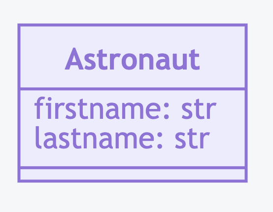
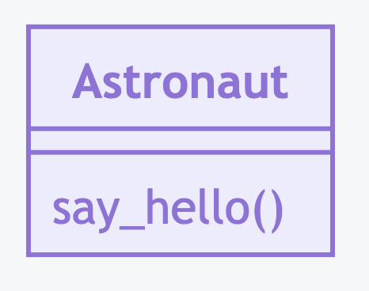
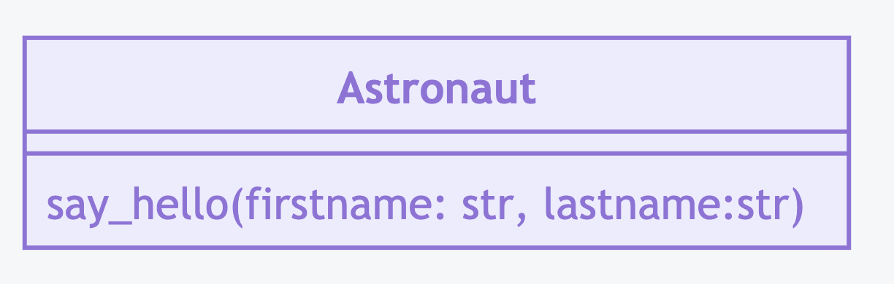
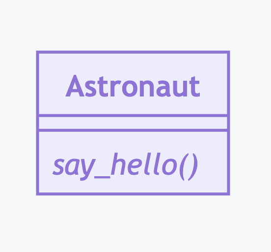
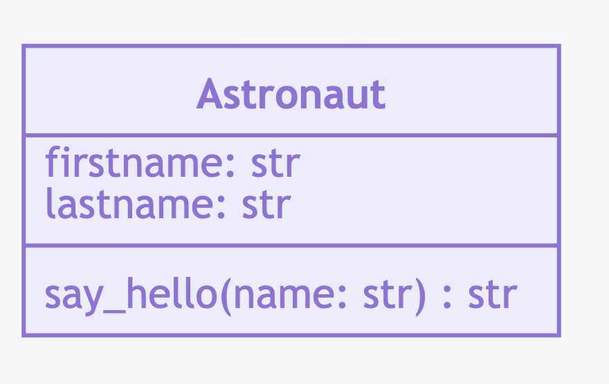
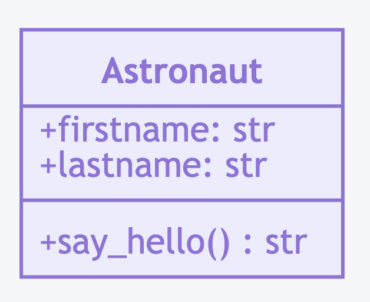
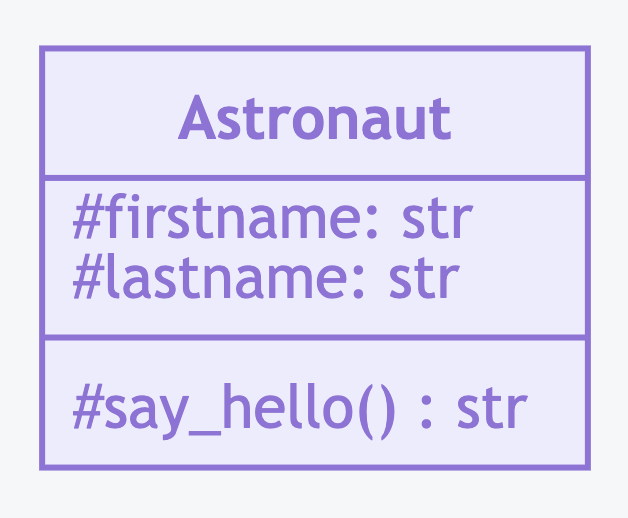
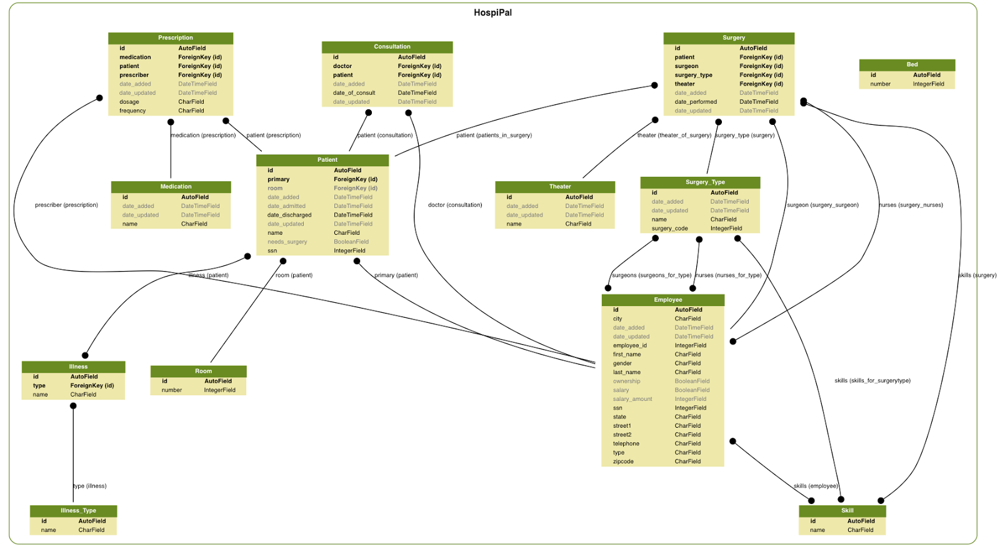
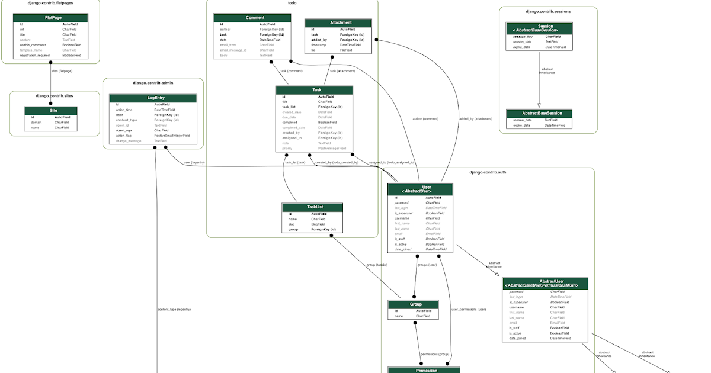
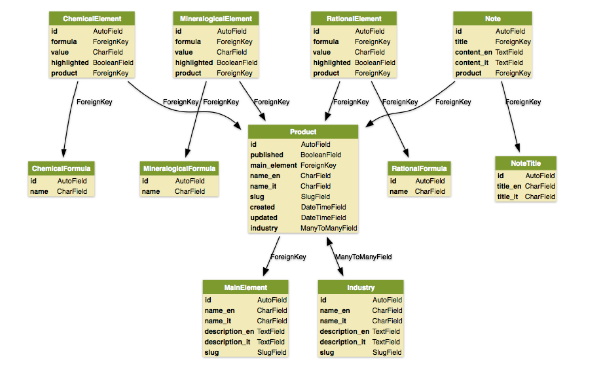

UML Class Diagram
=================


Attributes
----------
>>> class Astronaut:
...     firstname: str
...     lastname: str

.. code-block:: md

    ```mermaid
    classDiagram

    class Astronaut {
        firstname: str
        lastname: str
    }
    ```




Methods Without Parameters
--------------------------
>>> class Astronaut:
...     def say_hello(self):
...         pass

.. code-block:: md

    ```mermaid
    classDiagram

    class Astronaut {
        say_hello()
    }
    ```




Methods With Parameters
-----------------------
>>> class Astronaut:
...     def say_hello(self, firstname: str, lastname: str):
...         pass

.. code-block:: md

    ```mermaid
    classDiagram

    class Astronaut {
        say_hello(firstname: str, lastname: str)
    }
    ```




Method Return Type
------------------
>>> class Astronaut:
...     def say_hello(self) -> str:
...         pass

.. code-block:: md

    ```mermaid
    classDiagram

    class Astronaut {
        say_hello() str
    }
    ```

.. figure:: img/uml-classdiagram-method-return.png


Abstract Methods
----------------
>>> from abc import abstractmethod, ABCMeta
>>>
>>>
>>> class Astronaut(metaclass=ABCMeta):
...     @abstractmethod
...     def say_hello(self):
...         pass

.. code-block:: md

    ```mermaid
    classDiagram

    class Astronaut {
        say_hello()*
    }
    ```




Static Methods
--------------
>>> class Astronaut:
...     @staticmethod
...     def say_hello():
...         pass

.. code-block:: md

    ```mermaid
    classDiagram

    class Astronaut {
        say_hello()$
    }
    ```

.. figure:: img/uml-classdiagram-method-static.png
.. todo:: update image from mermaid code


Types
-----
>>> class Astronaut:
...     firstname: str
...     lastname: str
...
...     def say_hello(self, name: str) -> str:
...         pass

.. code-block:: md

    ```mermaid
    classDiagram

    class Astronaut {
        firstname: str
        lastname: str

        say_hello(name: str) str
    }
    ```




Access Modifiers
----------------
* ``+`` - Public
* ``-`` - Private
* ``#`` - Protected
* ``~`` - Package/Internal


Access Modifiers - Public
-------------------------
>>> class Astronaut:
...     firstname: str
...     lastname: str
...
...     def say_hello(self) -> str:
...         pass

.. code-block:: md

    ```mermaid
    classDiagram

    class Astronaut {
        +firstname: str
        +lastname: str
        +say_hello() str
    }
    ```



Access Modifiers - Protected
----------------------------
>>> class Astronaut:
...     _firstname: str
...     _lastname: str
...
...     def _say_hello(self) -> str:
...         pass

.. code-block:: md

    ```mermaid
    classDiagram

    class Astronaut {
        #firstname: str
        #lastname: str
        #say_hello() str
    }
    ```



Access Modifiers - Private
--------------------------
>>> class Astronaut:
...     __firstname: str
...     __lastname: str
...
...     def __say_hello(self) -> str:
...         pass

.. code-block:: md

    ```mermaid
    classDiagram

    class Astronaut {
        -firstname: str
        -lastname: str
        -say_hello() str
    }
    ```

.. figure:: img/uml-classdiagram-accessmodifiers-private.png


Boxes and Arrows
----------------
.. figure:: img/uml-classdiagram-usecase-01.jpg


Use Cases
---------
.. figure:: img/uml-classdiagram-usecase-02.png
.. figure:: img/uml-classdiagram-usecase-03.png
.. figure:: img/uml-classdiagram-usecase-04.png
.. figure:: img/uml-classdiagram-usecase-05.png
.. figure:: img/uml-classdiagram-usecase-06.png
.. figure:: img/uml-classdiagram-usecase-07.png
.. figure:: img/uml-classdiagram-usecase-08.jpg
.. figure:: img/uml-classdiagram-usecase-09.jpg
.. figure:: img/uml-classdiagram-usecase-10.png


Django
------
* GraphViz + Dot
* Django Extensions: https://django-extensions.readthedocs.io/en/latest/graph_models.html#example-usage

.. code-block:: console

    $ brew install graphviz
    $ pip install pydotplus
    $ pip install django-extensions

    # Add 'django_extensions' to INSTALLED_APP

    $ python manage.py graph_models -a -g -o all.png
    $ python manage.py graph_models myapp -g -o myapp.png
    $ python manage.py graph_models -a -I Contact,Address -o models.png
    $ python manage.py graph_models -a --arrow-shape normal -o myproject.png


.. figure:: img/uml-django-models-2.png
.. figure:: img/uml-django-models-3.png

.. figure:: img/uml-django-models-5.png



Generate from code
------------------
* ``sphinx.ext.graphviz`` (from ``sphinx``) - https://www.sphinx-doc.org/en/master/usage/extensions/graphviz.html
* ``pyreverse`` (from ``pylint``) - https://www.logilab.org/blogentry/6883
* ``GraphModels`` (from ``django-command-extensions``) - https://django-extensions.readthedocs.io/en/latest/graph_models.html#example-usage
* ``epydoc`` - http://epydoc.sourceforge.net - http://epydoc.sourceforge.net/api/epydoc.apidoc.VariableDoc-class.html
* ``pynsource`` - http://pynsource.com/
* ``pyUML`` - https://sourceforge.net/projects/eclipse-pyuml/
* ``lumpy`` - http://www.greenteapress.com/thinkpython/swampy/lumpy.html
* ``ObjectDomain`` - http://www.objectdomain.com/products/od-features
* ``argouml-python`` - http://argouml-python.tigris.org/
* ``pywebuml`` - https://bitbucket.org/tzulberti/pywebuml
* ``uml-to-django`` - https://github.com/auvipy/uml-to-django
* ``Python Vipera`` - https://sourceforge.net/projects/pythonvipera/
* ``gaphor`` - https://github.com/gaphor/gaphor
* https://stackoverflow.com/questions/260165/whats-the-best-way-to-generate-a-uml-diagram-from-python-source-code
* https://modeling-languages.com/uml-tools/#python

.. code-block:: console

    $ pyreverse -o png -p mymodule .
