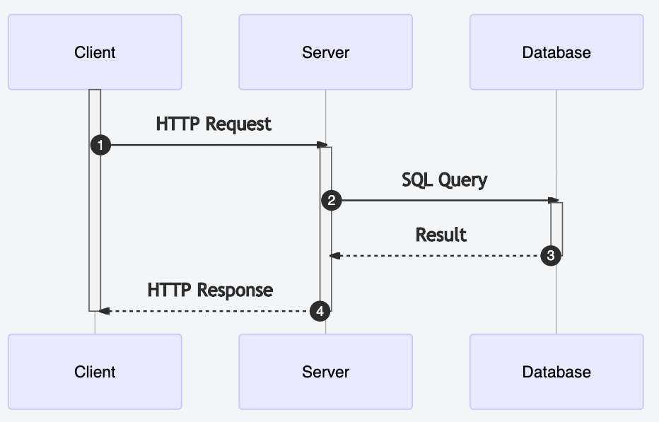
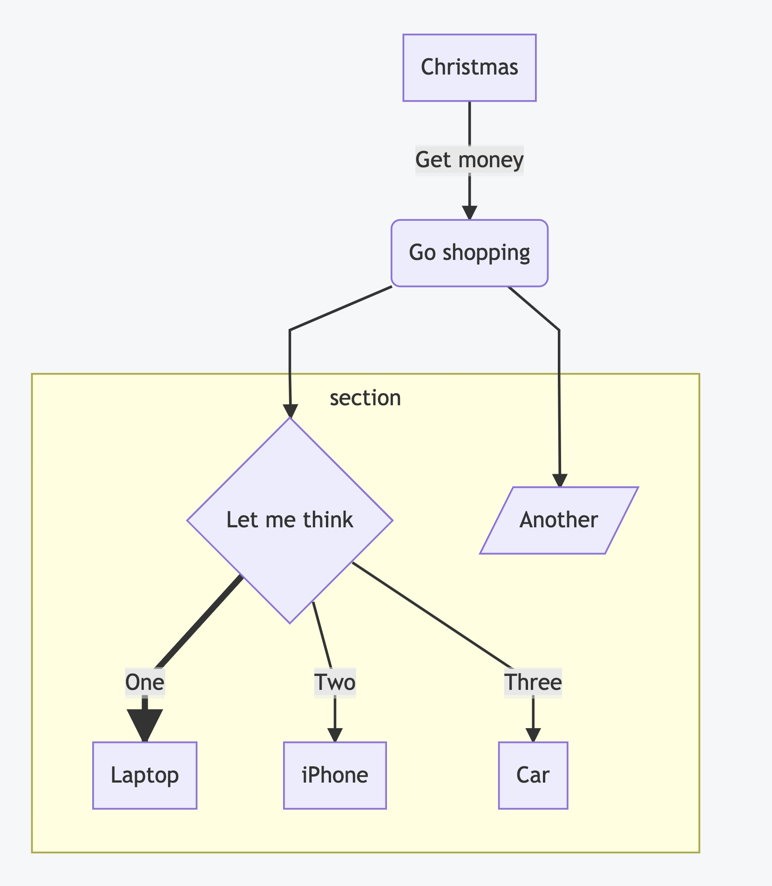
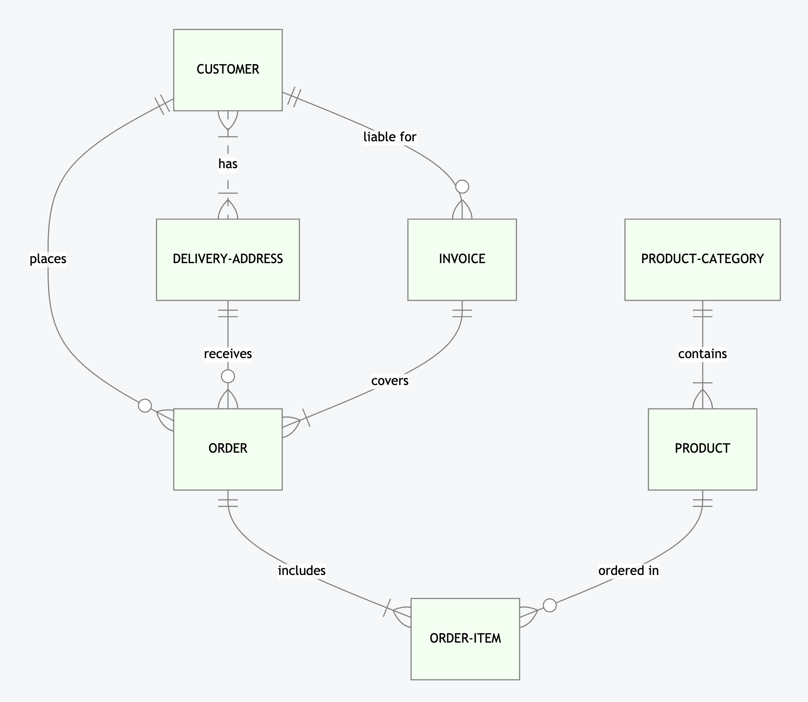
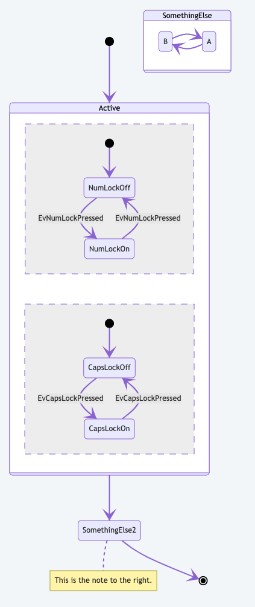
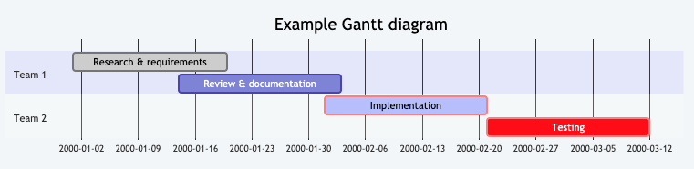

UML Mermaid
===========
* ``mermaid`` - Markdown extension
* https://mermaid-js.github.io/mermaid/#/classDiagram


Class Diagram
-------------
.. figure:: img/uml-mermaid-classdiagram.png

.. code-block:: md

    ```mermaid
    classDiagram

        Human <|-- Astronaut
        Human <|-- Cosmonaut

        class Human {
             + firstname: str
             + lastname: str
             + say_hello()
        }

        class Astronaut {
          + agency: str = 'NASA'
        }

        class Cosmonaut {
          + agency: str = 'Roscosmos'
        }
    ```


Sequence Diagram
----------------


.. code-block:: md

    ```mermaid
    sequenceDiagram

        participant Client
        participant Server
        participant Database

        activate Client
        Client ->> +Server: HTTP Request
        Server ->> +Database: SQL Query
        Database -->> -Server: Result
        Server -->> -Client: HTTP Response
        deactivate Client
    ```


Flowchart
---------

.. todo:: better example

.. code-block:: md

    ```mermaid
    graph TD

        A[Christmas] -->|Get money| B(Go shopping)
        B --> C{Let me think}
        B --> G[/Another/]
        C ==>|One| D[Laptop]
        C -->|Two| E[iPhone]
        C -->|Three| F[fa:fa-car Car]

        subgraph section
            C
            D
            E
            F
            G
        end
    ```


ERD
---
* Entity Relations diagram

.. code-block:: md

    ```mermaid
      erDiagram

        CUSTOMER }|..|{ DELIVERY-ADDRESS : has
        CUSTOMER ||--o{ ORDER : places
        CUSTOMER ||--o{ INVOICE : "liable for"
        DELIVERY-ADDRESS ||--o{ ORDER : receives
        INVOICE ||--|{ ORDER : covers
        ORDER ||--|{ ORDER-ITEM : includes
        PRODUCT-CATEGORY ||--|{ PRODUCT : contains
        PRODUCT ||--o{ ORDER-ITEM : "ordered in"
    ```




State Diagram
-------------
.. code-block:: md

    ```mermaid
    stateDiagram-v2

            [*] --> Active

            state Active {
                [*] --> NumLockOff
                NumLockOff --> NumLockOn : EvNumLockPressed
                NumLockOn --> NumLockOff : EvNumLockPressed
                --
                [*] --> CapsLockOff
                CapsLockOff --> CapsLockOn : EvCapsLockPressed
                CapsLockOn --> CapsLockOff : EvCapsLockPressed
            }

            state SomethingElse {
              A --> B
              B --> A
            }

            Active --> SomethingElse2
            note right of SomethingElse2 : This is the note to the right.

            SomethingElse2 --> [*]
    ```




Gantt
-----
.. code-block:: md

    ```mermaid
    gantt

        title Example Gantt diagram
        dateFormat  YYYY-MM-DD

        section Team 1
        Research & requirements :done, a1, 2000-01-01, 2000-01-20
        Review & documentation  :after a1, 2000-01-14, 20d

        section Team 2
        Implementation      :crit, active, 2000-02-01, 20d
        Testing             :crit, 20d
    ```




Theming
-------
* https://mermaid-js.github.io/mermaid/#/theming

.. code-block:: md

    %%{init: { 'theme': 'dark' } }%%
    %%{init: { 'theme': 'forest' } }%%


Config
------
.. code-block:: md

    %%{init: { 'logLevel': 'debug' } }%%
    %%{config: { 'fontFamily': 'Menlo', 'fontSize': 18, 'fontWeight': 400} }%%
