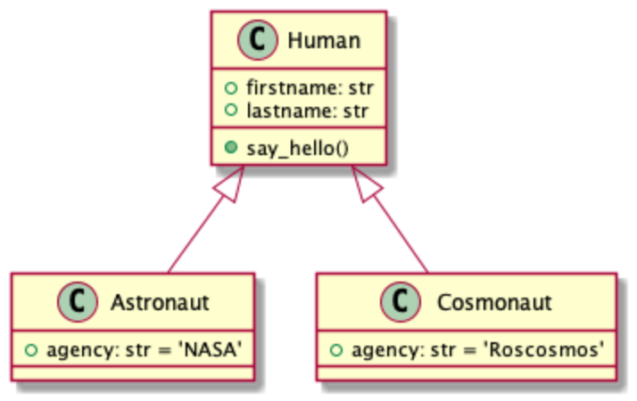
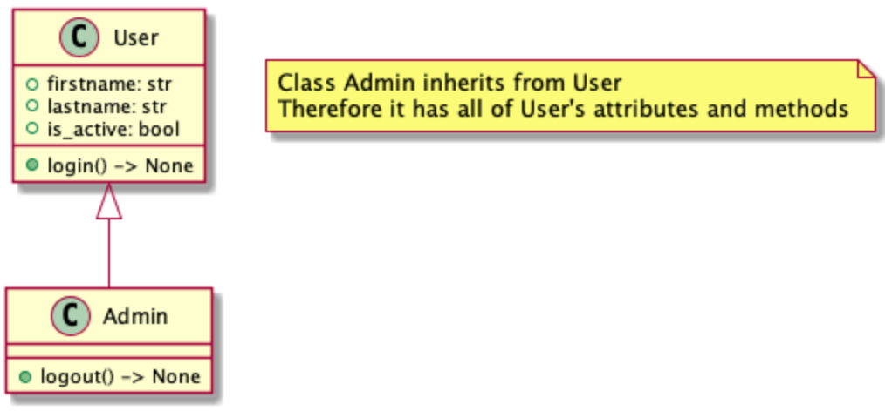
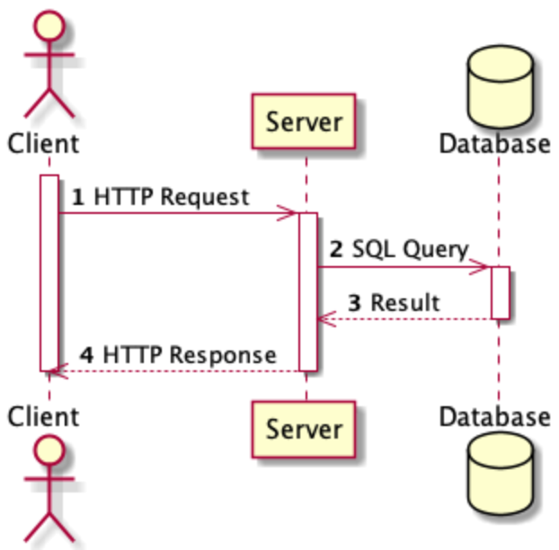
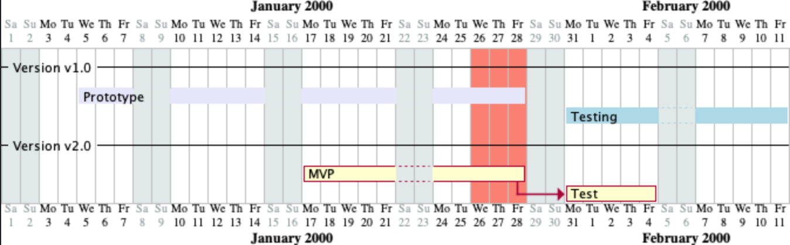

UML PlantUML
============
* ``planUML`` - Markdown extension
* https://plantuml.com/


Class Diagram
-------------
* https://plantuml.com/class-diagram



.. code-block:: md

    ```puml
    Human <|-- Astronaut
    Human <|-- Cosmonaut

    class Human {
         + firstname: str
         + lastname: str
         + say_hello()
    }

    class Astronaut {
      + agency: str = 'NASA'
    }

    class Cosmonaut {
      + agency: str = 'Roscosmos'
    }
    ```



.. code-block:: md

    ```puml
    User <|-- Admin

    class User {
        + firstname: str
        + lastname: str
        + is_active: bool
        + login() -> None
    }

    class Admin {
        + logout() -> None
    }

    note as N1
        Class Admin inherits from User
        Therefore it has all of User's attributes and methods
    endnote
    ```


Sequence Diagram
----------------


.. code-block:: md

    ```puml
    autonumber

    actor Client
    participant Server
    database Database

    activate Client
    Client ->> Server: HTTP Request

    activate Server
    Server ->> Database: SQL Query

    activate Database
    Database -->> Server: Result
    deactivate Database

    Server -->> Client: HTTP Response
    deactivate Server

    deactivate Client
    ```


.. code-block:: md

    ```puml
    participant Participant as Foo
    actor       Actor       as Foo1
    boundary    Boundary    as Foo2
    control     Control     as Foo3
    entity      Entity      as Foo4
    database    Database    as Foo5
    collections Collections as Foo6
    queue       Queue       as Foo7

    Foo -> Foo1 : To actor
    Foo -> Foo2 : To boundary
    Foo -> Foo3 : To control
    Foo -> Foo4 : To entity
    Foo -> Foo5 : To database
    Foo -> Foo6 : To collections
    Foo -> Foo7: To queue
    ```


Gantt
-----


.. code-block:: md

    ```puml
    Project starts 2000-01-01
    2000-01-26 to 2000-01-28 are colored in salmon
    saturday are closed
    sunday are closed

    -- Version v1.0 --

    [Prototype] starts 2000-01-05
    [Prototype] lasts 18 days
    [Prototype] is colored in Lavender

    [Testing] starts 2000-01-31
    [Testing] lasts 10 days
    [Testing] is colored in LightBlue

    -- Version v2.0 --

    [MVP] starts 2000-01-15
    [MVP] lasts 10 days
    then [Test] lasts 5 days
    ```


Theming
-------
* https://plantuml.com/theme

.. code-block:: md

    ```puml
    !theme plain
    ```

Config
------
* https://plantuml.com/preprocessing
