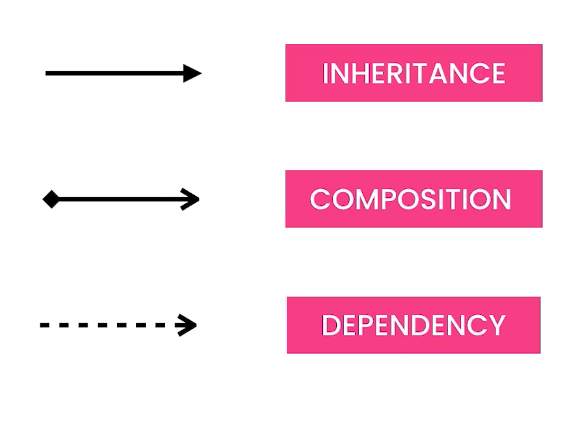
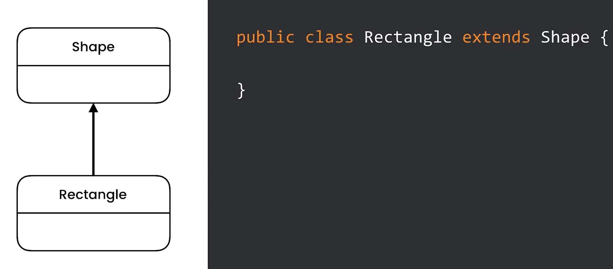
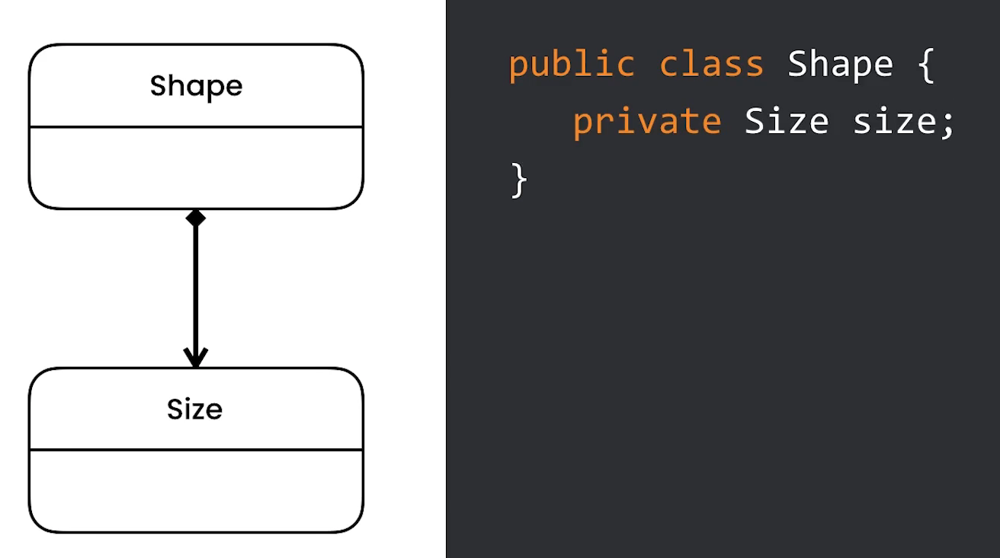
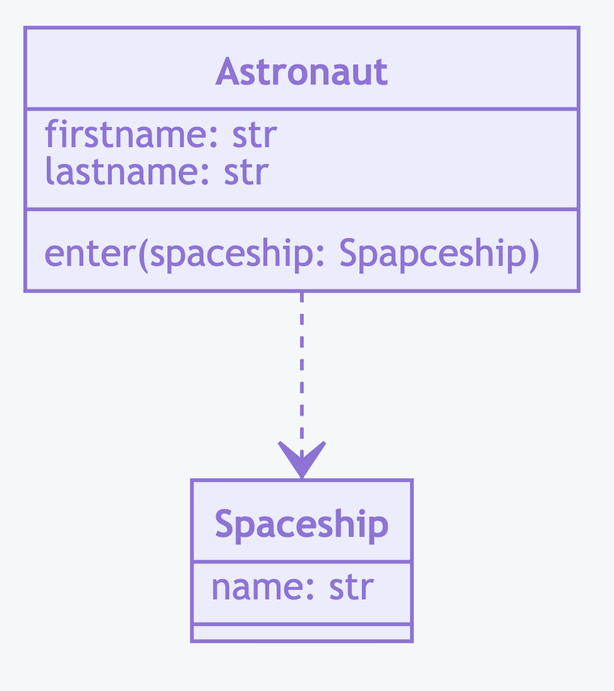

UML Relations
=============

Rationale
---------

Inheritance
-----------

Composition
-----------
* Aggregation

Dependency
----------
* Somewhere in ``Shape`` class you are using ``Document`` class

