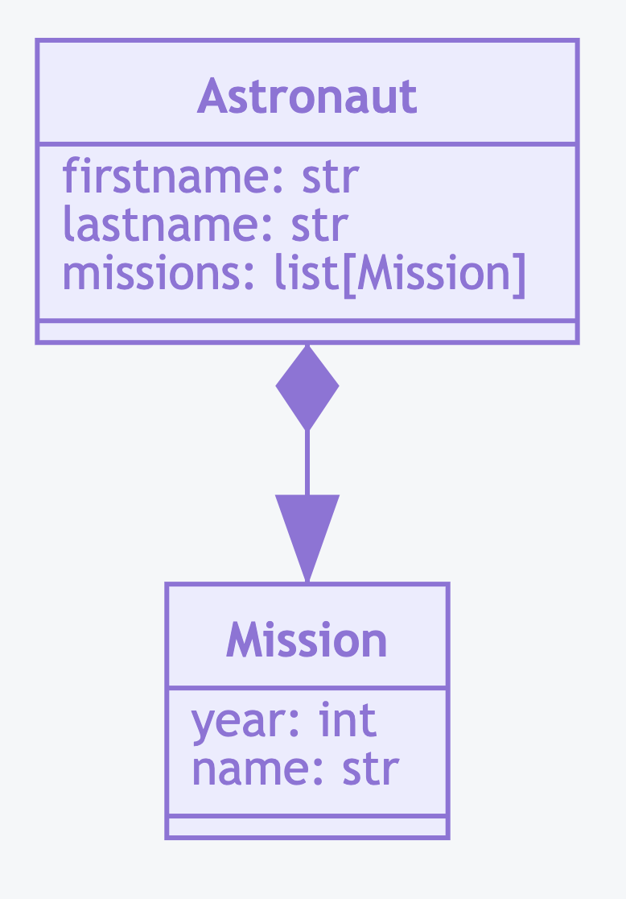

UML Relationship
================


Rationale
---------
* Arrow with empty triangle (but on picture is filled)
* ``<|--`` - Inheritance
* ``*--`` - Composition
* ``o--`` - Aggregation
* ``-->`` - Association
* ``--``  - Link (Solid)
* ``..>`` - Dependency
* ``..|>`` - Realization
* ``..`` - Link (Dashed)

.. figure:: ../_img/uml-mermaid-classdiagram-relations.png
.. figure:: ../_img/uml-relations.png


Inheritance
-----------
Simple Inheritance:

    .. code-block:: python

        class Vehicle:
            def engine_start():
                pass

            def engine_stop():
                pass


        class Car(Vehicle):
            pass

        class Truck(Vehicle):
            pass

        class Motorcycle(Vehicle):
            pass

    .. code-block:: md

        ```mermaid
        classDiagram
            Vehicle <|-- Car
            Vehicle <|-- Truck
            Vehicle <|-- Motorcycle

            class Vehicle {
                engine_start()
                engine_stop()
            }
        ```

    .. figure:: ../_img/uml-relations-inheritance-simple.png

Multilevel Inheritance:

    .. code-block:: python

        class Vehicle:
            def engine_start():
                pass

            def engine_stop():
                pass

        class HasWindows(Vehicle):
            def window_open():
                pass

            def window_close():
                pass


        class Car(HasWindows):
            pass

        class Truck(HasWindows):
            pass

        class Motorcycle(Vehicle):
            pass

    .. code-block:: md

        ```mermaid
        classDiagram
            Vehicle <|-- Motorcycle
            Vehicle <|-- HasWindows
            HasWindows <|-- Car
            HasWindows <|-- Truck

            class Vehicle {
                engine_start()
                engine_stop()
            }

            class HasWindows {
                window_open()
                window_close()
            }
        ```

    .. figure:: ../_img/uml-relations-inheritance-multilevel.png


Composition
-----------
    .. code-block:: python

        class Vehicle:
            def engine_start():
                pass

            def engine_stop():
                pass

        class HasWindows:
            def window_open():
                pass

            def window_close():
                pass


        class Car(Vehicle, HasWindows):
            pass

        class Truck(Vehicle, HasWindows):
            pass

        class Motorcycle(Vehicle):
            pass

.. code-block:: md

    ```mermaid
    classDiagram
        HasWindows --* Car
        HasWindows --* Truck

        Vehicle --* Car
        Vehicle --* Truck
        Vehicle --* Motorcycle

        class Vehicle {
            engine_start()
            engine_stop()
        }

        class HasWindows {
            window_open()
            window_close()
        }
    ```

.. figure:: ../_img/uml-relations-composition.png


Aggregation
-----------
.. code-block:: python

    class Mission:
        year: int
        name: str


    class Astronaut:
        firstname: str
        lastname: str
        mission: list[Mission]

.. code-block:: md

    ```mermaid
    classDiagram
        Astronaut *--|> Mission

        class Astronaut {
            firstname: str
            lastname: str
            missions: list[Mission]
        }

        class Mission {
            year: int
            name: str
        }
    ```




Dependency
----------
* Somewhere in ``Shape`` class you are using ``Document`` class

.. code-block:: python

    class Spaceship:
        name: str


    class Astronaut:
        firstname: str
        lastname: str

        def enter(spaceship: Spaceship):
            pass

.. code-block:: md

    ```mermaid
    classDiagram
        Astronaut ..> Spaceship

        class Astronaut {
            firstname: str
            lastname: str
            enter(spaceship: Spapceship)
        }

        class Spaceship {
            name: str
        }
    ```

.. figure:: ../_img/uml-relations-dependency.png
