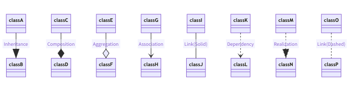
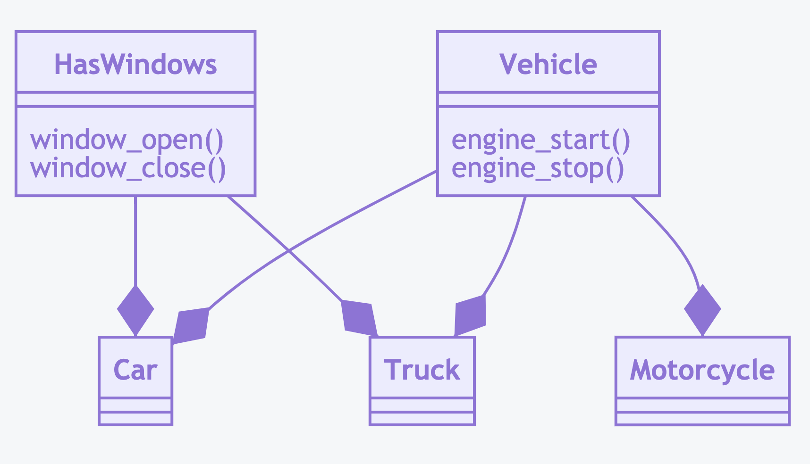

UML Relationship
================


Rationale
---------
* Arrow with empty triangle (but on picture is filled)
* ``<|--`` - Inheritance
* ``*--`` - Composition
* ``o--`` - Aggregation
* ``-->`` - Association
* ``--``  - Link (Solid)
* ``..>`` - Dependency
* ``..|>`` - Realization
* ``..`` - Link (Dashed)


.. figure:: img/uml-relations.png


Inheritance
-----------
.. figure:: img/uml-relations-inheritance-simple.png

.. code-block:: md

    ```mermaid
    classDiagram
        Vehicle <|-- Car
        Vehicle <|-- Truck
        Vehicle <|-- Motorcycle

        class Vehicle {
            engine_start()
            engine_stop()
        }
    ```

>>> class Vehicle:
...     def engine_start(self): pass
...     def engine_stop(self): pass
>>>
>>>
>>> class Car(Vehicle):
...     pass
>>>
>>> class Truck(Vehicle):
...     pass
>>>
>>> class Motorcycle(Vehicle):
...     pass

Multilevel Inheritance
----------------------
.. figure:: img/uml-relations-inheritance-multilevel.png

.. code-block:: md

    ```mermaid
    classDiagram
        Vehicle <|-- Motorcycle
        Vehicle <|-- VehicleWithWindows
        VehicleWithWindows <|-- Car
        VehicleWithWindows <|-- Truck

        class Vehicle {
            engine_start()
            engine_stop()
        }

        class VehicleWithWindows {
            window_open()
            window_close()
        }
    ```

>>> class Vehicle:
...     def engine_start(): pass
...     def engine_stop(): pass
>>>
>>> class VehicleWithWindows(Vehicle):
...     def window_open(): pass
...     def window_close(): pass
>>>
>>> class Car(VehicleWithWindows):
...     pass
>>>
>>> class Truck(VehicleWithWindows):
...     pass
>>>
>>> class Motorcycle(Vehicle):
...     pass


Multiple Inheritance
--------------------
* Also know as `Mixin Classes`

.. todo:: Update image Multiple Inheritance from mermaid code



.. code-block:: md

    ```mermaid
    classDiagram
        HasWindows --* Car
        HasWindows --* Truck

        Vehicle --* Car
        Vehicle --* Truck
        Vehicle --* Motorcycle

        class Vehicle {
            engine_start()
            engine_stop()
        }

        class HasWindows {
            window_open()
            window_close()
        }
    ```

>>> class Vehicle:
...     pass
>>>
>>> class HasEngine:
...     def engine_start(self): pass
...     def engine_stop(self): pass
>>>
>>> class HasWindows:
...     def window_open(self): pass
...     def window_close(self): pass
>>>
>>> class Car(Vehicle, HasEngine, HasWindows):
...     pass
>>>
>>> class Truck(Vehicle, HasEngine, HasWindows):
...     pass
>>>
>>> class Motorcycle(Vehicle, HasEngine):
...     pass


Composition
-----------
.. todo:: Add image to Composition UML

.. code-block:: md

    ```mermaid
    classDiagram

        class Engine {
            engine_start()
            engine_stop()
        }

        class Car {
            engine: Engine
        }

        class Truck {
            engine: Engine
        }

        class Motorcycle {
            engine: Engine
        }
    ```

>>> class Vehicle:
...     pass
>>>
>>> class Engine:
...     def engine_start(self): pass
...     def engine_stop(self): pass
>>>
>>> class Windows:
...     def window_open(self): pass
...     def window_close(self): pass
>>>
>>>
>>> class Car(Vehicle):
...     engine: Engine
...     window: Windows
>>>
>>> class Truck(Vehicle):
...     engine: Engine
...     window: Windows
>>>
>>> class Motorcycle(Vehicle):
...     engine: Engine


Aggregation
-----------
.. figure:: img/uml-relations-aggregation.png

.. code-block:: md

    ```mermaid
    classDiagram
        Astronaut *--|> Mission

        class Astronaut {
            firstname: str
            lastname: str
            missions: list[Mission]
        }

        class Mission {
            year: int
            name: str
        }
    ```

>>> class Mission:
...     year: int
...     name: str
>>>
>>>
>>> class Astronaut:
...     firstname: str
...     lastname: str
...     mission: list[Mission]

>>> class Vehicle:
...     pass
>>>
>>> class Part:
...     pass
>>>
>>> class Engine(Part):
...     def engine_start(self): pass
...     def engine_stop(self): pass
>>>
>>> class Windows(Part):
...     def window_open(self): pass
...     def window_close(self): pass
>>>
>>>
>>> class Car(Vehicle):
...     parts: list[Part]       # [Engine, Windows]
>>>
>>> class Truck(Vehicle):
...     parts: list[Part]       # [Engine, Windows]
>>>
>>> class Motorcycle(Vehicle):
...     parts: list[Part]       # [Engine]


Dependency
----------
* Somewhere in ``Astronaut`` class you are using ``Spaceship`` class

.. figure:: img/uml-relations-dependency.png

.. code-block:: md

    ```mermaid
    classDiagram
        Astronaut ..> Spaceship

        class Astronaut {
            firstname: str
            lastname: str
            enter(spaceship: Spaceship)
        }

        class Spaceship {
            name: str
        }
    ```

>>> class Spaceship:
...     name: str
>>>
>>>
>>> class Astronaut:
...     firstname: str
...     lastname: str
...
...     def enter(spaceship: Spaceship):
...         pass


Cardinality
-----------
* ``0..1`` - Zero or one
* ``0..n`` - Zero to `n` (where `n` > 1)
* ``0..*`` - Zero or more

* ``1`` - Only one
* ``1..n`` - One to `n` (where `n` > 1)
* ``1..*`` - One or more

* ``*`` - Many
* ``n..n`` - {where n>1}
