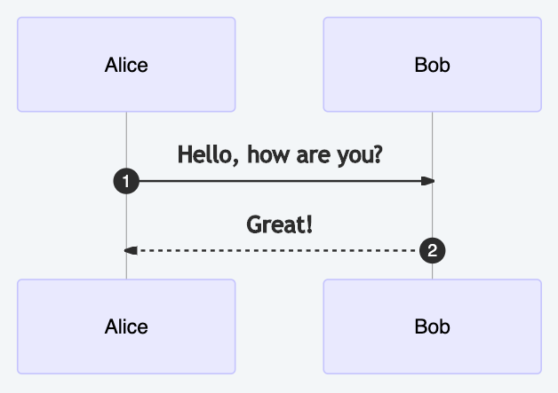
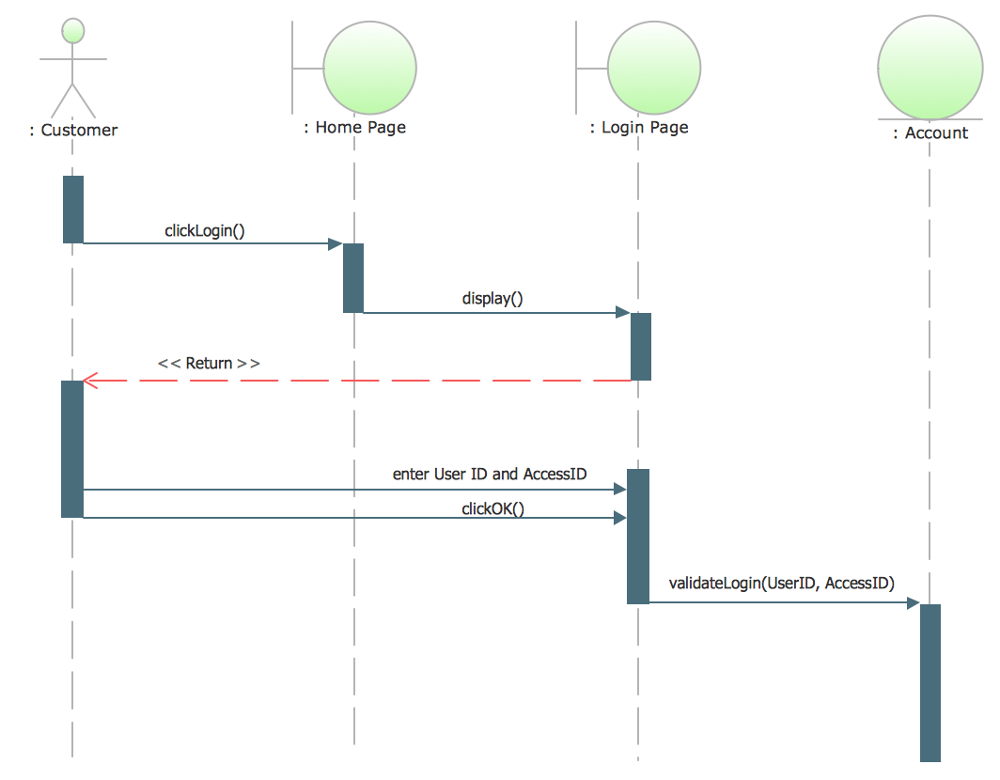

UML Sequence Diagram
====================


Rationale
---------
* https://mermaid-js.github.io/mermaid/#/sequenceDiagram


Connections
-----------
* ``->`` - Solid line without arrow
* ``-->`` - Dotted line without arrow
* ``->>`` - Solid line with arrowhead
* ``-->>`` - Dotted line with arrowhead
* ``-x`` - Solid line with a cross at the end (async)
* ``--x`` - Dotted line with a cross at the end (async)


Conversation
------------
.. code-block:: md

    ```mermaid
    sequenceDiagram

        participant Alice
        participant Bob

        Alice ->> Bob: Hello, how are you?
        Bob ->> Alice: Great!
    ```




Nested
------
.. code-block:: md

    ```mermaid
    sequenceDiagram

        participant Client
        participant Server
        participant Database

        activate Client
        Client ->> +Server: HTTP Request
        Server ->> +Database: SQL Query
        Database ->> -Server: Result
        Server ->> -Client: HTTP Response
        deactivate Client
    ```

.. figure:: img/uml-mermaid-sequencediagram-web.png


Use Cases
---------

.. figure:: img/uml-sequencediagram-2.jpg
