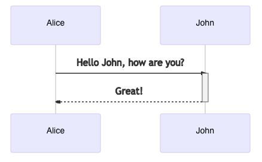

UML Sequence Diagram
====================


Rationale
---------
* https://mermaid-js.github.io/mermaid/#/sequenceDiagram


Example
-------
.. code-block:: md

    ```mermaid
    sequenceDiagram
        Alice ->> John: Hello John, how are you?
        activate John
        John -->> Alice: Great!
        deactivate John
    ```

There is also a shortcut notation by appending +/- suffix to the message arrow:

.. code-block:: md

    ```mermaid
    sequenceDiagram
        Alice ->> +John: Hello John, how are you?
        John -->> -Alice: Great!
    ```




Use Cases
---------
.. figure:: ../_img/uml-sequencediagram-1.png
.. figure:: ../_img/uml-sequencediagram-2.jpg
