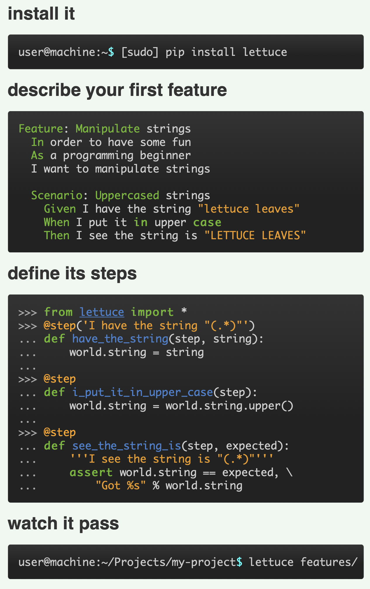
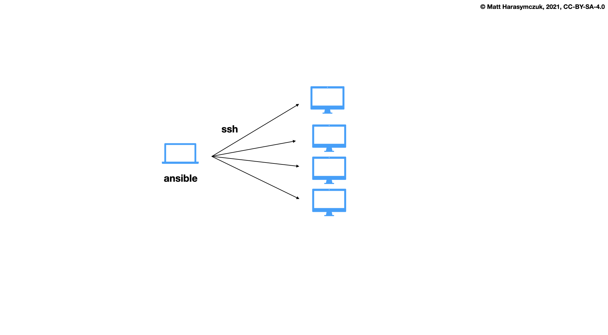

CI/CD Devtools Ecosystem
========================

Agility
-------
* Pair Programming in PyCharm: https://www.jetbrains.com/help/pycharm/code-with-me.html
* Further Reading: https://dev.astrotech.io/agile/index.html

.. todo:: Further Reading: https://agility.astrotech.io

.. figure:: ../_img/agility-bigpicture-v1.png
.. figure:: ../_img/agility-bigpicture-v2.png
.. figure:: ../_img/agility-scrum-userstory.png
.. figure:: ../_img/agility-scrum-capacity-backlog.png
.. figure:: ../_img/agility-scrum-capacity-sprint.png
.. figure:: ../_img/agility-scrum-daily-timer.png
.. figure:: ../_img/agility-scrum-sprint-week-continuous.png

Ecosystem
---------
* Further Reading: https://dev.astrotech.io/summary/index.html

.. todo:: Further Reading: https://ecosystem.astrotech.io

.. figure:: ../_img/ecosystem-bigpicture.png
.. figure:: ../_img/ecosystem-alternatives.png
.. figure:: ../_img/ecosystem-bigpicture-01.png
.. figure:: ../_img/ecosystem-bigpicture-02.png
.. figure:: ../_img/ecosystem-bigpicture-03.png
.. figure:: ../_img/ecosystem-bigpicture-04.png
.. figure:: ../_img/ecosystem-bigpicture-05.png
.. figure:: ../_img/ecosystem-bigpicture-06.png
.. figure:: ../_img/ecosystem-bigpicture-07.png
.. figure:: ../_img/ecosystem-bigpicture-08.png
.. figure:: ../_img/ecosystem-bigpicture-09.png
.. figure:: ../_img/ecosystem-bigpicture-10.png
.. figure:: ../_img/ecosystem-bigpicture-11.png
.. figure:: ../_img/ecosystem-bigpicture-12.png

Version Control System
----------------------
* Git
* Git Flow
* Github Flow
* Github
* Bitbucket
* GitLab
* GitOps: https://www.gitops.tech
* FluxCD: https://github.com/fluxcd/flux
* Further Reading: https://dev.astrotech.io/git/index.html

.. figure:: ../_img/vcs-gitflow-01-feature.png
.. figure:: ../_img/vcs-gitflow-02-feature-pr.png
.. figure:: ../_img/vcs-gitflow-03-bugfix.png
.. figure:: ../_img/vcs-gitflow-04-develop,feature,bugfix.png
.. figure:: ../_img/vcs-gitflow-05-develop,master.png
.. figure:: ../_img/vcs-gitflow-06-release.png
.. figure:: ../_img/vcs-gitflow-07-tag.png
.. figure:: ../_img/vcs-gitflow-08-hotfix.png
.. figure:: ../_img/vcs-gitflow-bigpicture.png
.. figure:: ../_img/vcs-gitflow-github.png
.. figure:: ../_img/vcs-gitflow-lean.png
.. figure:: ../_img/vcs-bitbucket-create-branch.png

Virtualization
--------------
* Docker
* LXC - Linux Containers
* OCI - Open Container Initiative
* Kubernetes
* Containerd
* OpenShift
* Open Stack
* Amazon EKS, ECS
* Further Reading: https://dev.astrotech.io/docker/index.html

.. todo:: Further Reading: https://virt.astrotech.io
.. todo:: Further Reading: https://docker.astrotech.io

.. figure:: ../_img/virt-docker-stack-01-baremetal.png
.. figure:: ../_img/virt-docker-stack-02-virtualization-1.png
.. figure:: ../_img/virt-docker-stack-02-virtualization-2.png
.. figure:: ../_img/virt-docker-stack-02-virtualization-3.png
.. figure:: ../_img/virt-docker-stack-02-virtualization-4.png
.. figure:: ../_img/virt-docker-stack-03-docker.png
.. figure:: ../_img/virt-docker-stack-04-docker-network-1.png
.. figure:: ../_img/virt-docker-stack-04-docker-network-2.png
.. figure:: ../_img/virt-docker-stack-04-docker-network-3.png
.. figure:: ../_img/virt-docker-stack-05-kubernetes.png
.. figure:: ../_img/virt-docker-stack-06-architecture.png

Continuous Integration / Delivery
---------------------------------
* Jenkins
* Github Actions
* Bitbucket Pipelines
* CircleCI
* Travis
* GitLab
* Further Reading: https://dev.astrotech.io/jenkins/index.html

.. todo:: Further Reading: https://cicd.astrotech.io
.. todo:: Further Reading: https://jenkins.astrotech.io

.. figure:: ../_img/cicd-jenkins-docker-1.png
.. figure:: ../_img/cicd-jenkins-docker-2-build.png
.. figure:: ../_img/cicd-jenkins-docker-3-notfound.png
.. figure:: ../_img/cicd-jenkins-docker-4-cannotcreatesocket.png
.. figure:: ../_img/cicd-jenkins-docker-5-permissiondenied.png
.. figure:: ../_img/cicd-jenkins-docker-6-dockersock.png
.. figure:: ../_img/cicd-jenkins-docker-7-containers.png
.. figure:: ../_img/cicd-jenkins-blueocean-failing.png
.. figure:: ../_img/cicd-jenkins-blueocean-success.png
.. figure:: ../_img/cicd-jenkins-blueocean-pipeline.png

Quality Assurance
-----------------
* SonarQube
* SonarLint [#sonarlintorg]_
* SonarScanner
* SonarCloud
* Coverage
* PEP-8
* PyLint
* Black
* Further Reading: https://dev.astrotech.io/sonarqube/index.html
* Further Reading: https://python.astrotech.io/devops/ci-cd/tools.html#static-analysis
* Further Reading: https://python.astrotech.io/devops/ci-cd/code-style.html
* Further Reading: https://python.astrotech.io/devops/ci-cd/coverage.html
* Further Reading: https://python.astrotech.io/devops/ci-cd/static-analysis.html

.. todo:: Further Reading: https://qa.astrotech.io
.. todo:: Further Reading: https://quality.astrotech.io
.. todo:: Further Reading: https://sonarqube.astrotech.io
.. todo:: Further Reading: https://sonar.astrotech.io

.. figure:: ../_img/qa-sonarlint-a.jpg
    :class: hidden

.. figure:: ../_img/qa-sonarlint-b.mp4
    :class: hidden

.. raw:: html

    <video autoplay="" loop="" muted="" playsinline="" src="../_img/qa-sonarlint-b.mp4" poster="../_img/qa-sonarlint-a.jpg" width="100%" height="100%" alt="SonarLint is an IDE extension that helps you detect and fix quality issues as you write code. [#sonarlintorg]_"></video>

.. figure:: ../_img/qa-sonarlint-a.jpg
.. figure:: ../_img/qa-sonarlint-b.mp4
.. figure:: ../_img/qa-sonarqube-bigpicture.png
.. figure:: ../_img/qa-sonarqube-feature-branch-a.png
.. figure:: ../_img/qa-sonarqube-feature-portfolio-a.png
.. figure:: ../_img/qa-sonarqube-feature-portfolio-b.png
.. figure:: ../_img/qa-sonarqube-feature-portfolio-c.png
.. figure:: ../_img/qa-sonarqube-feature-pr-a.png
.. figure:: ../_img/qa-sonarqube-feature-security-a.png
.. figure:: ../_img/qa-sonarqube-feature-security-b.png
.. figure:: ../_img/qa-sonarqube-integrations-azuredevops-a.png
.. figure:: ../_img/qa-sonarqube-integrations-bitbucket-a.png
.. figure:: ../_img/qa-sonarqube-integrations-bitbucket-b.png
.. figure:: ../_img/qa-sonarqube-integrations-bitbucket-c.png
.. figure:: ../_img/qa-sonarqube-integrations-bitbucket-d.png
.. figure:: ../_img/qa-sonarqube-integrations-github-a.png
.. figure:: ../_img/qa-sonarqube-integrations-gitlab-a.png
.. figure:: ../_img/qa-sonarqube-license-a.png

Issue Tracker
-------------
* Jira
* Gitlab
* Github issues
* Jira Integration: https://jira.astrotech.io/end-user/automation.html
* Further Reading: https://dev.astrotech.io/jira/index.html

.. todo:: https://dev.astrotech.io/jira/index.html
.. todo:: https://issue.astrotech.io
.. todo:: https://jira.astrotech.io

.. figure:: ../_img/jira-backlog.jpg
.. figure:: ../_img/jira-backlog-kanban.png
.. figure:: ../_img/jira-backlog-scrum.png
.. figure:: ../_img/jira-builds.png
.. figure:: ../_img/jira-devpanel-1.png
.. figure:: ../_img/jira-devpanel-2.png
.. figure:: ../_img/jira-devpanel-3.png
.. figure:: ../_img/jira-pullrequest.png
.. figure:: ../_img/jira-release.png
.. figure:: ../_img/jira-roadmap.png
.. figure:: ../_img/jira-triggers.png
.. figure:: ../_img/jira-versions.png

SSH
---
* Further Reading: https://dev.astrotech.io/linux/index.html

.. figure:: ../_img/ssh-pssh-1.jpg
.. figure:: ../_img/ssh-pssh-2.png
.. figure:: ../_img/ssh-pssh-3.png

Testing
-------
* Further Reading: https://test.astrotech.io

.. figure:: ../_img/cicd-strategy.png

Mutation Testing
----------------
.. figure:: ../_img/testing-mutation-1.jpg
.. figure:: ../_img/testing-mutation-2.png
.. figure:: ../_img/testing-mutation-3.jpg

BDD Testing
-----------
* Lettuce: http://lettuce.it/index.html
* Cucumber: https://cucumber.io
* Behave: https://behave.readthedocs.io/en/stable/tutorial.html

.. figure:: ../_img/test-bdd-behave.png

Load Testing
------------
* Gatling: https://gatling.io
* Locust: https://locust.io/
* JMeter: https://jmeter.apache.org

.. figure:: ../_img/test-load-gatling-result.png
.. figure:: ../_img/test-load-gatling-run.png

Testing UI
----------
* Selenium: https://www.selenium.dev

.. figure:: ../_img/qa-selenium-ide.png

Testing microservices
---------------------
* Further Reading: https://arch.astrotech.io
* Source: https://martinfowler.com/articles/microservice-testing/

.. figure:: ../_img/testing-microservices-01.png
.. figure:: ../_img/testing-microservices-02.png
.. figure:: ../_img/testing-microservices-03.png
.. figure:: ../_img/testing-microservices-04.png
.. figure:: ../_img/testing-microservices-05.png
.. figure:: ../_img/testing-microservices-06.png
.. figure:: ../_img/testing-microservices-07.png
.. figure:: ../_img/testing-microservices-08.png
.. figure:: ../_img/testing-microservices-09.png
.. figure:: ../_img/testing-microservices-10.png
.. figure:: ../_img/testing-microservices-11.png
.. figure:: ../_img/testing-microservices-12.png
.. figure:: ../_img/testing-microservices-13.png

Provisioning
------------
* Ansible
* Puppet
* Chef
* Salt, SaltStack
* Vagrant
* Further Reading: https://dev.astrotech.io/puppet/index.html
* Further Reading: https://dev.astrotech.io/ansible/index.html
* Further Reading: https://dev.astrotech.io/vagrant/index.html

Setup
-----
.. code-block:: sh

    sudo apt update
    sudo apt install -y uidmap
    curl https://get.docker.com/rootless |sh
    echo 'export PATH=/home/ubuntu/.local/bin:$PATH' >> ~/.profile
    echo 'export DOCKER_HOST=unix:///run/user/1000/docker.sock' >> ~/.profile
    echo 'export IP=$(curl -s ipecho.net/plain)' >> ~/.profile
    source ~/.profile
    docker network create ecosystem

Gitea:

    .. code-block:: sh

        cat > /home/ubuntu/bin/run-gitea << EOF

        docker run \\
            --name gitea \\
            --detach \\
            --restart always \\
            --env USER_UID=1000 \\
            --env USER_GID=1000 \\
            --env GITEA__server__ROOT_URL=http://$IP:3000/ \\
            --env GITEA__database__DB_TYPE=sqlite3 \\
            --env GITEA__database__PATH=/var/lib/gitea/data/gitea.db \\
            --env GITEA__database__HOST=... \\
            --env GITEA__database__NAME=... \\
            --env GITEA__database__USER=... \\
            --env GITEA__database__PASSWD=... \\
            --network ecosystem \\
            --publish 3000:3000 \\
            --publish 2222:22 \\
            --volume gitea_data:/var/lib/gitea \\
            --volume gitea_config:/etc/gitea \\
            --volume /etc/timezone:/etc/timezone:ro \\
            --volume /etc/localtime:/etc/localtime:ro \\
            gitea/gitea:latest-rootless

        docker exec -itu root gitea ash -c 'echo "nameserver 8.8.8.8" > /etc/resolv.conf'

        echo "Gitea running on: http://$IP:3000/"

        EOF

        chmod +x /home/ubuntu/bin/run-gitea
        run-gitea

Jenkins:

    .. code-block:: sh

        cat > /home/ubuntu/bin/run-jenkins << EOF

        chmod o+rw /run/user/1000/docker.sock
        sudo ln -s /home/ubuntu/.local/share/docker/volumes/jenkins_data/_data/ /var/jenkins_home

        docker run \\
            --name jenkins \\
            --detach \\
            --restart always \\
            --network ecosystem \\
            --publish 8080:8080 \\
            --volume jenkins_data:/var/jenkins_home \\
            --volume /run/user/1000/docker.sock:/var/run/docker.sock \\
            jenkinsci/blueocean:latest

        docker exec -u root jenkins apk add python3 py3-pip

        echo "Jenkins running on: http://$IP:8080/"

        EOF

        chmod +x /home/ubuntu/bin/run-jenkins
        run-jenkins

SonarQube:

    .. code-block:: sh

        cat > /home/ubuntu/bin/run-sonarqube << EOF

        docker run \\
            --name sonarqube \\
            --detach \\
            --restart always \\
            --network ecosystem \\
            --publish 9000:9000 \\
            --volume sonarqube_data:/opt/sonarqube/data \\
            --volume sonarqube_logs:/opt/sonarqube/logs \\
            --volume sonarqube_extensions:/opt/sonarqube/extensions \\
            sonarqube

        echo "SonarQube running on: http://$IP:9000/"

        EOF

        chmod +x /home/ubuntu/bin/run-sonarqube
        run-sonarqube

SonarScanner:

    * ``sonar-project.properties``
    * Further Reading: https://dev.astrotech.io/sonarqube/sonarscanner.html
    * Further Reading: https://python.astrotech.io/devops/ci-cd/static-analysis.html

    .. code-block:: sh

        docker pull sonarsource/sonar-scanner-cli

Docker Registry:

    .. code-block:: sh

        cat > /home/ubuntu/bin/run-registry << EOF

        docker run \\
            --detach \\
            --restart always \\
            --name registry \\
            --net ecosystem \\
            --publish 5000:5000 \\
            --volume registry_data:/var/lib/registry \\
            registry:2

        echo "Registry running on: http://$IP:5000/"

        EOF

        chmod +x /home/ubuntu/bin/run-registry
        run-registry

Registry UI:

    .. code-block:: sh

        cat > /home/ubuntu/registry-ui.yml << EOF

        listen_addr: 0.0.0.0:8888
        base_path: /

        registry_url: http://registry:5000
        verify_tls: true

        # registry_username: user
        # registry_password: pass

        # The same one should be configured on Docker registry as Authorization Bearer token.
        event_listener_token: token
        event_retention_days: 7

        event_database_driver: sqlite3
        event_database_location: data/registry_events.db
        # event_database_driver: mysql
        # event_database_location: user:password@tcp(localhost:3306)/docker_events

        cache_refresh_interval: 10

        # If users can delete tags.
        # If set to False, then only admins listed below.
        anyone_can_delete: false

        # Users allowed to delete tags.
        # This should be sent via X-WEBAUTH-USER header from your proxy.
        admins: []

        # Debug mode. Affects only templates.
        debug: true

        # How many days to keep tags but also keep the minimal count provided no matter how old.
        purge_tags_keep_days: 90
        purge_tags_keep_count: 2

        EOF

    .. code-block:: sh

        cat > /home/ubuntu/bin/run-registry-ui << EOF

        docker run \\
            --name registry-ui \\
            --detach \\
            --restart=always \\
            --network ecosystem \\
            --publish 8888:8888 \\
            --volume /home/ubuntu/registry-ui.yml:/opt/config.yml:ro \\
            quiq/docker-registry-ui

        echo "Registry UI running on: http://$IP:8888/"

        EOF

        chmod +x /home/ubuntu/bin/run-registry-ui
        run-registry-ui

Files:

    .. code-block:: sh

        cat > /home/ubuntu/src/Dockerfile << EOF
        FROM python:3.10
        COPY game.pyz /game.pyz
        CMD python3 /game.pyz
        EOF

    .. code-block:: sh

        cat > /home/ubuntu/src/sonar-project.properties << EOF
        ## Sonar Server
        sonar.host.url=http://sonarqube:9000/
        sonar.login=TOKEN

        ## Software Configuration Management
        sonar.scm.enabled=true
        sonar.scm.provider=git

        ## SonarScanner Config
        sonar.sourceEncoding=UTF-8
        sonar.verbose=false
        sonar.log.level=INFO
        sonar.showProfiling=false
        sonar.projectBaseDir=/usr/src/
        sonar.working.directory=/tmp/

        ## Quality Gates
        sonar.qualitygate.wait=true
        sonar.qualitygate.timeout=300

        ## About Project
        sonar.projectKey=mypythonproject
        sonar.projectName=MyPythonProject

        ## Python
        sonar.language=py
        sonar.python.version=3.10
        sonar.sources=src
        sonar.tests=test
        sonar.inclusions=**/*.py
        sonar.exclusions=**/migrations/**,**/*.pyc,**/__pycache__/**
        sonar.python.coverage.reportPaths=.tmp/coverage.xml,./cobertura.xml
        sonar.python.bandit.reportPaths=.tmp/bandit.json
        sonar.python.pylint.reportPaths=.tmp/pylint.txt
        sonar.python.flake8.reportPaths=.tmp/flake8.txt

        EOF

    .. code-block:: sh

        cat > /home/ubuntu/src/Jenkinsfile << EOF
        pipeline {
          agent any
          triggers { pollSCM('* * * * *') }

          stages {
            stage('Env Prepare')            { steps { sh 'run/env-prepare' }}
            stage('Env Setup')              { steps { sh 'run/env-setup' }}
            stage('Env Debug')              { steps { sh 'run/env-debug' }}

            stage('Test') {
            parallel {
                stage('Test Code Style')    { steps { sh 'run/test-codestyle' }}
                stage('Test Functional')    { steps { sh 'run/test-functional' }}
                stage('Test Integration')   { steps { sh 'run/test-integration' }}
                stage('Test Lint')          { steps { sh 'run/test-lint' }}
                stage('Test Load')          { steps { sh 'run/test-load' }}
                stage('Test Mutation')      { steps { sh 'run/test-mutation' }}
                stage('Test Regression')    { steps { sh 'run/test-regression' }}
                stage('Test Security')      { steps { sh 'run/test-security' }}
                stage('Test Smoke')         { steps { sh 'run/test-smoke' }}
                stage('Test Static')        { steps { sh 'run/test-static' }}
                stage('Test UI')            { steps { sh 'run/test-ui' }}
                stage('Test Unit')          { steps { sh 'run/test-unit' }}
            }}
            stage('Test Report')            { steps { sh 'run/test-report' }}

            stage('Artifact Prepare')       { steps { sh 'run/artifact-prepare' }}
            stage('Artifact Build')         { steps { sh 'run/artifact-create' }}
            stage('Artifact Publish')       { steps { sh 'run/artifact-publish' }}
            stage('Artifact Cleanup')       { steps { sh 'run/artifact-cleanup' }}

            stage('Deploy Dev')             { steps { sh 'run/deploy-dev' }}
            stage('Deploy Test')            { steps { sh 'run/deploy-test' }}
            stage('Deploy Preprod')         { steps { sh 'run/deploy-preprod' }}
            stage('Deploy Prod')            { steps { sh 'run/deploy-prod' }}
          }
        }

        // To run all:
        // grep -Po "^[^/].*sh '\K.+(?=')" Jenkinsfile |sh -x

        EOF

Tests:

    .. code-block:: sh

        cd /home/ubuntu/src
        mkdir -p run/
        touch run/test-codestyle
        touch run/test-coverage
        touch run/test-functional
        touch run/test-integration
        touch run/test-lint
        touch run/test-load
        touch run/test-mutation
        touch run/test-regression
        touch run/test-report
        touch run/test-security
        touch run/test-smoke
        touch run/test-static
        touch run/test-ui
        touch run/test-unit
        touch run/artifact-prepare
        touch run/artifact-create
        touch run/artifact-publish
        touch run/artifact-cleanup
        touch run/deploy-dev
        touch run/deploy-test
        touch run/deploy-preprod
        touch run/deploy-prod
        chmod +x run/*

    .. code-block:: sh

        cat > run/env-prepare << EOF
        env |sort
        EOF

    .. code-block:: sh

        cat > run/env-setup << EOF
        python3 -m pip install --upgrade -r requirements.dev
        EOF

    .. code-block:: sh

        cat > run/env-debug << EOF
        which python3
        python3 --version
        python3 -m pip freeze
        EOF

    .. code-block:: sh

        cat > run/test-codestyle << EOF
        export PYTHONPATH=src
        python3 -m flake8 --exit-zero --doctest --output-file=.tmp/flake8.txt src
        EOF

    .. code-block:: sh

        cat > run/test-coverage << EOF
        export PYTHONPATH=src
        python3 -m coverage run src
        python3 -m coverage xml -o .tmp/coverage.xml
        EOF

    .. code-block:: sh

        cat > run/test-functional << EOF
        echo 'Not Implemented'
        EOF

    .. code-block:: sh

        cat > run/test-integration << EOF
        export PYTHONPATH=src
        python3 -m doctest -v test/*.py
        EOF

    .. code-block:: sh

        cat > run/test-lint << EOF
        export PYTHONPATH=src
        python3 -m pylama --verbose --async src || true
        python3 -m pylint --exit-zero --msg-template="{path}:{line}: [{msg_id}({symbol}), {obj}] {msg}" --output=.tmp/pylint.txt --disable=C0114,C0115,C0116,E0401,C0103 src
        EOF

    .. code-block:: sh

        cat > run/test-load << EOF
        echo 'Not Implemented'
        EOF

    .. code-block:: sh

        cat > run/test-mutation << EOF
        echo 'Not Implemented'
        EOF

    .. code-block:: sh

        cat > run/test-regression << EOF
        echo 'Not Implemented'
        EOF

    .. code-block:: sh

        cat > run/test-report << EOF
        docker run --rm --net ecosystem -v $(pwd):/usr/src sonarsource/sonar-scanner-cli
        EOF

    .. code-block:: sh

        cat > run/test-security << EOF
        export PYTHONPATH=src
        python3 -m bandit --format json --output=.tmp/bandit.json --recursive src
        EOF

    .. code-block:: sh

        cat > run/test-smoke << EOF
        echo 'Not Implemented'
        EOF

    .. code-block:: sh

        cat > run/test-static << EOF
        export PYTHONPATH=src
        python3 -m mypy --ignore-missing-imports --cobertura-xml-report=.tmp src || test
        EOF

    .. code-block:: sh

        cat > run/test-ui << EOF
        echo 'Not Implemented'
        EOF

    .. code-block:: sh

        cat > run/test-unit << EOF
        export PYTHONPATH=src
        python3 -m unittest discover -v test
        EOF

    .. code-block:: sh

        cat > run/artifact-prepare << EOF
        python3 -m pip install --upgrade --no-cache-dir -r requirements.prod --target src
        rm -fr src/*.dist-info
        python3 -m compileall -f src
        # find src -name '*.py' -not -name '__main__.py' -not -name '__init__.py' -delete  # not working for now
        python3 -m zipapp --python="/usr/bin/env python3" --output=game.pyz src
        EOF

    .. code-block:: sh

        cat > run/artifact-create << EOF
        docker build . -t localhost:5000/myapp:$(git log -1 --format='$h')
        EOF

    .. code-block:: sh

        cat > run/artifact-publish << EOF
        docker push localhost:5000/myapp:$(git log -1 --format='$h')
        EOF

    .. code-block:: sh

        cat > run/artifact-cleanup << EOF
        docker rmi localhost:5000/myapp:$(git log -1 --format='$h')
        EOF

    .. code-block:: sh

        cat > run/deploy-dev << EOF
        echo 'Not Implemented'
        EOF

    .. code-block:: sh

        cat > run/deploy-test << EOF
        echo 'Not Implemented'
        EOF

    .. code-block:: sh

        cat > run/deploy-preprod << EOF
        echo 'Not Implemented'
        EOF

    .. code-block:: sh

        cat > run/deploy-prod << EOF
        echo 'Not Implemented'
        EOF

References
----------
.. [#sonarlintorg] https://www.sonarlint.org
