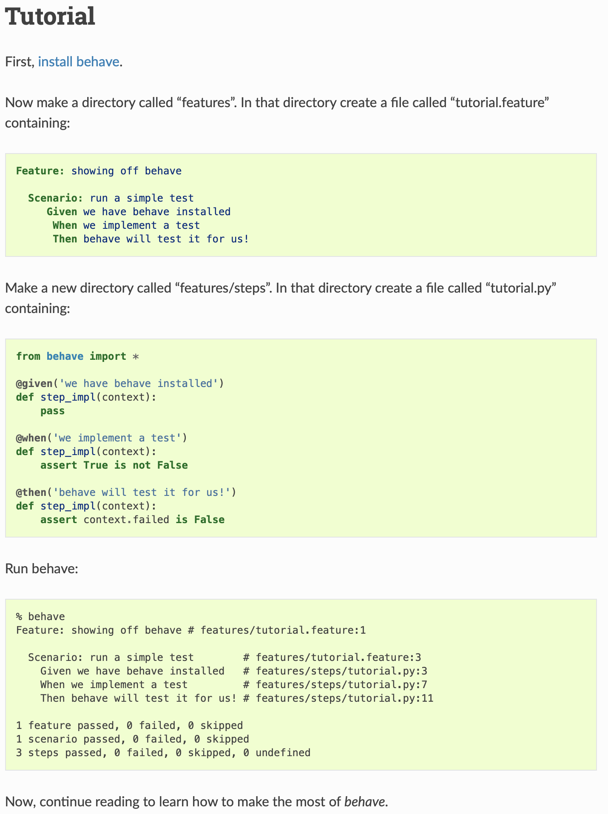
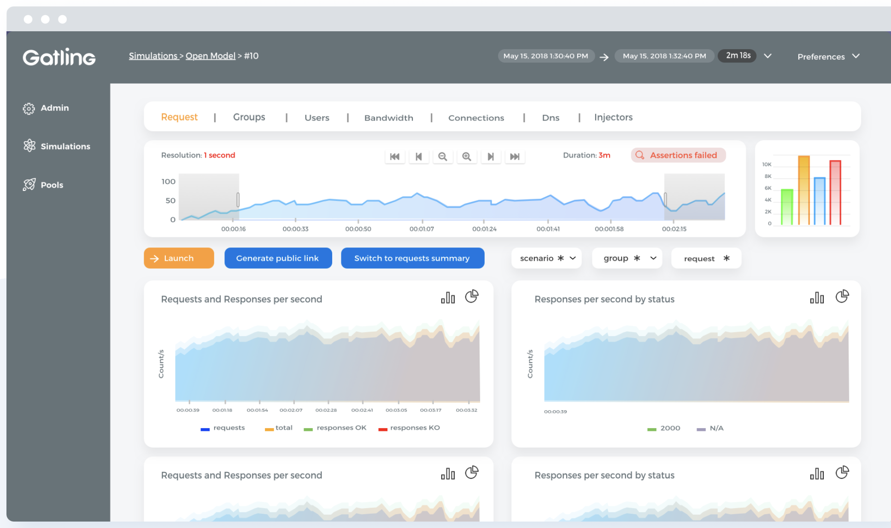
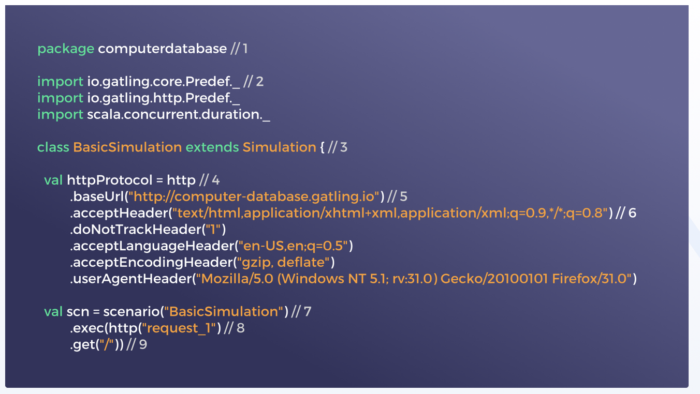

CI/CD Devtools Ecosystem
========================

Agility
-------
* Pair Programming in PyCharm: https://www.jetbrains.com/help/pycharm/code-with-me.html
* Further Reading: https://dev.astrotech.io/agile/index.html

.. todo:: Further Reading: https://agility.astrotech.io

.. figure:: ../_img/agility-bigpicture-v1.png
.. figure:: ../_img/agility-bigpicture-v2.png
.. figure:: ../_img/agility-scrum-userstory.png
.. figure:: ../_img/agility-scrum-capacity-backlog.png
.. figure:: ../_img/agility-scrum-capacity-sprint.png
.. figure:: ../_img/agility-scrum-daily-timer.png
.. figure:: ../_img/agility-scrum-sprint-week-continuous.png

Ecosystem
---------
* Further Reading: https://dev.astrotech.io/summary/index.html

.. todo:: Further Reading: https://ecosystem.astrotech.io

.. figure:: ../_img/ecosystem-bigpicture.png
.. figure:: ../_img/ecosystem-alternatives.png
.. figure:: ../_img/ecosystem-bigpicture-01.png
.. figure:: ../_img/ecosystem-bigpicture-02.png
.. figure:: ../_img/ecosystem-bigpicture-03.png
.. figure:: ../_img/ecosystem-bigpicture-04.png
.. figure:: ../_img/ecosystem-bigpicture-05.png
.. figure:: ../_img/ecosystem-bigpicture-06.png
.. figure:: ../_img/ecosystem-bigpicture-07.png
.. figure:: ../_img/ecosystem-bigpicture-08.png
.. figure:: ../_img/ecosystem-bigpicture-09.png
.. figure:: ../_img/ecosystem-bigpicture-10.png
.. figure:: ../_img/ecosystem-bigpicture-11.png
.. figure:: ../_img/ecosystem-bigpicture-12.png

Version Control System
----------------------
* Git
* Git Flow
* Github
* Bitbucket
* GitLab
* GitOps: https://www.gitops.tech
* FluxCD: https://github.com/fluxcd/flux
* Further Reading: https://dev.astrotech.io/git/index.html

.. todo:: Further Reading: https://dev.astrotech.io/git/index.html
.. todo:: Further Reading: https://vcs.astrotech.io
.. todo:: Further Reading: https://git.astrotech.io

.. figure:: ../_img/vcs-gitflow-01-feature.png
.. figure:: ../_img/vcs-gitflow-02-feature-pr.png
.. figure:: ../_img/vcs-gitflow-03-bugfix.png
.. figure:: ../_img/vcs-gitflow-04-develop,feature,bugfix.png
.. figure:: ../_img/vcs-gitflow-05-develop,master.png
.. figure:: ../_img/vcs-gitflow-06-release.png
.. figure:: ../_img/vcs-gitflow-07-tag.png
.. figure:: ../_img/vcs-gitflow-08-hotfix.png
.. figure:: ../_img/vcs-gitflow-bigpicture.png
.. figure:: ../_img/vcs-gitflow-github.png
.. figure:: ../_img/vcs-gitflow-lean.png
.. figure:: ../_img/vcs-bitbucket-create-branch.png

Virtualization
--------------
* Docker
* LXC - Linux Containers
* OCI - Open Container Initiative
* Kubernetes
* Containerd
* OpenShift
* Open Stack
* Amazon EKS, ECS
* Further Reading: https://dev.astrotech.io/docker/index.html

.. todo:: Further Reading: https://virt.astrotech.io
.. todo:: Further Reading: https://docker.astrotech.io

.. figure:: ../_img/virt-docker-stack-01-baremetal.png
.. figure:: ../_img/virt-docker-stack-02-virtualization-1.png
.. figure:: ../_img/virt-docker-stack-02-virtualization-2.png
.. figure:: ../_img/virt-docker-stack-02-virtualization-3.png
.. figure:: ../_img/virt-docker-stack-02-virtualization-4.png
.. figure:: ../_img/virt-docker-stack-03-docker.png
.. figure:: ../_img/virt-docker-stack-04-docker-network-1.png
.. figure:: ../_img/virt-docker-stack-04-docker-network-2.png
.. figure:: ../_img/virt-docker-stack-04-docker-network-3.png
.. figure:: ../_img/virt-docker-stack-05-kubernetes.png
.. figure:: ../_img/virt-docker-stack-06-architecture.png

Continuous Integration / Delivery
---------------------------------
* Jenkins
* Github Actions
* Bitbucket Pipelines
* CircleCI
* Travis
* GitLab
* Further Reading: https://dev.astrotech.io/jenkins/index.html

.. todo:: Further Reading: https://cicd.astrotech.io
.. todo:: Further Reading: https://jenkins.astrotech.io

.. figure:: ../_img/cicd-jenkins-docker-1.png
.. figure:: ../_img/cicd-jenkins-docker-2-build.png
.. figure:: ../_img/cicd-jenkins-docker-3-notfound.png
.. figure:: ../_img/cicd-jenkins-docker-4-cannotcreatesocket.png
.. figure:: ../_img/cicd-jenkins-docker-5-permissiondenied.png
.. figure:: ../_img/cicd-jenkins-docker-6-dockersock.png
.. figure:: ../_img/cicd-jenkins-docker-7-containers.png
.. figure:: ../_img/cicd-jenkins-blueocean-failing.png
.. figure:: ../_img/cicd-jenkins-blueocean-success.png
.. figure:: ../_img/cicd-jenkins-blueocean-pipeline.png

Quality Assurance
-----------------
* SonarQube
* SonarLint
* SonarScanner
* SonarCloud
* Coverage
* PEP-8
* PyLint
* Black
* Further Reading: https://dev.astrotech.io/sonarqube/index.html
* Further Reading: https://python.astrotech.io/devsecops/ci-cd/tools.html#static-analysis
* Further Reading: https://python.astrotech.io/devsecops/ci-cd/code-style.html
* Further Reading: https://python.astrotech.io/devsecops/ci-cd/coverage.html
* Further Reading: https://python.astrotech.io/devsecops/ci-cd/static-analysis.html

.. todo:: Further Reading: https://qa.astrotech.io
.. todo:: Further Reading: https://quality.astrotech.io
.. todo:: Further Reading: https://sonarqube.astrotech.io
.. todo:: Further Reading: https://sonar.astrotech.io

.. figure:: ../_img/qa-sonarlint-a.jpg
    :class: hidden

.. figure:: ../_img/qa-sonarlint-b.mp4
    :class: hidden

.. raw:: html

    <video autoplay="" loop="" muted="" playsinline="" src="../_img/qa-sonarlint-b.mp4" poster="../_img/qa-sonarlint-a.jpg" width="100%" height="100%" alt="SonarLint is an IDE extension that helps you detect and fix quality issues as you write code. [sonarlintorg]_"></video>

.. figure:: ../_img/qa-sonarlint-a.jpg
.. figure:: ../_img/qa-sonarlint-b.mp4
.. figure:: ../_img/qa-sonarqube-bigpicture.png
.. figure:: ../_img/qa-sonarqube-feature-branch-a.png
.. figure:: ../_img/qa-sonarqube-feature-portfolio-a.png
.. figure:: ../_img/qa-sonarqube-feature-portfolio-b.png
.. figure:: ../_img/qa-sonarqube-feature-portfolio-c.png
.. figure:: ../_img/qa-sonarqube-feature-pr-a.png
.. figure:: ../_img/qa-sonarqube-feature-security-a.png
.. figure:: ../_img/qa-sonarqube-feature-security-b.png
.. figure:: ../_img/qa-sonarqube-integrations-azuredevops-a.png
.. figure:: ../_img/qa-sonarqube-integrations-bitbucket-a.png
.. figure:: ../_img/qa-sonarqube-integrations-bitbucket-b.png
.. figure:: ../_img/qa-sonarqube-integrations-bitbucket-c.png
.. figure:: ../_img/qa-sonarqube-integrations-bitbucket-d.png
.. figure:: ../_img/qa-sonarqube-integrations-github-a.png
.. figure:: ../_img/qa-sonarqube-integrations-gitlab-a.png
.. figure:: ../_img/qa-sonarqube-license-a.png

Issue Tracker
-------------
* Jira
* Gitlab
* Github issues
* Jira Integration: https://jira.astrotech.io/end-user/automation.html
* Further Reading: https://dev.astrotech.io/jira/index.html

.. todo:: https://dev.astrotech.io/jira/index.html
.. todo:: https://issue.astrotech.io
.. todo:: https://jira.astrotech.io

.. figure:: ../_img/jira-backlog.jpg
.. figure:: ../_img/jira-backlog-kanban.png
.. figure:: ../_img/jira-backlog-scrum.png
.. figure:: ../_img/jira-builds.png
.. figure:: ../_img/jira-devpanel-1.png
.. figure:: ../_img/jira-devpanel-2.png
.. figure:: ../_img/jira-devpanel-3.png
.. figure:: ../_img/jira-pullrequest.png
.. figure:: ../_img/jira-release.png
.. figure:: ../_img/jira-roadmap.png
.. figure:: ../_img/jira-triggers.png
.. figure:: ../_img/jira-versions.png

SSH
---
* Further Reading: https://dev.astrotech.io/linux/index.html

.. figure:: ../_img/ssh-pssh-1.jpg
.. figure:: ../_img/ssh-pssh-2.png
.. figure:: ../_img/ssh-pssh-3.png

Testing
-------
* Further Reading: https://test.astrotech.io

.. figure:: ../_img/cicd-strategy.png

Mutation Testing
----------------
.. figure:: ../_img/testing-mutation-1.jpg
.. figure:: ../_img/testing-mutation-2.png
.. figure:: ../_img/testing-mutation-3.jpg

BDD Testing
-----------
* Lettuce: http://lettuce.it/index.html
* Cucumber: https://cucumber.io
* Behave: https://behave.readthedocs.io/en/stable/tutorial.html

.. figure:: ../_img/test-bdd-lettuce.png

Load Testing
------------
* Gatling: https://gatling.io
* JMeter: https://jmeter.apache.org

Testing UI
----------
* Selenium: https://www.selenium.dev

.. figure:: ../_img/qa-selenium-ide.png

Testing microservices
---------------------
* Further Reading: https://arch.astrotech.io
* Source: https://martinfowler.com/articles/microservice-testing/

.. figure:: ../_img/testing-microservices-01.png
.. figure:: ../_img/testing-microservices-02.png
.. figure:: ../_img/testing-microservices-03.png
.. figure:: ../_img/testing-microservices-04.png
.. figure:: ../_img/testing-microservices-05.png
.. figure:: ../_img/testing-microservices-06.png
.. figure:: ../_img/testing-microservices-07.png
.. figure:: ../_img/testing-microservices-08.png
.. figure:: ../_img/testing-microservices-09.png
.. figure:: ../_img/testing-microservices-10.png
.. figure:: ../_img/testing-microservices-11.png
.. figure:: ../_img/testing-microservices-12.png
.. figure:: ../_img/testing-microservices-13.png

Provisioning
------------
* Ansible
* Puppet
* Chef
* Salt, SaltStack
* Vagrant
* Further Reading: https://dev.astrotech.io/puppet/index.html
* Further Reading: https://dev.astrotech.io/ansible/index.html
* Further Reading: https://dev.astrotech.io/vagrant/index.html

.. figure:: ../_img/provision-ansible.png

Assignments
-----------
.. code-block:: sh

    curl https://get.docker.com |sudo sh
    sudo usermod -aG docker ubuntu   # requires logout

Jenkins:

    .. code-block:: sh

        docker network create ecosystem
        mkdir -p /home/jenkins
        chmod 777 /home/jenkins
        chmod 777 /var/run/docker.sock
        ln -s /home/jenkins /var/jenkins_home

        docker run \
            --name jenkins \
            --detach \
            --rm \
            --network ecosystem \
            --publish 8080:8080 \
            --volume /home/jenkins:/var/jenkins_home \
            --volume /var/run/docker.sock:/var/run/docker.sock \
            jenkins/jenkins:alpine

SonarQube:

    .. code-block:: sh

        docker network create ecosystem
        docker volume create --name sonarqube_data
        docker volume create --name sonarqube_extensions
        docker volume create --name sonarqube_logs

        docker run \
            --name sonarqube \
            --detach \
            --rm \
            --network ecosystem \
            --publish 9000:9000 \
            --volume sonarqube_data:/opt/sonarqube/data \
            --volume sonarqube_logs:/opt/sonarqube/logs \
            --volume sonarqube_extensions:/opt/sonarqube/extensions \
            sonarqube

SonarScanner:

    * ``sonar-project.properties``
    * Further Reading: https://dev.astrotech.io/sonarqube/sonarscanner.html
    * Further Reading: https://python.astrotech.io/devsecops/ci-cd/static-analysis.html

    .. code-block:: properties

        ## Sonar Server
        sonar.host.url=http://sonarqube:9000/
        sonar.login=admin
        sonar.password=admin

        ## About Project
        sonar.projectKey=myproject
        sonar.projectName=myproject
        sonar.sourceEncoding=UTF-8

        ## SonarScanner Config
        sonar.verbose=false
        sonar.log.level=INFO
        sonar.showProfiling=false
        sonar.projectBaseDir=/usr/src/
        sonar.working.directory=/tmp/

        ## Build Breaker
        sonar.buildbreaker.skip=false
        sonar.buildbreaker.queryInterval=10000
        sonar.buildbreaker.queryMaxAttempts=1000

        ## Debugging
        # sonar.verbose=true
        # sonar.log.level=DEBUG
        # sonar.showProfiling=true
        # sonar.scanner.dumpToFile=/tmp/sonar-project.properties

        ## Python
        sonar.language=py
        sonar.sources=.
        sonar.inclusions=**/*.py
        sonar.exclusions=**/migrations/**,**/*.pyc,**/__pycache__/**

    .. code-block:: sh

        docker run --rm --network ecosystem -v $(pwd):/usr/src sonarsource/sonar-scanner-cli

Docker Registry:

    .. code-block:: sh

        docker network create ecosystem
        mkdir -p /home/registry
        chmod 777 /home/registry

        docker run \
            --name registry \
            --detach \
            --rm \
            --network ecosystem \
            --publish 5000:5000 \
            --volume /home/registry:/var/lib/registry \
            registry:2

Tests:

    .. code-block:: sh
        :caption: ``test-unit.sh``

        #!/bin/sh

        cd example-py-unittest
        python3 -m unittest

    .. code-block:: sh
        :caption: ``test-functional.sh``

        #!/bin/sh

        cd example-py-doctest/
        python3 -m doctest -v doctests/*

    .. code-block:: sh
        :caption: ``test-integration.sh``

        #!/bin/sh

        pip install -r requirements.txt
        cd example-py-pytest/
        python3 -m pytest

    .. code-block:: sh
        :caption: ``test-static.sh``

        #!/bin/sh

        docker run --rm --net ecosystem -v $(pwd):/usr/src sonarsource/sonar-scanner-cli

    .. code-block:: sh
        :caption: ``make-artifact.sh``

        #!/bin/sh

        REGISTRY='localhost:5000'
        NAME='myapp'
        VERSION="$(git log -1 --format='%h')"

        IMAGE="$REGISTRY/$NAME:$VERSION"

        docker build . -t $IMAGE
        docker push $IMAGE
        docker rmi $IMAGE

References
----------
.. [sonarlintorg] https://www.sonarlint.org
