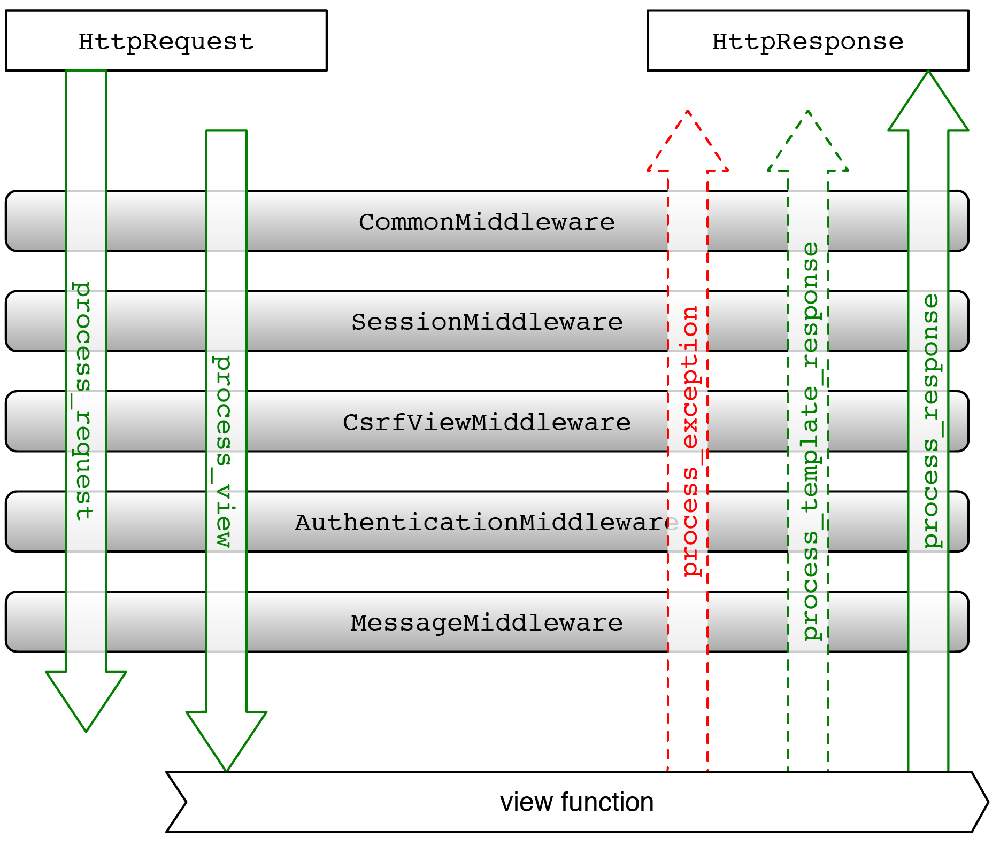

Middleware
==========
* Middleware is a framework of hooks into Django's request/response processing.
* It's a light, low-level "plugin" system for globally altering Django's input or output.
* A middleware factory is a callable that takes a ``get_response`` callable and returns a middleware.
* A middleware is a callable that takes a request and returns a response, just like a view.

Framework Architecture
----------------------

Request-Response flow
---------------------
.. figure:: img/django-request-response-flow.jpg

Example
-------
>>> class SimpleMiddleware:
...     def __init__(self, get_response):
...         self.get_response = get_response
...         # One-time configuration and initialization.
...
...     def __call__(self, request):
...         # Code to be executed for each request before
...         # the view (and later middleware) are called.
...
...         response = self.get_response(request)
...
...         # Code to be executed for each request/response after
...         # the view is called.
...
...         return response

The ``get_response`` callable provided by Django might be the actual view
(if this is the last listed middleware) or it might be the next middleware
in the chain. The current middleware doesn't need to know or care what
exactly it is, just that it represents whatever comes next.

By default, Django assumes that your middleware is capable of handling only
synchronous requests. To change these assumptions, set the following
attributes on your middleware factory function or class:

* ``sync_capable`` is a boolean indicating if the middleware can handle
  synchronous requests. Defaults to ``True``.

* ``async_capable`` is a boolean indicating if the middleware can handle
  asynchronous requests. Defaults to ``False``.

If your middleware has both ``sync_capable = True`` and
``async_capable = True``, then Django will pass it the request without
converting it. In this case, you can work out if your middleware will
receive async requests by checking if the get_response object you are passed
is a coroutine function, using ``asyncio.iscoroutinefunction()``.

The returned callable must match the sync or async nature of the
``get_response`` method. If you have an asynchronous ``get_response``,
you must return a coroutine function (``async def``).
