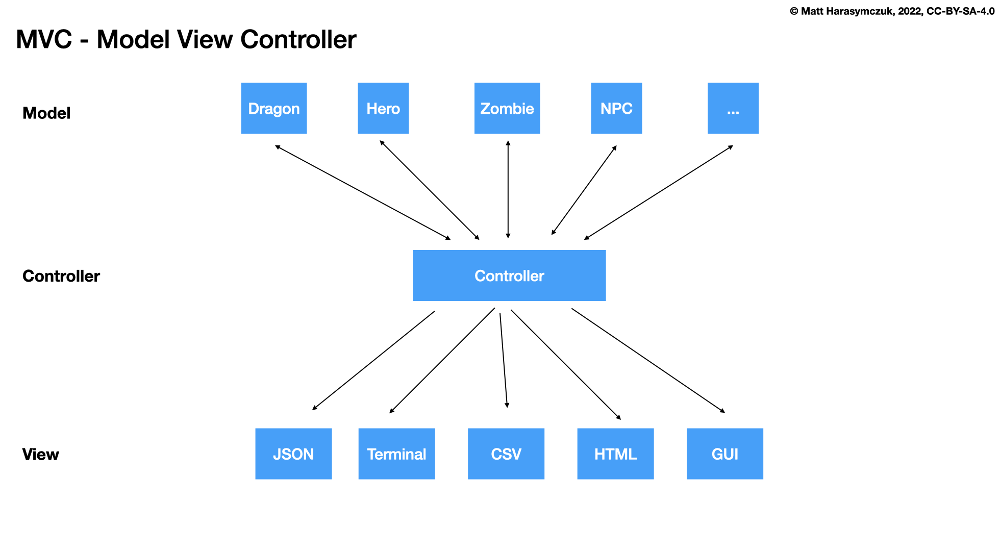
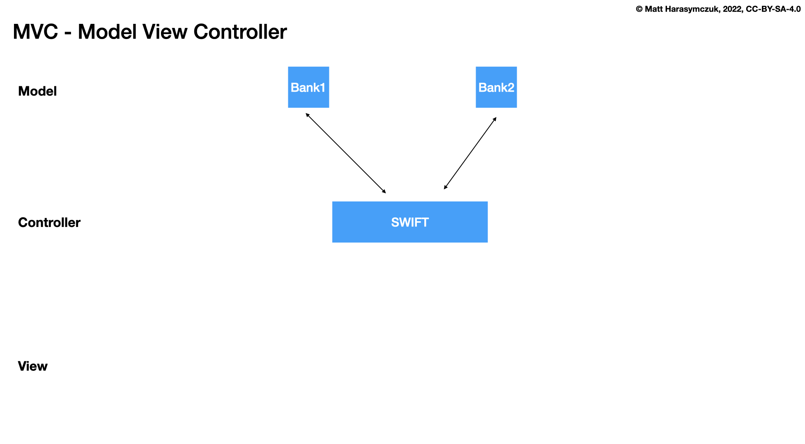

.. testsetup::

    # doctest: +SKIP_FILE

Dragon ADR Damage Make
======================
* ADR - Architecture Design Records

Problem
-------
* Dragon makes damage

Option 1
--------
>>> dragon.get_damage()

* Good: easy use
* Good: readability
* Good: clear intent
* Good: easy to add validation if needed
* Bad: name ``get_damage()`` indicate a getter of ``damage`` field
* Verdict: rejected, bad method name

Option 2
--------
>>> dragon.attack()  # dragon  -> enemy
>>> dragon.hit()     # dragon <-> enemy
>>> dragon.hurt()    # dragon <-  enemy
>>> dragon.damage()  # dragon <-  enemy
>>> dragon.wound()   # dragon <-  enemy

* Bad: Indication of direction is too weak ``dragon <-> enemy``
* Bad: not directed, all methods could mean making damage or receiving damage
* Verdict: rejected, bad method names

Rationale:

Some method names has stronger emphasis on who is making damage to whom.
Consider this: ``dragon.hurt()`` - is that dragon who makes damage or takes
damage?

.. code-block:: text

    dragon ---> enemy
    dragon -> enemy
    dragon <-> enemy
    dragon <- enemy
    dragon <--- enemy

Option 3
--------
>>> dragon.take_damage()    # dragon <--- enemy

* Good: Simple
* Bad: Relation is other way around ``dragon <--- enemy``
* Verdict: rejected, relation is other way around

Option 4
--------
>>> dragon.deal_damage()    # dragon ---> enemy
>>> dragon.hurt_someone()   # dragon ---> enemy

* Good: Strong indication of direction ``dragon ---> enemy``
* Bad: ``hurt_someone()`` method name is too use-case specific
* Verdict: rejected, method names are too use-case specific

Option 5
--------
>>> dragon.make_damage()    # dragon ---> enemy

* Good: Strong indication of direction ``dragon ---> enemy``
* Good: Name indicates intent
* Verdict: candidate

Option 6
--------
>>> dragon.damage(ENEMY)
>>> dragon.attack(ENEMY)
>>> dragon.hit(ENEMY)
>>> dragon.wound(ENEMY)
>>> dragon.make_damage(ENEMY)
>>> dragon.take_damage(ENEMY)

* Bad: violates Model-View-Controller (MVC)
* Bad: each ENEMY will get different (random) damage
* Verdict: rejected, violates Model-View-Controller (MVC)

Problem:

>>> class BankAccount:
...     def transfer(destination_account, amount):
...         self.withdraw(amount)
...         destination_account.deposit(amount)

* Bad: other bank of will not share their source code with you, to make a transfer

Option 6
--------
>>> hero.health -= dragon.damage()

* Good: simple
* Good: can use ``@property`` for validation if needed
* Bad: violates encapsulation
* Verdict: rejected, violates encapsulation

Option 7
--------
>>> hero.wound(dragon.hit())

* Bad: readability
* Bad: requires knowledge of API
* Bad: this is responsibility of a controller
* Verdict: rejected, violates Model-View-Controller (MVC)

Decision
--------
>>> dmg = dragon.make_damage()

* Good: clear intent
* Good: dragon ---> enemy
* Good: readability
* Good: encapsulation
