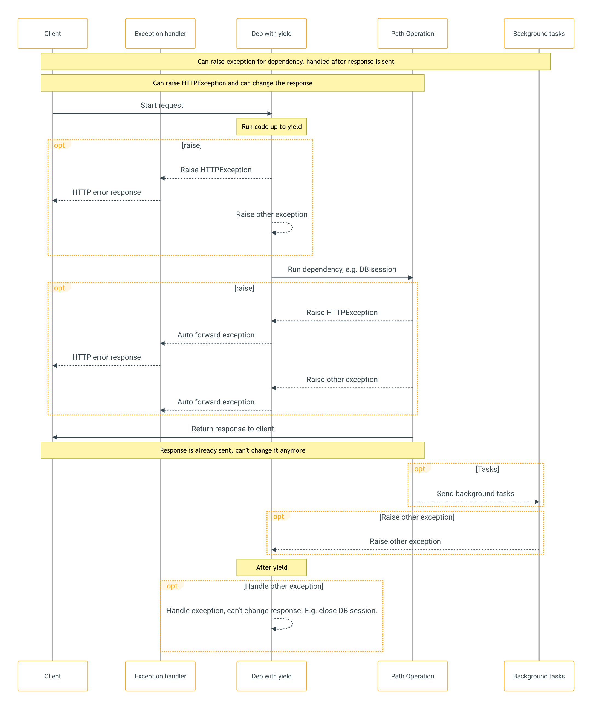

FastAPI Background Tasks
========================
* The class BackgroundTasks comes directly from starlette.background.
* It is imported/included directly into FastAPI so that you can import it from fastapi and avoid accidentally importing the alternative BackgroundTask (without the s at the end) from starlette.background.
* Background tasks are run after the response has been sent. So there's no way to raise an HTTPException because there's not even a way to change the response that is already sent.
* But if a background task creates a DB error, at least you can rollback or cleanly close the session in the dependency with yield, and maybe log the error or report it to a remote tracking system.
* Only one response will be sent to the client.
* After one of those responses is sent, no other response can be sent.

Example
-------
>>> from fastapi import BackgroundTasks, FastAPI
>>>
>>> app = FastAPI()
>>>
>>>
>>> def write_notification(email: str, message=""):
...     with open("log.txt", mode="w") as email_file:
...         content = f"notification for {email}: {message}"
...         email_file.write(content)
>>>
>>>
>>> @app.post("/send-notification/{email}")
... async def send_notification(email: str, background_tasks: BackgroundTasks):
...     background_tasks.add_task(write_notification, email, message="some notification")
...     return {"message": "Notification sent in the background"}

References
----------
* https://fastapi.tiangolo.com/tutorial/background-tasks/
