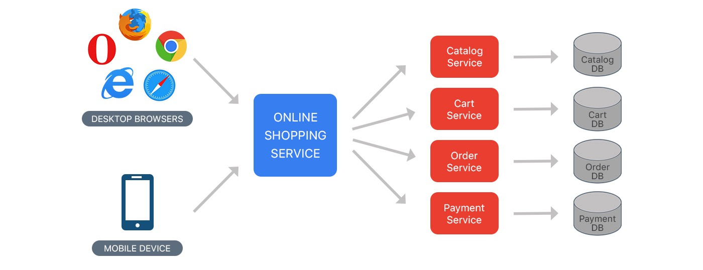

Microservices Architecture
==========================
* Duży próg wejścia
* Wymaga bardzo dobrego ekosystemu narzędziowego
* Wymaga automatyzacji
* Wymaga stworzenia i wdrożenia wielu różnych technologii
* Tworzenie technologii, które skalują się horyzontalnie
* Zmiana myślenia
* Wdrożenie ludzi
* Dla większości firm nie przynosi to korzyści (sic!)
* SOA zrobiona porządnie (wywalone tematy związane z Enterprise)

Monolithic architecture
-----------------------
* Build an application with a monolithic architecture
* a single Java ``.war`` or Python ``.pyz`` file
* a single directory hierarchy of Rails or NodeJS code

.. figure:: img/microservices-monolithic-application.jpg

    Monolithic architecture

.. figure:: img/microservices-architecture-monolith.jpeg

    Source: [#Haq2018]_

Microservices architecture
--------------------------
* Architect the application by applying the Scale Cube (specifically y-axis scaling) and functionally decompose the application into a set of collaborating services. Each service implements a set of narrowly, related functions. For example, an application might consist of services such as the order management service, the customer management service etc.
* Services communicate using either synchronous protocols such as HTTP/REST or asynchronous protocols such as AMQP.
* Services are developed and deployed independently of one another.
* Each service has its own database in order to be decoupled from other services. When necessary, consistency is between databases is maintained using either database replication mechanisms or application-level events.

.. figure:: img/microservices-architecture.jpg

    Microservices Architecture

    Source: [#Haq2018]_

CQRS - Command Query Responsibility Segregation
-----------------------------------------------
* Split the system into two parts.
* The command side handles create, update and delete requests.
* The query side handles queries using one or more materialized views of the application's data.

Further Reading
---------------
* https://medium.com/koderlabs/introduction-to-monolithic-architecture-and-microservices-architecture-b211a5955c63

References
----------
.. [#Haq2018] ul Haq, S. Introduction to Monolithic Architecture and MicroServices Architecture. Year: 2018. Retrieved: 2022-03-28. URL: https://medium.com/koderlabs/introduction-to-monolithic-architecture-and-microservices-architecture-b211a5955c63
