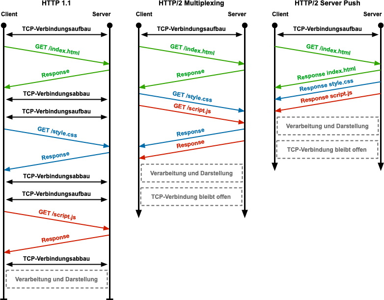

HTTP 2.0
========
* One TCP Connection
* Request -> Stream
* Streams are multiplexed
* Streams are prioritized
* Binary framing layer
* Flow control
* Server push
* Header compression

About
-----
.. figure:: img/http-http2-about.jpeg

    Difference between HTTP 1.0 vs 2.0 [#http2about]_

.. figure:: img/http-http2-flowdiagram.png

    HTTP 2.0 Flow Diagram [#http2flowdiagram]_

.. figure:: img/http-http2-pipelining.jpeg

    HTTP 2.0 Pipelining [#http2pipelining]_

.. figure:: img/http-http2-multiplexing.png

    HTTP 2.0 Multiplexing [#http2multiplexing]_

    HTTP 2.0 Push [#http2push]_

References
----------
.. [#http2about] https://coolicehost.com/images/http2-how-it-works.jpg
.. [#http2flowdiagram] https://user-images.githubusercontent.com/40616436/80909169-33493000-8d61-11ea-8386-985a3cac7f3b.png
.. [#http2pipelining] https://turbo.paulstamatiou.com/uploads/2007/07/http_pipelining.jpg
.. [#http2push] https://www.elektronik-kompendium.de/sites/net/bilder/18073111.png
.. [#http2multiplexing] https://blog.restcase.com/content/images/2018/01/http1-vs-http2-multiplexing.png
