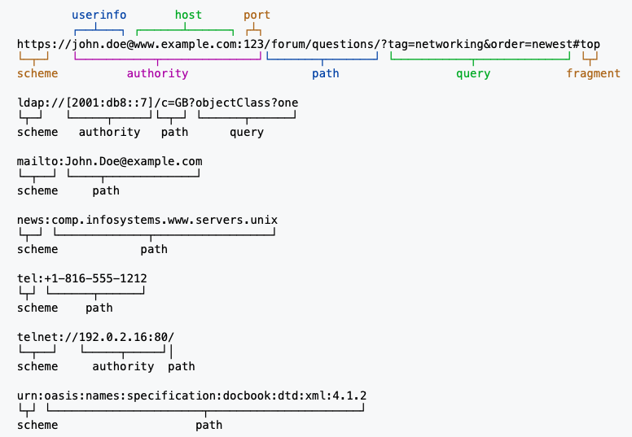

HTTP Identifier
===============
* URN - name (i.e. book title)
* URI - resource (i.e. one particular unit of book with that title)
* URL - location (i.e. where to get it)
* Locators are also identifiers, so every URL is also a URI
* There are URIs which are not URLs

Examples:

    Mark Watney

This is the name, which is an identifier. It is like a URI, but cannot be
a URL, as it tells you nothing about the location or how to contact Mark.
In this case it also happens to identify at least several other people
in the USA alone.  [#Pate2019]_

    Johnson Space Center Home, 1601 NASA Parkway, Houston, TX 77058-3145

This is a locator, which is an identifier for that physical location.
It is like both a URL and URI (since all URLs are URIs), and also
identifies me indirectly as "resident of..". That would uniquely identify
Marks location, if he was alone in that place. There is a lot of employees
at JSC. Although habitat on Mars could be URI an URL. [#Pate2019]_

I say "like" because these examples do not follow the required syntax.

URI
---
* URI - Uniform Resource Identifier
* URI - resource (i.e. one particular unit of book with that title)
* Example: ``https://example.com/path/resource.txt#fragment``
* Example: ``//example.com/path/resource.txt``
* Example: ``/path/resource.txt``
* Example: ``path/resource.txt``
* Example: ``../resource.txt``
* Example: ``./resource.txt``
* Example: ``resource.txt``
* Example: ``#fragment``

A Uniform Resource Identifier (URI) is a unique sequence of characters
that identifies a logical or physical resource used by web technologies.

URIs may be used to identify anything, including real-world objects, such
as people and places, concepts, or information resources such as web pages
and books. Some URIs provide a means of locating and retrieving information
resources on a network (either on the Internet or on another private
network, such as a computer filesystem or an Intranet), these are Uniform
Resource Locators (URLs). Other URIs provide only a unique name, without
a means of locating or retrieving the resource or information about it,
these are Uniform Resource Names (URNs). The web technologies that use URIs
are not limited to web browsers. URIs are used to identify anything described
using the Resource Description Framework (RDF), for example, concepts that
are part of an ontology defined using the Web Ontology Language (OWL), and
people who are described using the Friend of a Friend vocabulary would each
have an individual URI. [#WikipediaURI]_

Example:

    * ``https://example.com/path/resource.txt#fragment``
    * ``//example.com/path/resource.txt``
    * ``/path/resource.txt``
    * ``path/resource.txt``
    * ``../resource.txt``
    * ``./resource.txt``
    * ``resource.txt``
    * ``#fragment``

URN
---
* URN - Uniform Resource Name
* URN - name (i.e. book title)
* It says what is it, but not where to get it
* Example: ``urn:isbn:9788395718625`` - Python3: from None to Machine Learning book, identified by its book number.
* Example: ``urn:ISSN:0167-6423`` - The scientific journal Science of Computer Programming, identified by its serial number.
* Example: ``urn:uuid:6e8bc430-9c3a-11d9-9669-0800200c9a66`` - A version 1 UUID.

A Uniform Resource Name (URN) is a Uniform Resource Identifier (URI) that
uses the urn scheme.

URNs are globally unique persistent identifiers assigned within defined
namespaces so they will be available for a long period of time, even after
the resource which they identify ceases to exist or becomes unavailable.
URNs cannot be used to directly locate an item and need not be resolvable,
as they are simply templates that another parser may use to find an item
[#WikipediaURN]_.

Examples:

    * ``urn:isbn:9788395718625`` - Python3: from None to Machine Learning book, identified by its book number.
    * ``urn:ISSN:0167-6423`` - The scientific journal Science of Computer Programming, identified by its serial number.
    * ``urn:uuid:6e8bc430-9c3a-11d9-9669-0800200c9a66`` - A version 1 UUID.

It says what is it, but not where to get it.

URL
---
* URL - Uniform Resource Locator
* URL - location (i.e. where to get it)
* Example: ``https://john.doe@www.example.com:123/forum/questions/?tag=networking&order=newest#top``
* Example: ``ldap://[2001:db8::7]/c=GB?objectClass?one``
* Example: ``mailto:John.Doe@example.com``
* Example: ``news:comp.infosystems.www.servers.unix``
* Example: ``tel:+1-816-555-1212``
* Example: ``telnet://192.0.2.16:80/``
* Example: ``urn:oasis:names:specification:docbook:dtd:xml:4.1.2``

A Uniform Resource Locator (URL), colloquially termed a web address,
is a reference to a web resource that specifies its location on a computer
network and a mechanism for retrieving it. A URL is a specific type of
Uniform Resource Identifier (URI), although many people use the two terms
interchangeably. URLs occur most commonly to reference web pages (http),
but are also used for file transfer (ftp), email (mailto), database access
(JDBC), and many other applications. Most web browsers display the URL of
a web page above the page in an address bar. A typical URL could have the
form http://www.example.com/index.html, which indicates a protocol (http),
a hostname (www.example.com), and a file name (index.html). [#WikipediaURL]_

Example:

    * ``https://john.doe@www.example.com:123/forum/questions/?tag=networking&order=newest#top``
    * ``ldap://[2001:db8::7]/c=GB?objectClass?one``
    * ``mailto:John.Doe@example.com``
    * ``news:comp.infosystems.www.servers.unix``
    * ``tel:+1-816-555-1212``
    * ``telnet://192.0.2.16:80/``
    * ``urn:oasis:names:specification:docbook:dtd:xml:4.1.2``

.. figure:: img/http-identifiers-url.png

References
----------
.. [#WikipediaURL] https://en.wikipedia.org/wiki/URL
.. [#WikipediaURN] https://en.wikipedia.org/wiki/Uniform_Resource_Name
.. [#WikipediaURI] https://en.wikipedia.org/wiki/Uniform_Resource_Identifier
.. [#Pate2019] Pate, R. What is the difference between a URI, a URL and a URN? Year: 2019. Retrieved: 2019-05-22. URL: https://stackoverflow.com/questions/176264/what-is-the-difference-between-a-uri-a-url-and-a-urn
