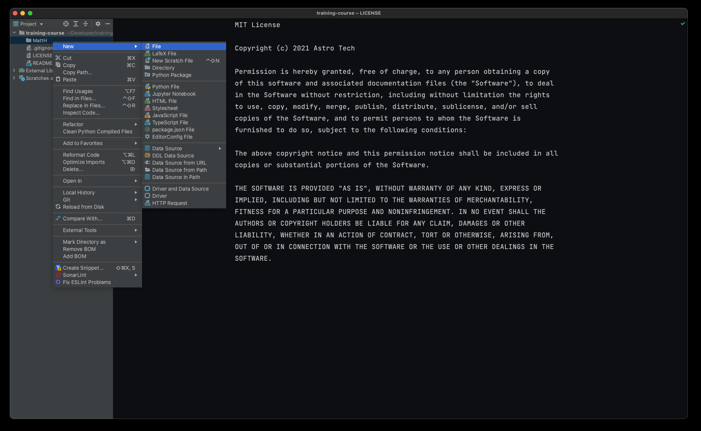
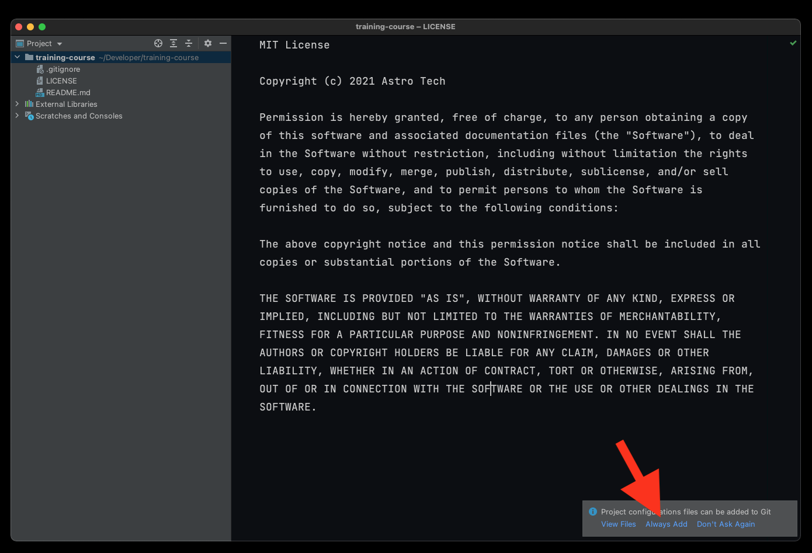
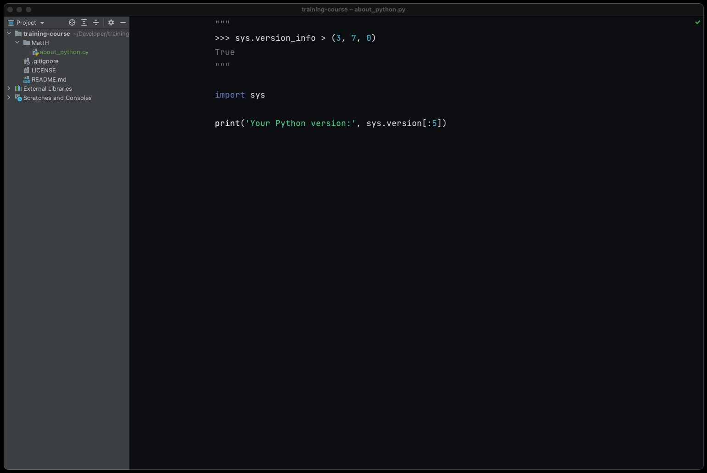
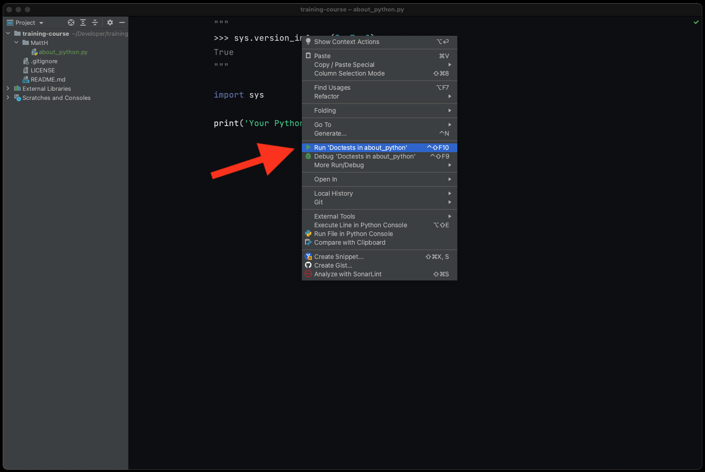
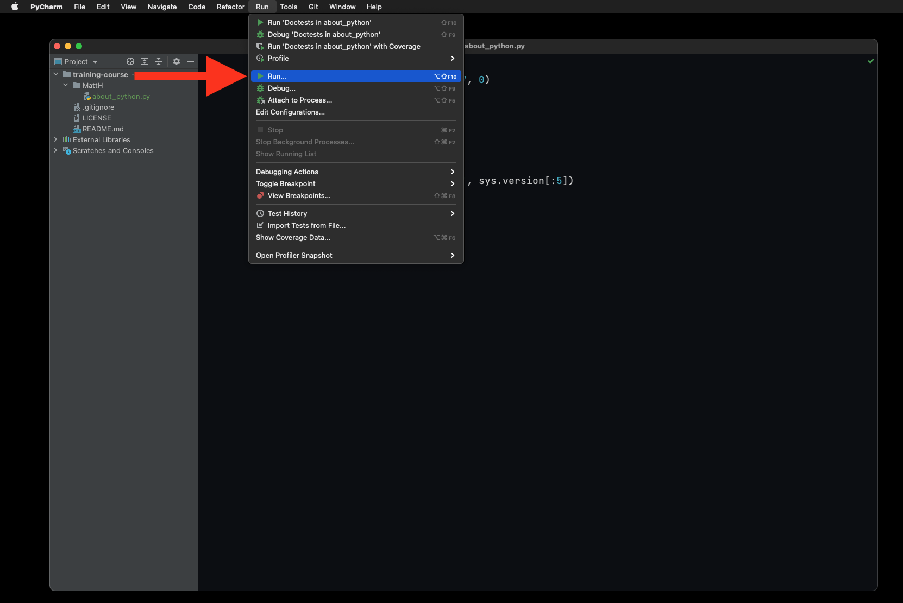
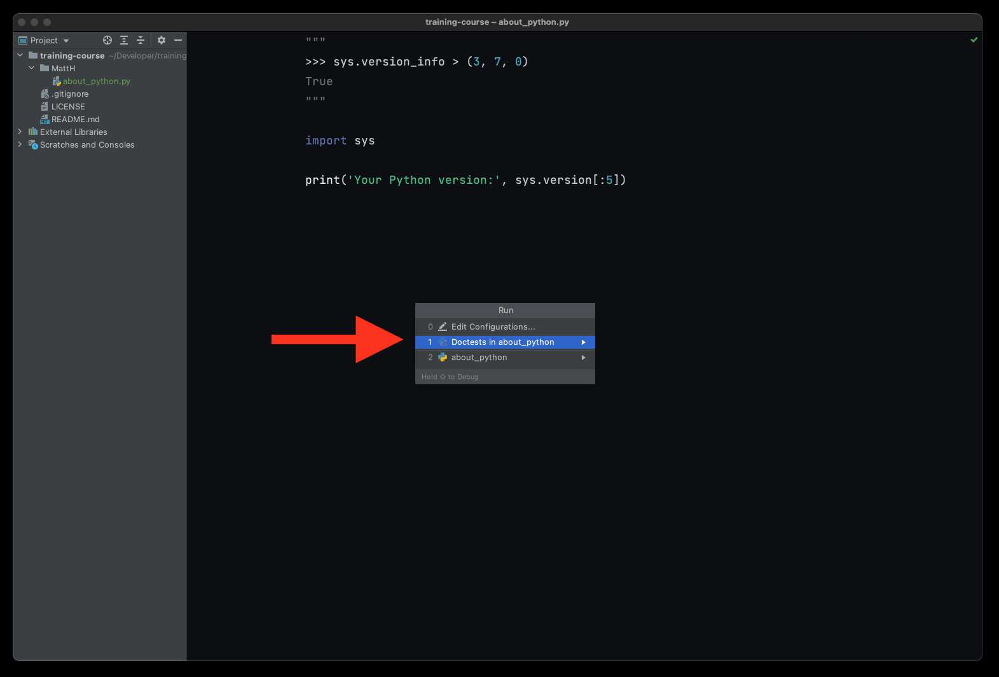
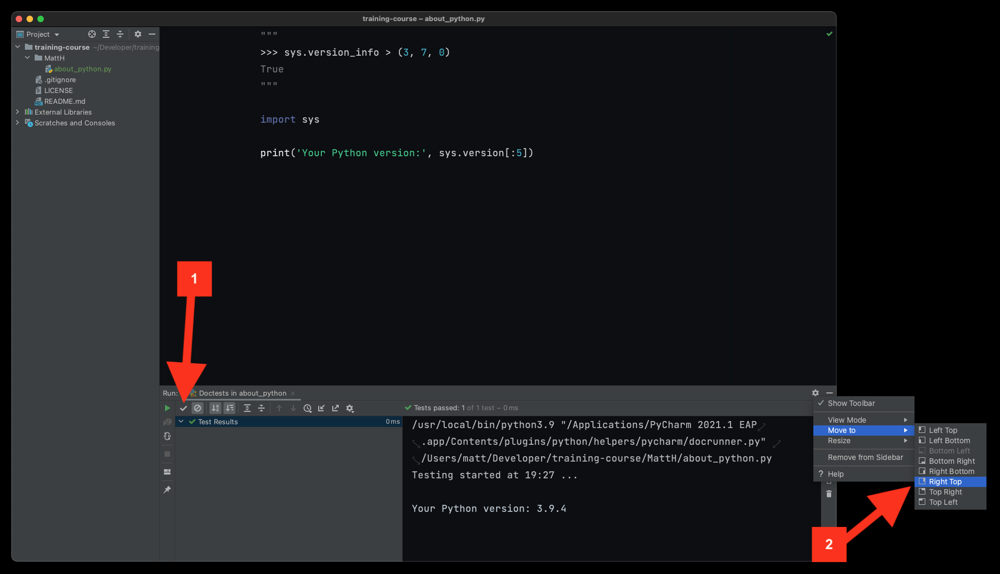

Install Doctest
===============

Polish
------
Doctest to mechanizm uruchamiania testów w Pythonie. Pozwala na weryfikację
poprawności kodu. Wszystkie listingi w tych materiałach, a także wszystkie
zadania do samodzielnego rozwiązania wykorzystują ten mechanizm.

Składnią doctesty przypominają sesję Pythona w konsoli. Każda z linii kodu
zaczyna się od ``>>>``. Ewentualnie linie mogą zaczynać się od ``...``
jeżeli są kontynuacją poprzedniej linii. Linie poniżej wyświetlają
oczekiwany wynik. Doctesty muszą znajdować się w pierwszym wieloliniowym
ciągu znaków w pliku, funkcji lub klasie. Przykład:

    .. code-block:: python

        """
        >>> x = 1
        >>> y = 2
        >>> x + y
        3
        """

1. W swoim katalogu stwórz plik ``about_python.py``:

    a. Kliknij prawym klawiszem myszy na swój katalog
    b. Z menu wybierz `New` a następnie `File`
    c. W okienku, które wyskoczy wpisz ``about_python.py``
    d. Jeżeli pojawi się pytanie czy dodać plik do repozytorium GIT,
       zaznacz checkbox `Always add` i wybierz `Yes`

2. Skopiuj treść następującego listingu do swojego kodu:

    .. code-block:: python

        """
        >>> sys.tracebacklimit = 0
        >>> assert sys.version_info > (3, 8, 0), \
        'Python 3.8+ is required'
        """

        import sys

        print('Your Python version:', sys.version[:5])

    a. Upewnij się, że skopiowałeś/aś również trzy znaki cudzysłowu
       ``"""`` na początku i końcu doctest - to ważne
    b. Sprawdź czy tło testów zmieniło kolor na żółty lub zielony w zależności
       od schematu kolorystycznego PyCharm

3. Aby uruchomić doctest, kliknij prawym klawiszem myszy na którejś z linii
   doctest i wybierz `Run 'Doctests in about_python'`

4. Alternatywnie możesz uruchomić doctest, przez wybranie z górnego menu
   -> `Run` -> `Run...` -> `Doctest in about_python`

5. Test musi przechodzić (tzn. być na zielono):

    a. Po lewej stronie jest haczyk (ptaszek) `Show Passed` [1] - zaznacz go
    b. Po prawej stronie kliknij na ikonę trybiku -> `Move to` -> `Right Top`

6. Panel doctestów powinien otworzyć się po prawej:

    a. Wyniki doctestów są w panelu po prawej stronie u góry [1]
    b. W treści pliku powinien być napis ``Your Python version: ...``
    c. Przepisz numer wersji (cyfry rozdzielone kropkami) do arkusza
       kalkulacyjnego w sekcji nagłówkowej

7. Zapisz `100%` we współdzielonym arkuszu kalkulacyjnym w wierszu zadania

Figure
------

.. figure:: img/install-doctest-6.png
