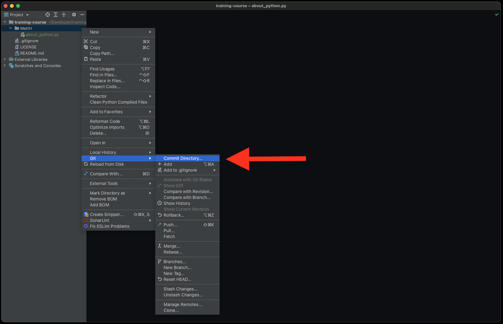
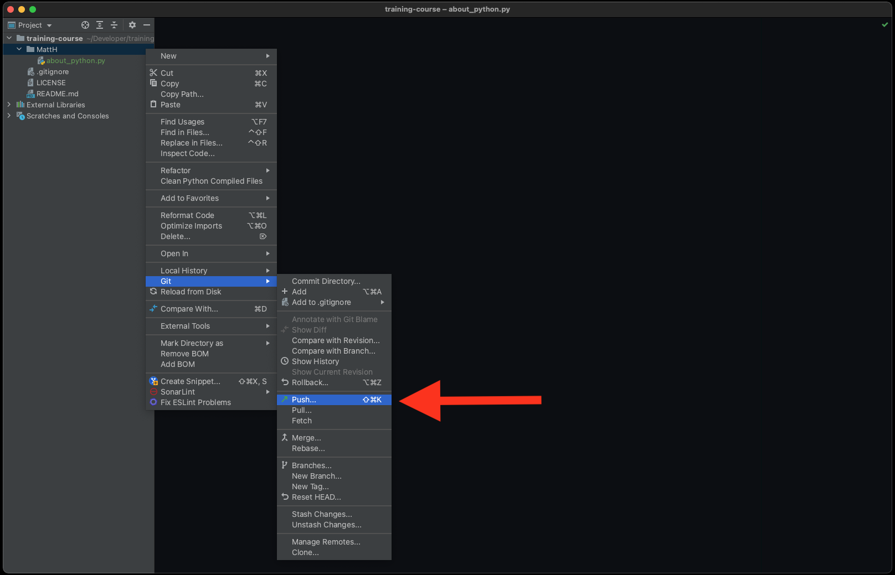
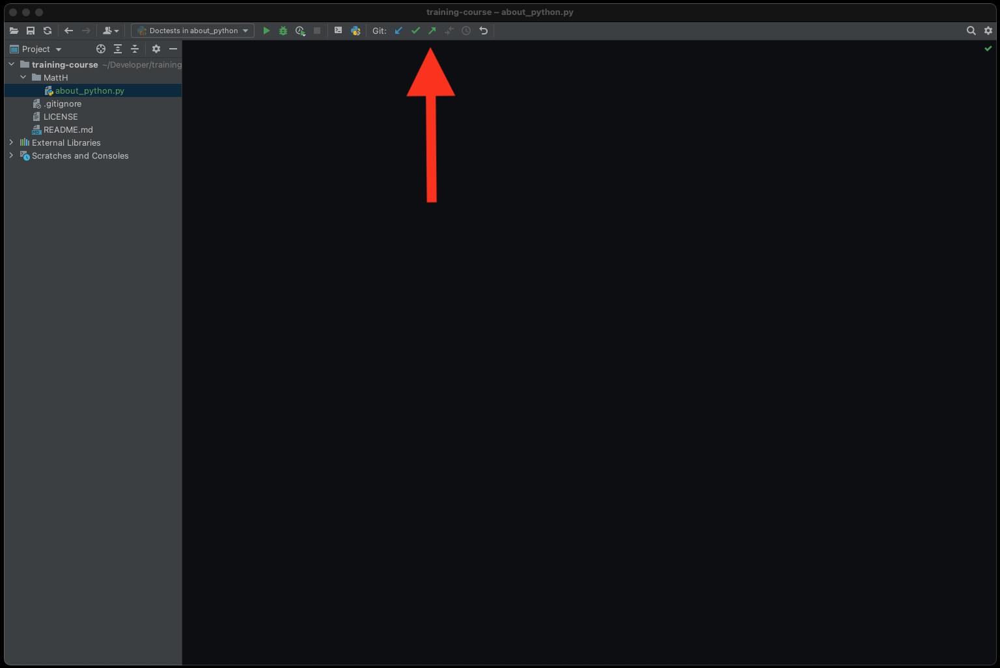
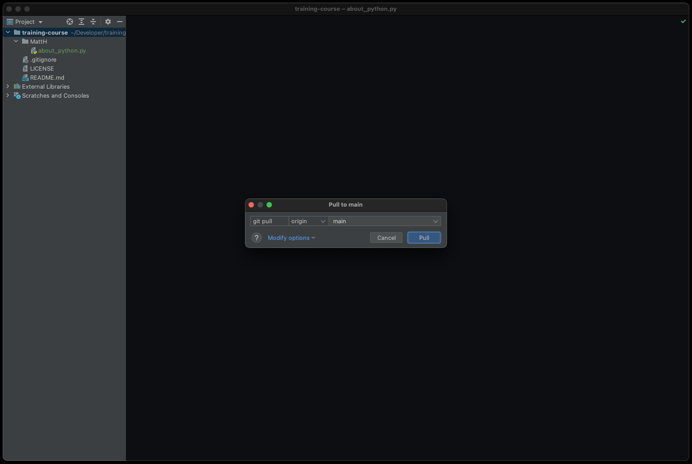
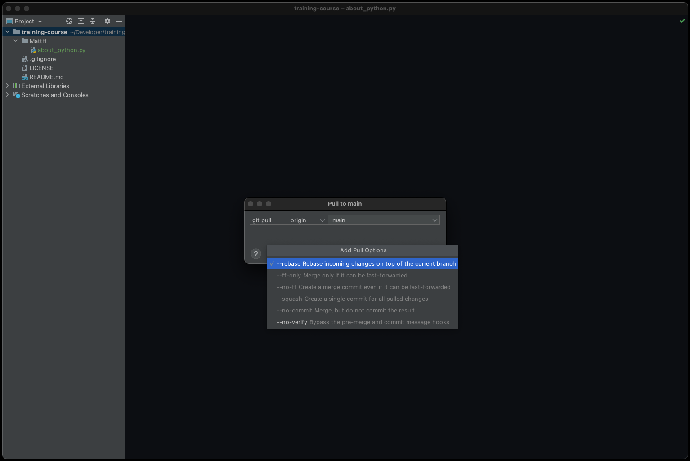
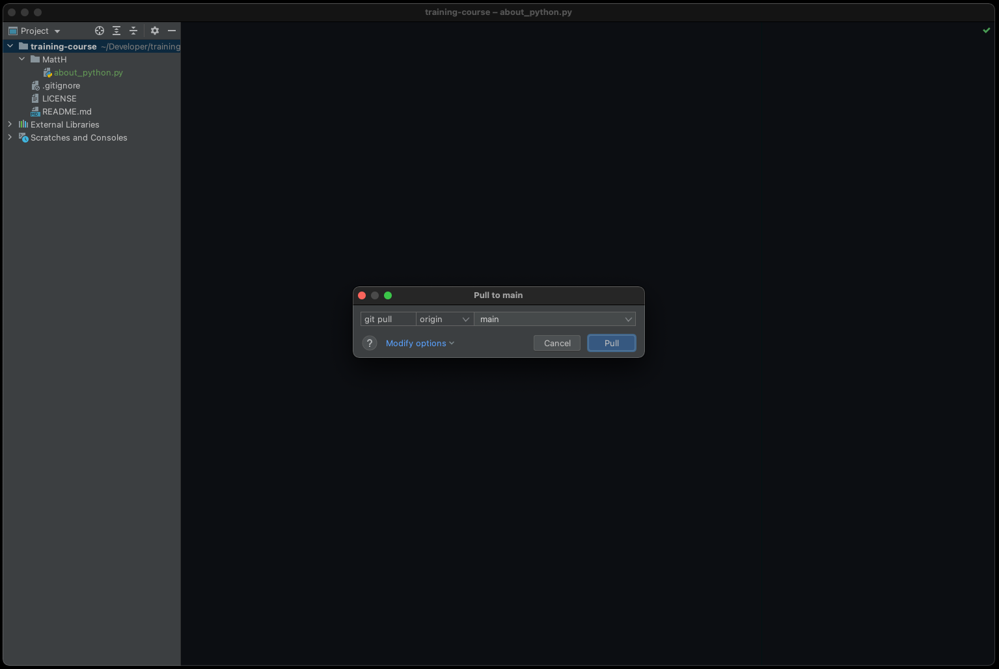

Install Git
===========

Polish
------
Git `commit` służy do zapisywania Twojej obecnej pracy na Twoim komputerze.
Aby upublicznić zmiany w repozytorium na Github, konieczne będzie zrobienie
tzw. `push`.

1. Zapisywanie zmian (``git add``):

    a. Kliknij prawym klawiszem na nazwę projektu (w panelu po lewej stronie)
       -> `Git` -> `Commit Directory`
    b. Ewentualnie w menu u góry jest ikona haczyka (ptaszek) - `git commit`
    c. Ewentualnie użyj skrótu klawiszowego: `ctrl+k` na Windows i Linux,
       lub `cmd+k` na macOS

2. Na ekranie zapisywania zmian (``git commit``):

    a. Upewnij się, że wybrany jest tylko jeden plik [1]
    b. Upewnij się, że treść pliku (diff) jest odpowiedni [2]
    c. Wpisz swoje imie jako `Commit Message` [3]
    d. Kliknij przycisk `Commit and Push...` [4] - ważne
    e. Po dziesięciu sekundach zmiany powinny być zapisane i wypchnięte
       (powiadomi Cię o tym komunikat w prawym dolnym rogu - `Push successful`)

3. Wypchnięcie zmian na Github (``git push``) - ten krok jest potrzebny
   tylko, jeżeli wcześniej wciśnięto przycisk `Commit` (bez push):

    a. Kliknij prawym klawiszem na nazwę projektu (w panelu po lewej stronie)
       -> `Git` -> `Push...`
    b. Ewentualnie w menu u góry jest ikona strzałki w górę - `git push`
    c. Ewentualnie użyj skrótu klawiszowego: `ctrl+shift+k` na Windows i Linux,
       lub `cmd+shift+k` na macOS
    d. Po dziesięciu sekundach zmiany powinny być zapisane i wypchnięte
       (powiadomi Cię o tym komunikat w prawym dolnym rogu -
       `Pushed 1 commit to origin/master`)

4. Ściągnięcie zmian z Github (``git pull``):

    a. Kliknij prawym klawiszem na nazwę projektu (w panelu po lewej stronie)
       -> `Git` -> `Pull...`
    b. Ewentualnie w menu u góry jest ikona strzałki w dół - `git pull`
    c. W okienku `Pull to main` wybierz `Modify options`
    d. Z opcji wybierz ``--rebase``
    e. Wciśnij przycisk `Pull` aby ściągnąć zmiany z Github
    f. Po dziesięciu sekundach zmiany powinny być pobrane (komunikat w prawym
       dolnym rogu - `Project is up-to-date`)

5. Sprawdzić Github czy:

    a. Pojawił się Twój katalog
    b. Czy zawiera zmiany, które zapisałeś/aś przed chwilą

6. Zapisz `100%` we arkuszu zadań w wierszu z tym zadaniem

Figures
-------

.. figure:: img/install-git-1b.png
.. figure:: img/install-git-2.png

.. figure:: img/install-git-4a.png
.. figure:: img/install-git-4b.png

