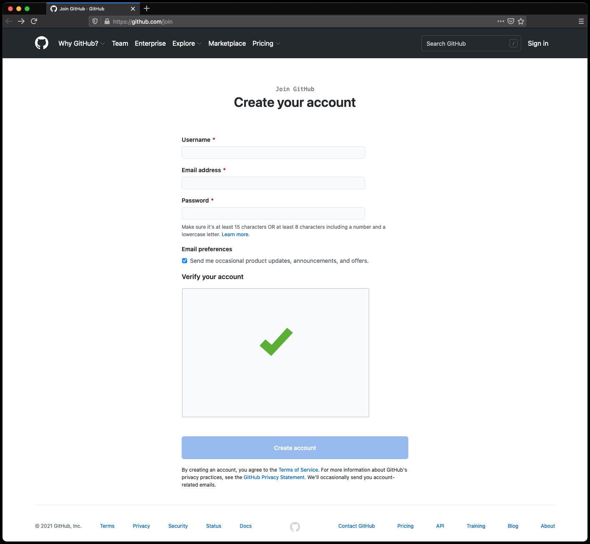

Install Github
==============

Polish
------
Github jest najpopularniejszym na świecie miejscem wymiany kodu źródłowego.
Serwis od 2018 roku Github należy do Microsoft [#MicrosoftAcquireGithub]_.
Język Python, Kernel Linuxa oraz wiele projektów open source, np. .NET,
Swift, Django są rozwijane na Github. Założenie i posiadanie konta jest
darmowe. Będzie konieczne do sprawnego przeprowadzenia szkolenia.
W trakcie rejestracji konieczne będzie podanie adresu email (użyj
prywatnego lub firmowego). Maila będzie trzeba zweryfikować klikając
w link aktywacyjny.

1. Jeżeli nie masz konta na Github to proszę załóż je [#GithubJoin]_
2. Wpisz swój username z Github w arkuszu kalkulacyjnym zadań
3. Zaczekaj aż trener nada Ci uprawnienia do repozytorium
4. Wejdź na swojego maila i zaakceptuj zaproszenie do repozytorium
5. Sprawdź czy na głównej stronie repozytorium widać pliki
6. Zapisz `100%` we arkuszu zadań w wierszu z tym zadaniem

Figures
-------

References
----------
.. [#MicrosoftAcquireGithub] Microsoft News Center. Microsoft to acquire GitHub for $7.5 billion. Year: 2018. Retrieved: 2021-04-19. URL: https://news.microsoft.com/2018/06/04/microsoft-to-acquire-github-for-7-5-billion/
.. [#GithubJoin] Github. Join Github. Year: 2021. Retrieved: 2021-04-19. URL: https://github.com/join
