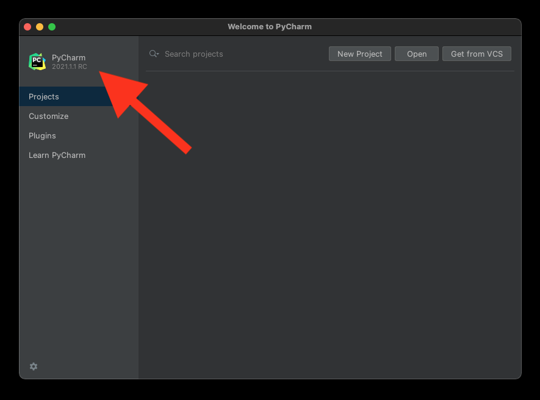
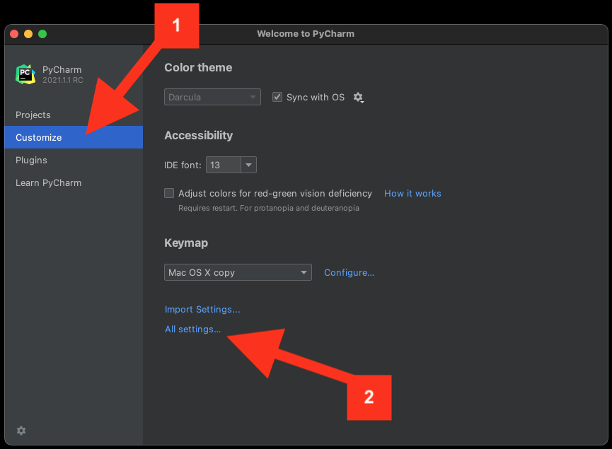
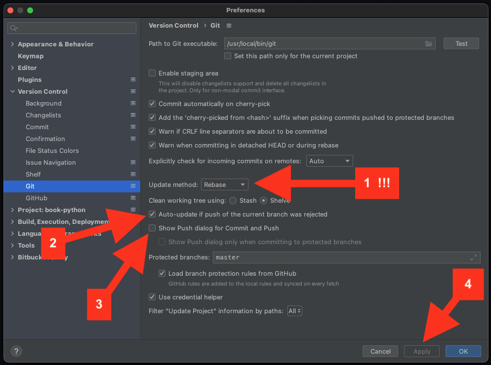
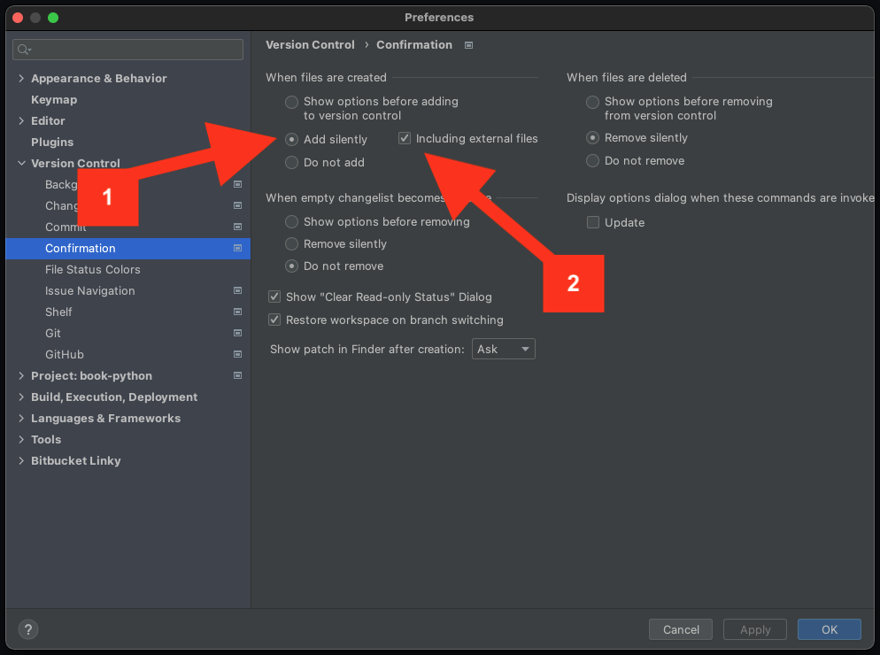

Install IDE
===========

Polish
------
PyCharm jest środowiskiem programistycznym (IDE), w którym będziemy
programować. Podczas szkolenia trener będzie korzystał tylko z tego IDE. Nie
będzie czasu na rozwiązywanie problemów z innymi środowiskami
programistycznymi, więc proszę o instalację PyCharm w najnowszej dostępnej
wersji. Bez znaczenia czy Community czy Professional. Wersja Professional jest
płatna i ma więcej funkcjonalności (np. debugger JavaScript). Ale nie będziemy
z nich korzystać podczas szkolenia. Wersja Community w zupełności nam
wystarczy.

0. Uruchom PyCharm:

    a. Jeżeli nie masz PyCharm to ściągnij go i zainstaluj [#DownloadPyCharm]_
    b. Na chwilę obecną nie twórz projektu
    c. Jeżeli projekt stworzył/otworzył Ci się automatycznie, to
       zamknij go `File -> Close Project in Current Window`

1. W arkuszu zadań zapisz wersję PyCharm z której korzystasz:

    a. Na ekranie głównym w lewym górnym rogu jest numer wersji PyCharm
    b. Format zapisu, np. `2021.1 CE` lub `2021.1 PRO` itp.
    c. `CE` - Community Edition
    d. `PRO` - Professional

2. W lewym menu przejdź na zakładkę `Customize` i następnie `All settings`

3. W menu po lewej wybierz `Version Control` a następnie `Git`:

    a. Zmień `Update Method` na `Rebase` (to jest bardzo ważne)
    b. Zaznacz: `Auto-update if push of the current branch was rejected`
    c. Odznacz: `Show Push dialog for Commit and Push`
    d. Upewnij się dwa razy, że `Update Method` jest `Rebase`
    e. Kliknij: `Apply` aby zapisać zmiany

4. W menu po lewej wybierz `Version Control` a następnie `Confirmation`:

    a. W sekcji `When files are created`
    b. Zaznacz `Add silently`
    c. Zaznacz `Include external files`

5. Zapisz `100%` we arkuszu zadań w wierszu z tym zadaniem

Figures
-------

References
----------
.. [#DownloadPyCharm] JetBrains. Download PyCharm. Year: 2021. Retrieved: 2021-04-19. URL: https://www.jetbrains.com/pycharm/download/
