Install Project
===============

Polish
------
Repozytorium posłuży nam do wymiany kodu źródłowego. Trener będzie w nim
umieszczał treści ćwiczeń do samodzielnego wykonania podczas szkolenia. Twoim
zadaniem będzie zapisywanie zmian z rozwiązaniami do zadań. Podczas szkolenia
mie będziemy pracowali na gałęziach! Wszyscy uczestnicy będą wrzucali kod do
jednego brancha do swoich katalogów. Dzięki oddzielnym katalogom dla każdego
uczestnika unikniemy konfliktów w Git. Do końca szkolenia jedynie w tym
katalogu będziesz tworzył/tworzyła rozwiązania do wszystkich zadań.

0. Jeżeli nie masz Git to proszę zainstaluj go [#DownloadGit]_

1. Stwórz projekt w Twoim IDE wykorzystując opcję:

    a. `Get from VCS` dla PyCharm 2020.3 lub nowszego
    b. `Get from Version Control` dla wcześniejszych wersji PyCharm

2. W oknie `Get from Version Control` wpisz:

    a. W polu `URL` wklej link do repozytorium z Github [1]
    b. Upewnij się, że adres rozpoczyna się na ``https://github.com/``
    c. Upewnij się, że na końcu adresu jest ``.git``
    d. Sprawdź, czy katalog w polu `Directory` jest tym, w którym chcesz mieć
       projekt - w tym miejscu będziemy przechowywać kod źródłowy [2]
    e. Kliknij `Clone` i zaczekaj na pobranie repozytorium [3]

3. Autoryzacja do `Github`:

    a. Jeżeli zostaniesz zapytany o autoryzację wybierz "Use Token..."
    b. Powinno Cię przekierować na stronę Github:
       https://github.com/settings/tokens/new
    c. Wszystkie opcje powinny być zaznaczone prawidłowo - nic nie zmieniaj
    d. Na dole strony kliknij `Generate token` i zaakceptuj formularz
    e. Skopiuj token poprzez kliknięcie ikony kopiowania
    f. Wklej token do PyCharm w oknie w polu `Token`
    g. Zwróć uwagę, by nie skopiować spacji na końcu tokena (częsty błąd)

4. Po kilkunastu sekundach w PyCharm powinien otworzyć się projekt

5. Po założeniu projektu załóż w nim swój katalog, w którym będziesz
   przechowywać rozwiązania do wszystkich zadań podczas szkolenia:

    a. Kliknij prawym klawiszem myszy na nazwę projektu (prawy górny róg)
    b. Wybierz `New` -> `Directory`
    c. Katalog ma mieć nazwę jak Twoje imie i pierwsza litera nazwiska,
       np. `JanT`, `MarkW` lub `MelissaL`
    d. Nie używaj żadnych białych znaków (spacji)
    e. Nie używaj żadnych innych znaków specjalnych
    f. Nie używaj żadnych akcentów, znaków diakrytycznych itp.

6. Nazwa katalogu powinna być taka jak nazwa Twojej kolumny we
   współdzielonym arkuszu kalkulacyjnym z wynikami zadań

7. Zapisz `100%` we arkuszu zadań w wierszu z tym zadaniem

Figures
-------
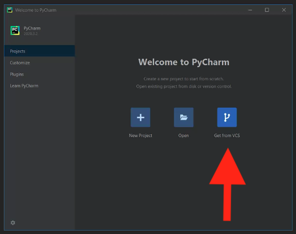
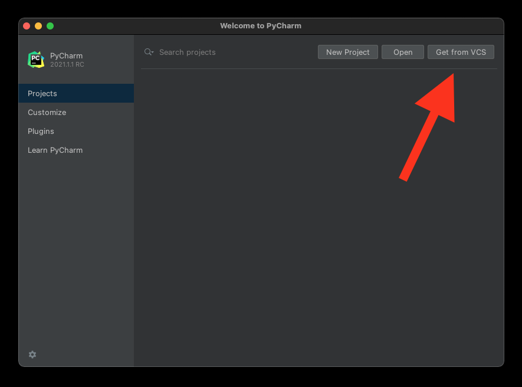
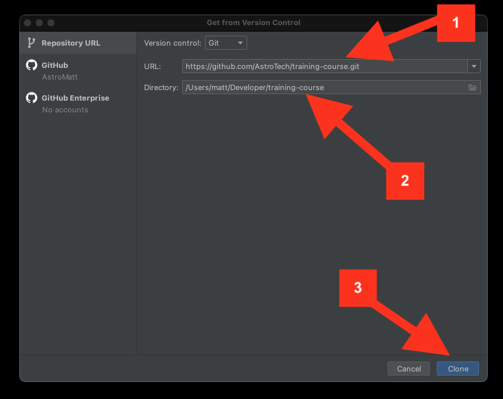
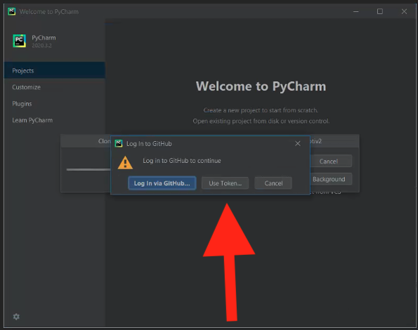
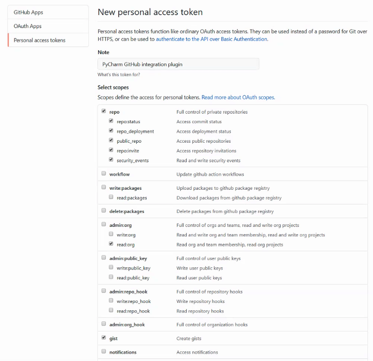
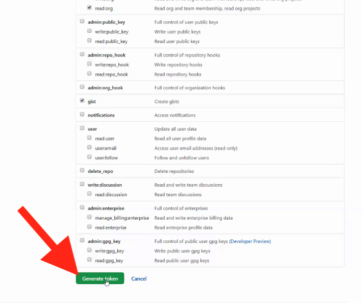
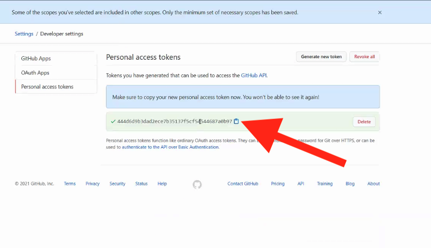
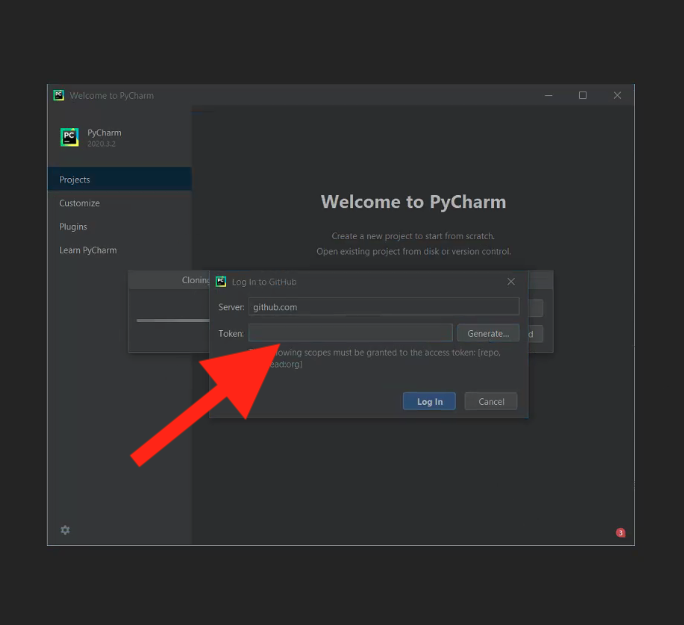
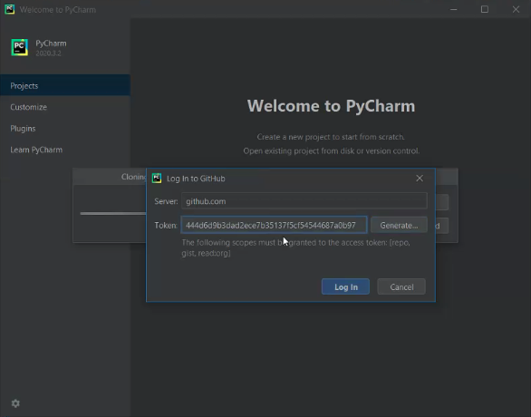
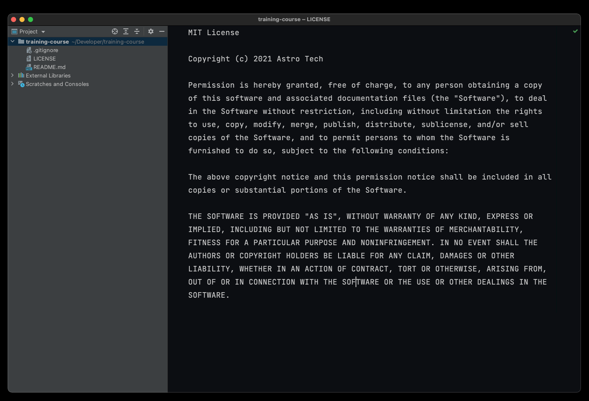
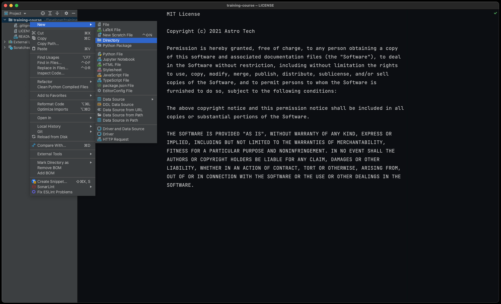
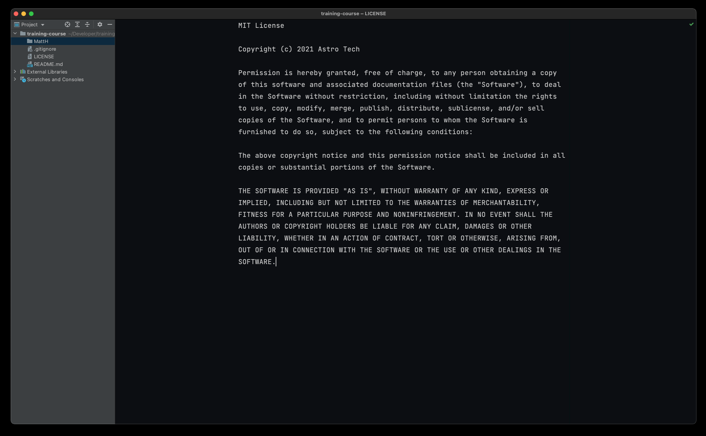

References
----------
.. [#DownloadGit] Download Git. Year: 2021. Retrieved: 2021-04-19. URL: https://git-scm.com/download
