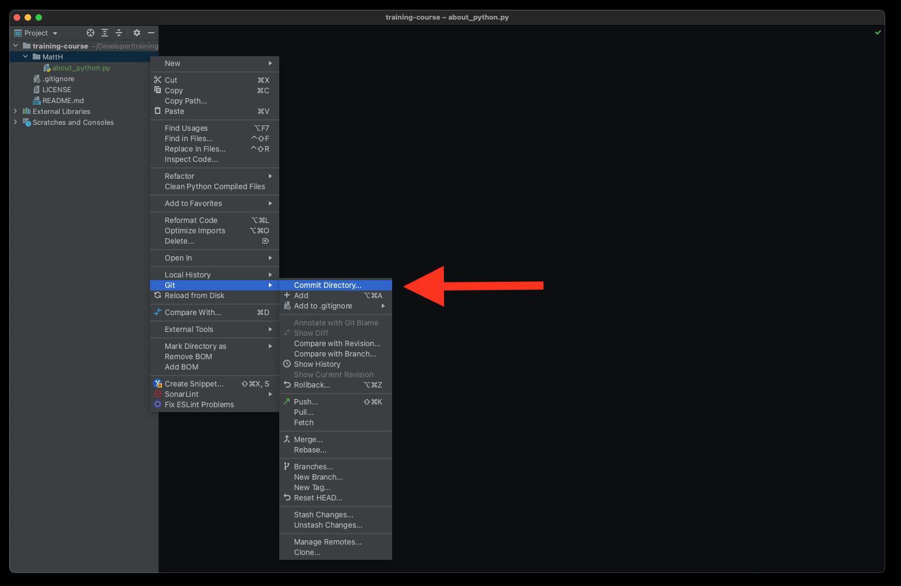
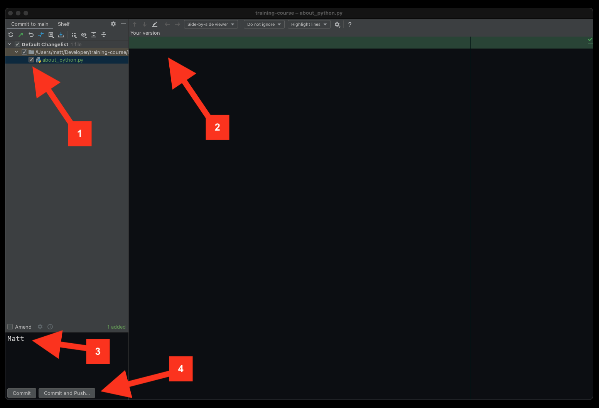
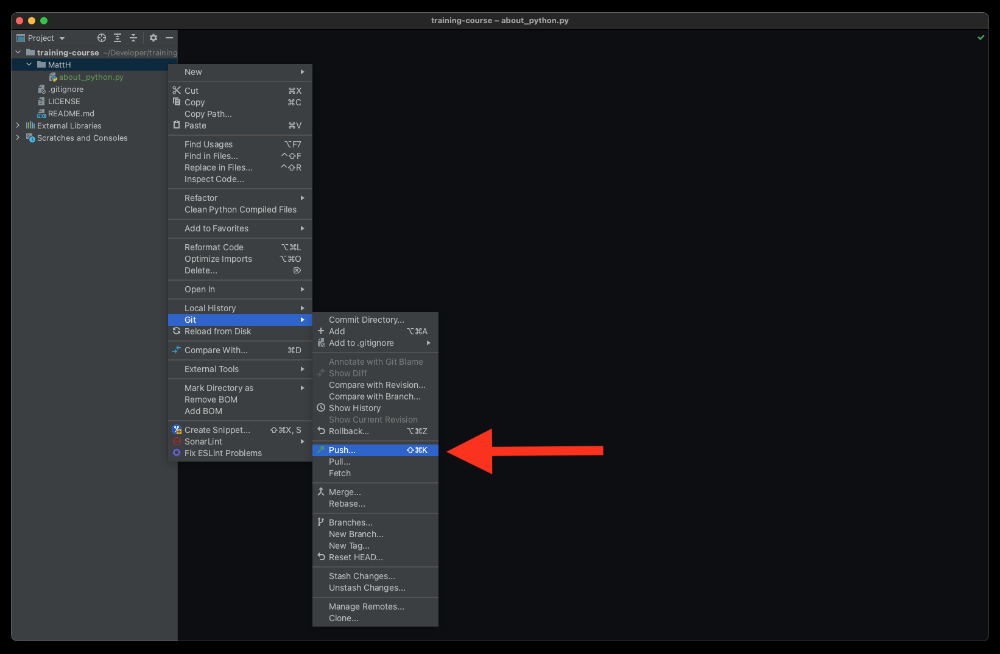
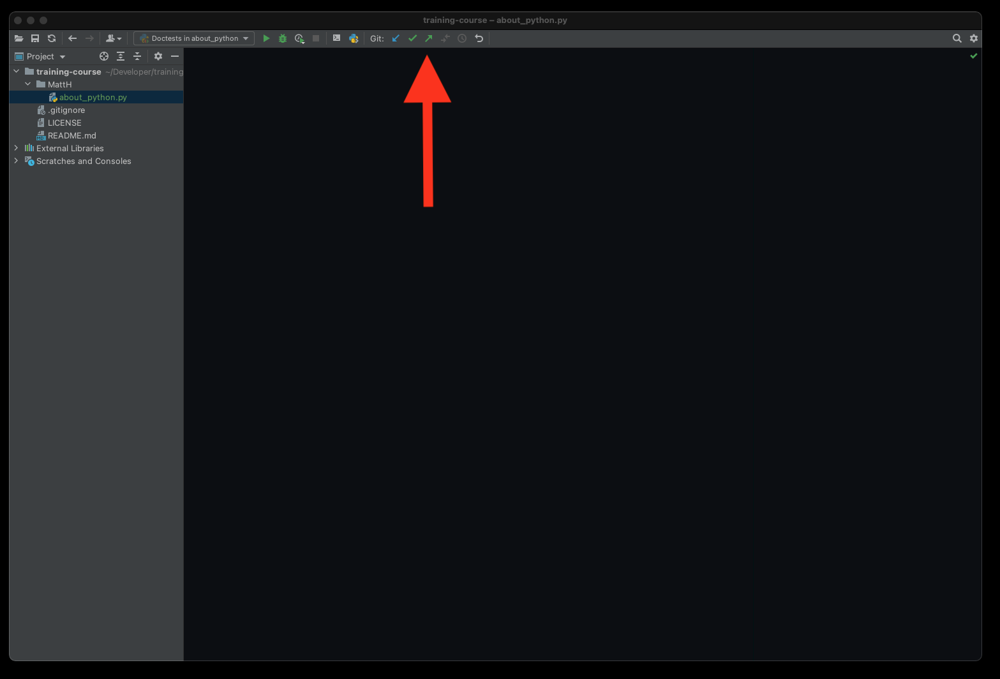
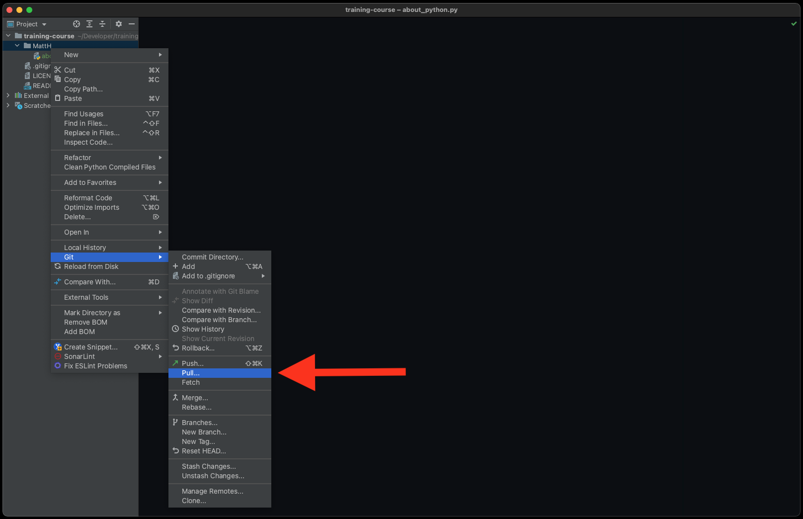
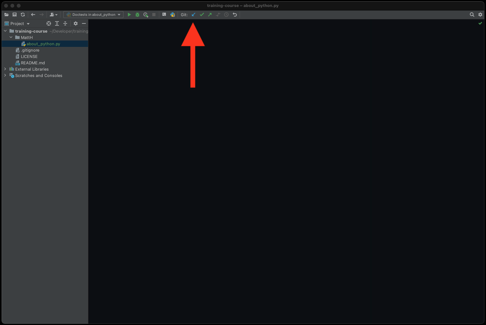
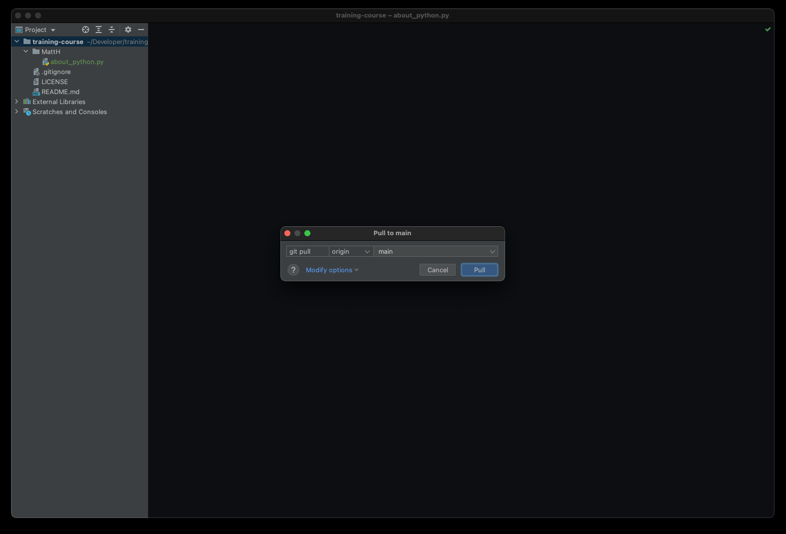

Install Push
============

Polish
------
Git `commit` służy do zapisywania Twojej obecnej pracy na Twoim komputerze.
Aby upublicznić zmiany w repozytorium na Github, konieczne będzie zrobienie
tzw. `push`.

1. Aby zrobić `git commit`:

    a. Kliknij prawym klawiszem na nazwę projektu (w panelu po lewej stronie)
       -> `Git` -> `Commit Directory`
    b. Ewentualnie w menu u góry jest znaczek (ptaszek) - `git commit`
    c. Ewentualnie użyj skrótu klawiszowego: `ctrl+k` na Windows i Linux,
       lub `cmd+k` na macOS

2. Na ekranie zapisywania zmian:

    a. Upewnij się, że wybrany jest tylko jeden plik [1]
    b. Upewnij się, że treść pliku (diff) jest odpowiedni [2]
    c. Wpisz swoje imie jako `Commit Message` [3]
    d. Kliknij przycisk `Commit and Push...` [4] - ważne
    e. Po dziesięciu sekundach zmiany powinny być zapisane

8. Sprawdzić Github
9. Zapisz `100%` we arkuszu zadań w wierszu z tym zadaniem

Figures
-------

.. figure:: img/install-pycharm-push-1b.png

.. figure:: img/install-pycharm-push-5b.png
.. figure:: img/install-pycharm-push-5c.png
