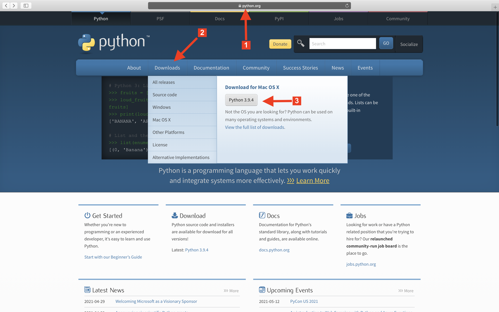
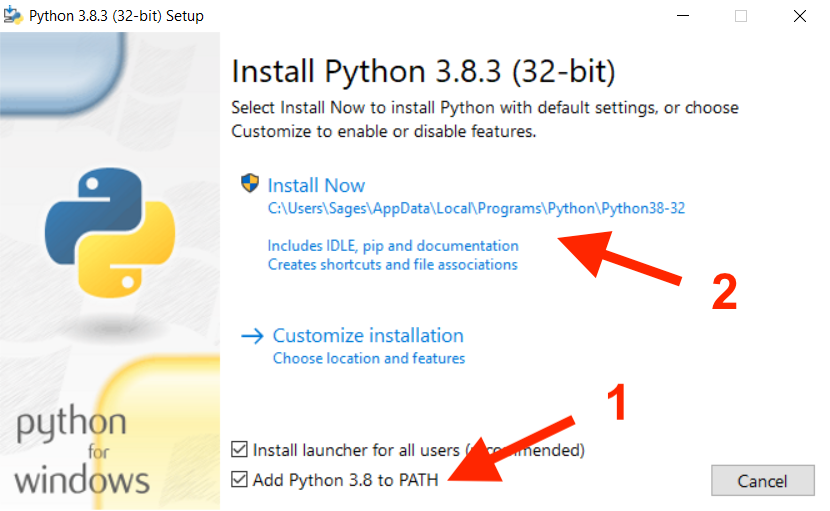
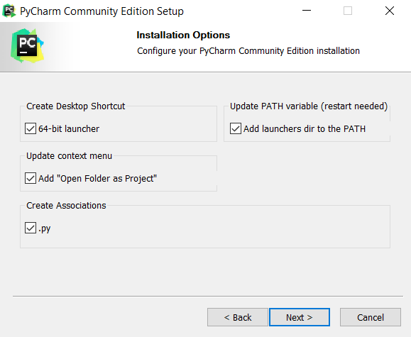
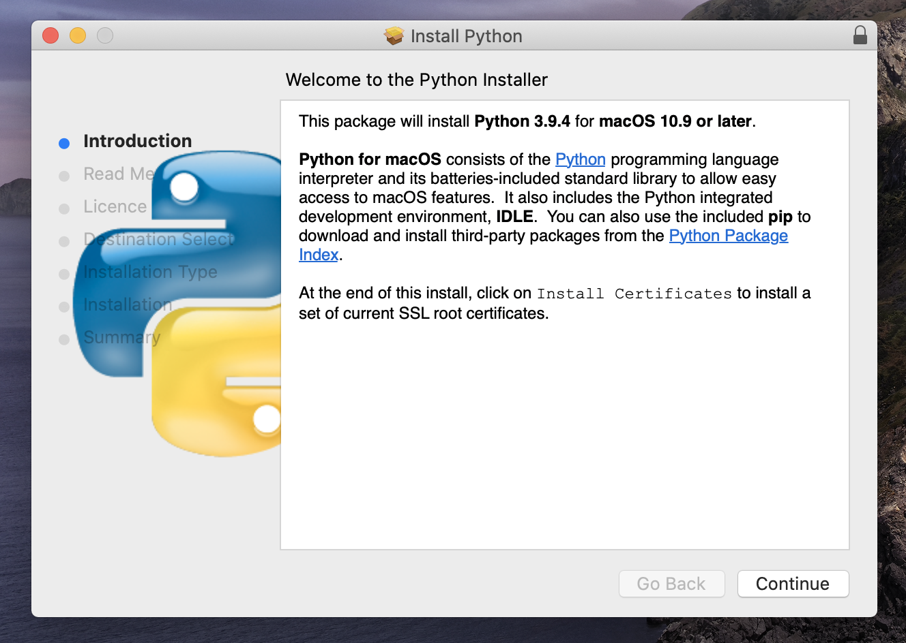
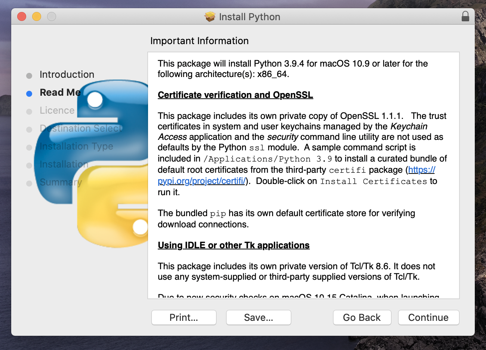
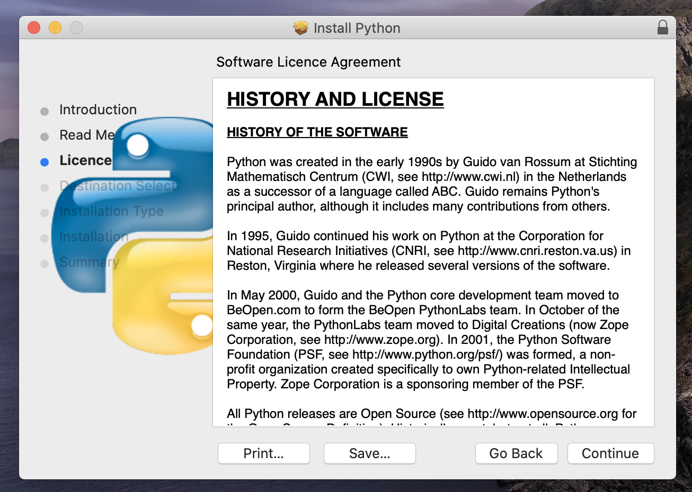
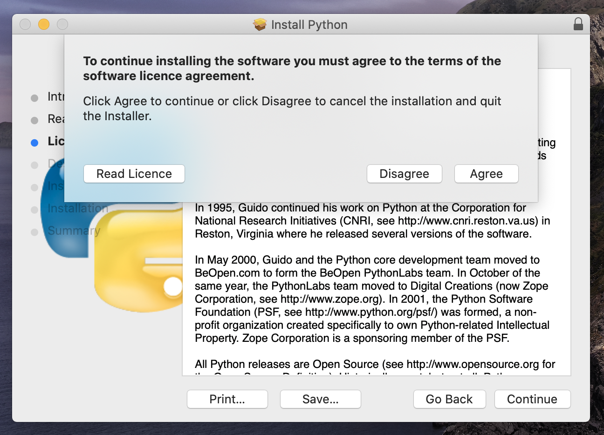
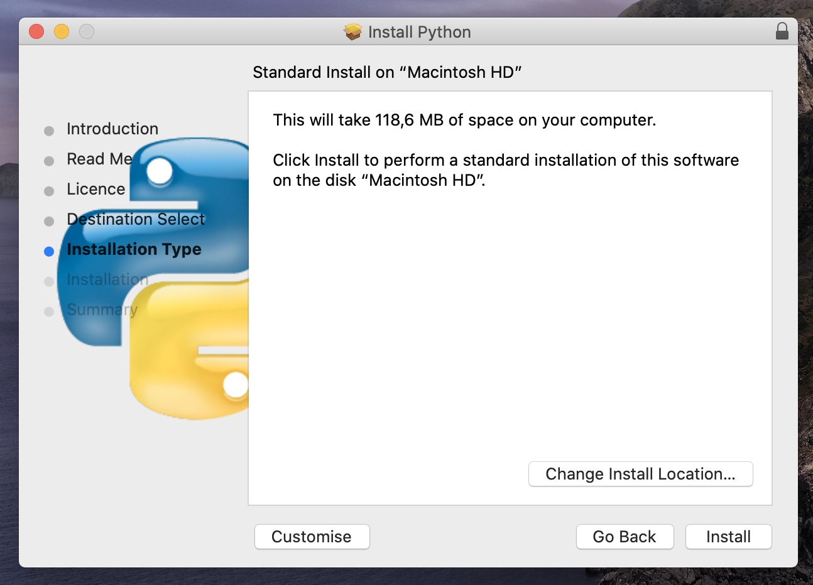
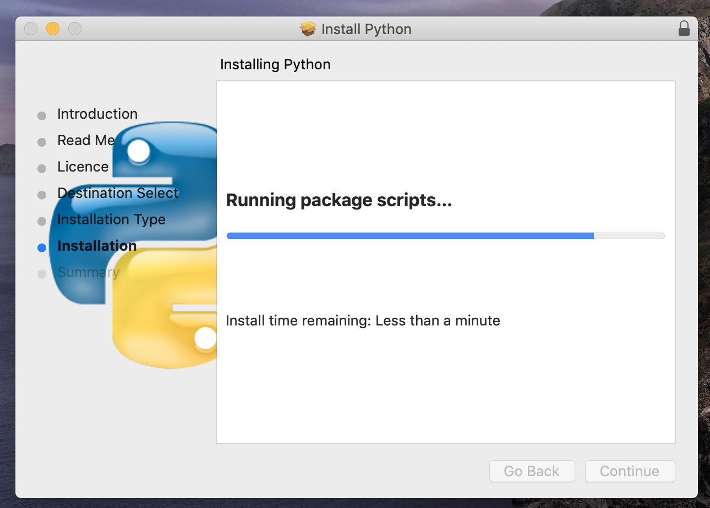
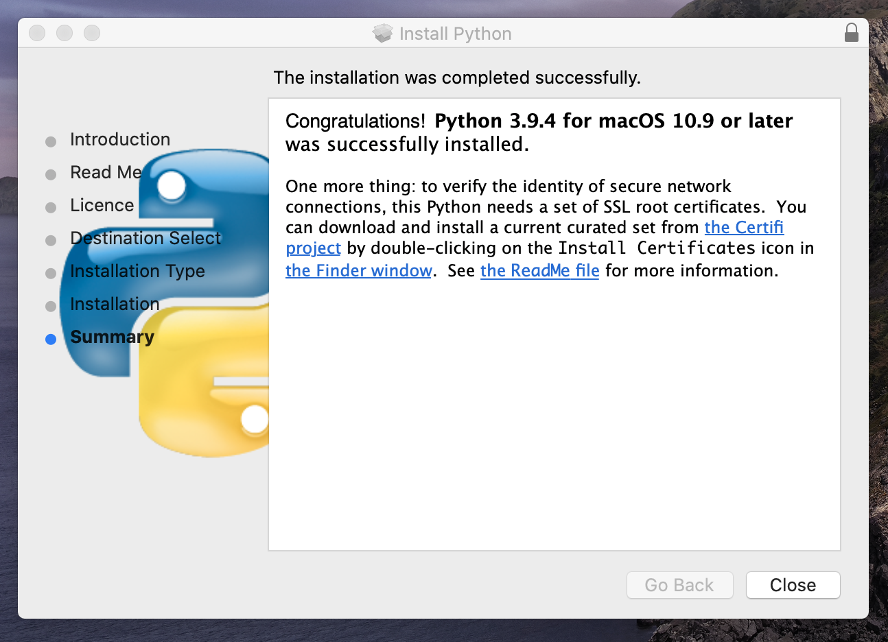

Install Python
==============

Install on macOS
----------------
1. macOS domyślnie ma zainstalowaną starą wersję Pythona 2 (nie będziemy z niej
   korzystać)
2. Pobierz i zainstaluj najnowszą wersję Pythona
3. Alternatywnie użyj Brew (https://brew.sh) i zainstaluj Python za pomocą:
   ``brew install python3``
4. Wykonaj w terminalu ``python --version`` - powinno wyświetlić wersję Python
   zgodną z wymaganiami kursu
5. Wykonaj w terminalu ``pip --version`` - wersja ``pip`` w nie ma większego
   znaczenia, ale ważne aby polecenie nie wyrzuciło błędu (tzn. ``pip`` by był
   poprawnie zainstalowany)

Install on Linux
----------------
1. Niemalże wszystkie dystrybucje Linuxa posiadają zainstalowanego Pythona
2. Pobierz i zainstaluj najnowszą wersję Pythona z oficjalnej strony
   internetowej (https://www.python.org/downloads/)
3. Alternatywnie zainstaluj używając managera pakietów dla dystrybucji z której
   korzystasz:

    * ``apt`` - Debian, Ubuntu
    * ``snap`` - Ubuntu
    * ``yum`` - SuSe
    * ``emerge`` - Gentoo
    * ``rpm`` - RedHat, Fedora

4. Wykonaj w terminalu ``python3 --version`` - powinno wyświetlić wersję Python
   zgodną z wymaganiami kursu
5. Wykonaj w terminalu ``pip3 --version`` - wersja ``pip`` w nie ma większego
   znaczenia, ale ważne aby polecenie nie wyrzuciło błędu (tzn. ``pip`` by był
   poprawnie zainstalowany)

W Ubuntu może nie być ``pip`` wtedy trzeba uruchomić:
``sudo apt update; sudo apt install --yes python3-pip``

Install on Windows
------------------
1. Pobierz zgodną z wymaganiami kursu wersję Pythona
2. Podczas instalacji Python zaznacz opcję "Add Python to ``PATH``"
3. Zainstaluj Python używając opcji "Install now", która ustawi domyślne opcje
4. Wykonaj w terminalu ``python --version`` - powinno wyświetlić wersję Python
   zgodną z wymaganiami kursu
5. Wykonaj w terminalu ``pip --version`` - wersja ``pip`` w nie ma większego
   znaczenia, ale ważne aby polecenie nie wyrzuciło błędu (tzn. ``pip`` by był
   poprawnie zainstalowany)

.. warning:: Uwaga, jeżeli opcja "Add Python to ``PATH``" nie została
             zaznaczona podczas instalacji:

    * ``cmd`` nie wykryje polecenia ``python`` oraz ``pip``
    * Trzeba będzie to dodać Python do ``PATH`` ręcznie:

        #. Kliknij przycisk start
        #. Kliknij prawym przyciskiem myszy na "Komputer" i wybierz z menu:
           "Właściwości"
        #. Z menu po lewej stronie wybierz: "Zaawansowane ustawienia systemu"
           (wymaga uprawnień administracyjnych)
        #. Na zakładce "Zaawansowane" kliknąć przycisk "Zmienne
           środowiskowe..." (na dole po prawej)
        #. Z okienka "Zmienne systemowe" (dolne okienko - ważne!) wybrać
           zmienną ``Path`` (na dole listy) i kliknąć "Edytuj..."
        #. Na końcu pola "Wartość zmiennej" dopisać poniższe wartości
        #. Uwaga, nie kasować tego co już jest tylko dopisać na koniec
        #. Ścieżki muszą być rozdzielone średnikiem ";", tzn. dopisać na końcu
           pola, za pozostałymi wpisami treść ``;ścieżka1;ścieżka2``
        #. Ścieżki do dopisania:

            * ``%USERPROFILE%\AppData\Local\Programs\Python\Python38\``
            * ``%USERPROFILE%\AppData\Local\Programs\Python\Python38\Scripts\``

        #. Sprawdź ścieżki przed dodaniem, gdyż w zależności od wersji katalog
           instalacji może się nieznacznie różnić (np. katalog ``Python38`` w
           ścieżce)
        #. Po wprowadzeniu modyfikacji kliknij "OK", następnie "OK" dla okienka
           ze zmiennymi środowiskowymi oraz "OK" w okienku "Właściwości systemu"
        #. Trzeba zamknąć i uruchomić ``cmd`` ponownie
        #. Starsze wersje Windows wymagają wylogowania użytkownika i
           zalogowania się ponownie

    * Można to też zrobić z poziomu ``cmd``: ``setx PATH "%PATH%;ścieżka1;ścieżka2"``
    * Instrukcja z obrazkami: https://www.computerhope.com/issues/ch000549.htm

Figures
-------

.. figure:: img/install-python-windows-02.png
.. figure:: img/install-python-windows-03.png

