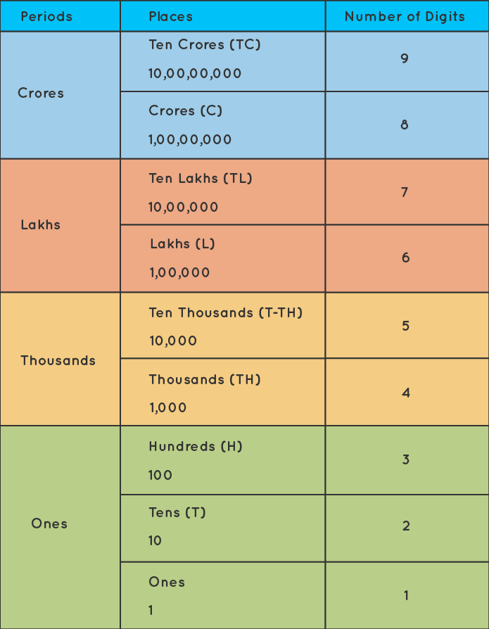

Locale About
============
* i18n = internationalization
* l10n = localization
* https://en.wikipedia.org/wiki/Indian_numbering_system
* https://www.youtube.com/watch?v=0j74jcxSunY

.. code-block:: text

    $100
    100 zł

.. code-block:: text

    100.00
    100,00

.. code-block:: text

    1000000
    1 000 000
    1.000.000
    1,000,000
    1'000'000

.. code-block:: text

    10k
    10.5k
    10kk
    10M

Number grouping (mind Indian numeric system
[#wikiIndianNumberingSystem]_):

.. code-block:: text

    1.000.000
    10.00.000

World vs Indian:

.. figure:: img/locale-about-numbering-worldwide.png

    Source: [#IndianNumeralSystem]_

    Source: [#IndianNumeralSystem]_

Polish vs English:

.. code-block:: text

    Polish      | English
    ------------+--------------
    tysiąc      | thousand
    milion      | milion
    miliard     | bilion
    bilion      | trillion
    biliard     | quadrillion
    trylion     | quintillion
    tryliard    | sextillion

Syntax
------
* language (i18n)
* variant (l10n)
* encoding (enctype)

.. code-block:: text

    en_US.UTF-8
    en_GB.UTF-8
    en_AU.UTF-8
    en_NZ.UTF-8

.. code-block:: text

    pl_PL.UTF-8
    pl_PL.ISO-8859-2
    pl_PL.CP1250

Get Locale
----------
.. code-block:: console

    $ locale
    LANG=""
    LC_COLLATE="en_US.UTF-8"
    LC_CTYPE="en_US.UTF-8"
    LC_MESSAGES="en_US.UTF-8"
    LC_MONETARY="en_US.UTF-8"
    LC_NUMERIC="en_US.UTF-8"
    LC_TIME="en_US.UTF-8"
    LC_ALL="en_US.UTF-8"

.. code-block:: console

    $ env |grep LC_
    LC_ALL=en_US.UTF-8
    LC_CTYPE=UTF-8

Set Locale
----------
.. code-block:: console

    $ echo 'export LC_ALL=en_US.UTF-8' >> ~/.profile

.. code-block:: console

    ls -R /etc/locale*

Locale in Python
----------------
.. code-block:: python

    import locale

Further Reading
---------------
* https://github.com/django/django/blob/master/django/utils/formats.py
* https://github.com/django/django/blob/master/django/conf/locale/pl/formats.py
* https://github.com/django/django/blob/master/django/conf/locale/en/formats.py
* https://github.com/django/django/blob/main/django/conf/locale/hi/formats.py

References
----------
.. [#wikiIndianNumberingSystem] Wikipedia. Indian numbering system. Year: 2022. Retrieved: 2022-06-13. URL: https://en.wikipedia.org/wiki/Indian_numbering_system

.. [#IndianNumeralSystem] Cuemath. Indian Numeral System. Year: 2022. Retrieved: 2022-06-13. URL: https://www.cuemath.com/numbers/indian-numeral-system/
