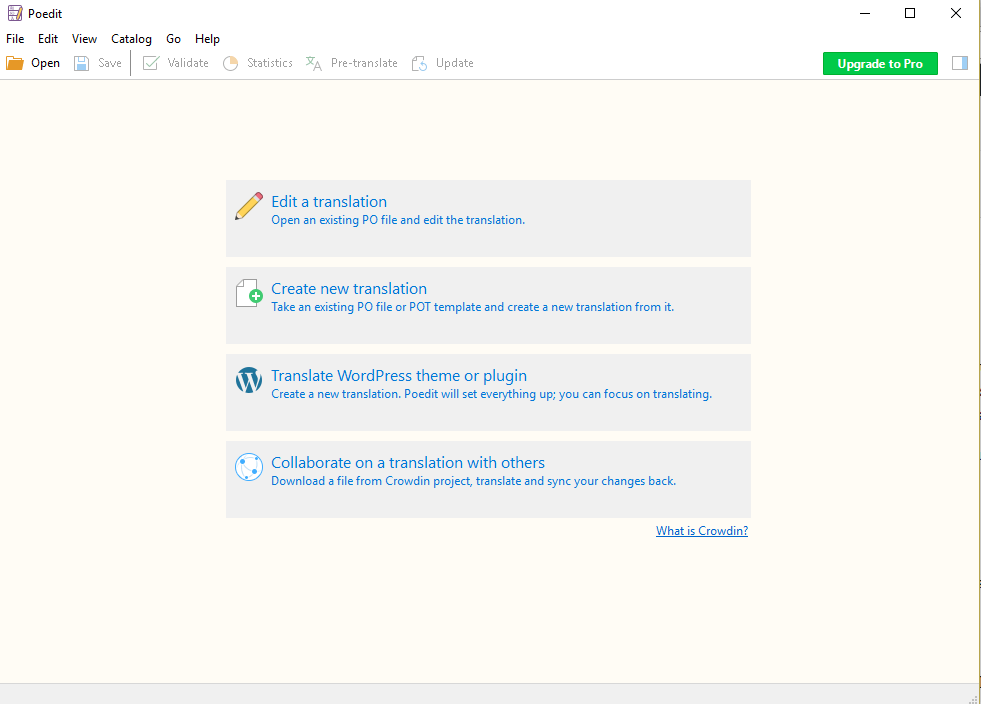
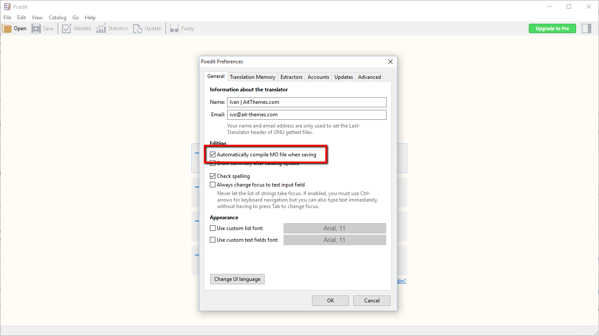

Locale i18n
===========

Important
---------
* i18n = internationalization

Examples
--------
pl_PL.UTF-8:

.. code-block:: text

    hello = 'witaj'

en_US.UTF-8:

.. code-block:: text

    hello = 'hello'

en_GB.UTF-8:

.. code-block:: text

    hello = 'good morning'

Gettext
-------
* ``.po`` files
* ``.mo`` files
* Using ``gettext`` in code
* Generating translation files
* Compiling translation files
* Updating translation files
* Transifex (``tx push`` and ``tx pull``)

Django
------
* ``django-admin makemessages -l en``
* ``django-admin compilemessages``
* ```` and ````
* ````
* ``from django.utils.translation import gettext_lazy as _``
* transifex-client
* gettext
* poedit

.. code-block:: python

    # Internationalization
    # https://docs.djangoproject.com/en/dev/topics/i18n/
    LANGUAGE_CODE = 'en-us'
    TIME_ZONE = 'UTC'
    USE_I18N = True
    USE_L10N = True
    USE_TZ = True

.. code-block:: console

    $ cd myproject
    $ mkdir locale

    $ django-admin makemessages -l en
    processing locale en

    $ django-admin makemessages -l pl
    processing locale pl

    $ django-admin compilemessages
    processing file django.po in /tmp/myproject/locale/en/LC_MESSAGES
    processing file django.po in /tmp/myproject/locale/pl/LC_MESSAGES

Poedit
------
.. figure:: img/locale-i18n-poedit1.png

