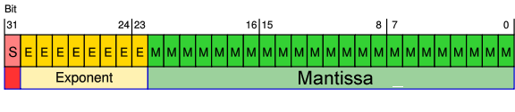

.. _Math Precision:

**************
Math Precision
**************

``float`` min and max
=====================

Maximal and minimal ``float`` values
------------------------------------
.. code-block:: python

    import sys

    sys.float_info.min      # 2.2250738585072014e-308
    sys.float_info.max      # 1.7976931348623157e+308

Infinity representation
-----------------------
.. code-block:: python

    1e308                   # 1e+308
    1e309                   # inf

.. code-block:: python

    float('inf')            # inf
    float('Infinity')       # inf

.. code-block:: python

    float('-inf')           # -inf
    float('-Infinity')      # -inf

Not-a-Number
------------
.. code-block:: python

    float('nan')
    # nan

    float('-nan')
    # nan

NaN vs Inf
----------
.. code-block:: python

    float('inf') + float('inf')     # inf
    float('inf') + float('-inf')    # nan
    float('-inf') + float('inf')    # nan
    float('-inf') + float('-inf')   # -inf

    float('inf') - float('inf')     # nan
    float('inf') - float('-inf')    # inf
    float('-inf') - float('inf')    # -inf
    float('-inf') - float('-inf')   # nan

    float('inf') * float('inf')     # inf
    float('inf') * float('-inf')    # -inf
    float('-inf') * float('inf')    # -inf
    float('-inf') * float('-inf')   # inf

    float('inf') / float('inf')     # nan
    float('inf') / float('-inf')    # nan
    float('-inf') / float('inf')    # nan
    float('-inf') / float('-inf')   # nan

Precision
=========

Problem
-------
.. code-block:: python

    0.1 + 0.2
    # 0.30000000000000004

.. code-block:: python

    0.1 + 0.2 == 0.3
    # False

What is ``float``
-----------------
.. figure:: img/float-anatomy.png
    :scale: 100%
    :align: center

    What is ``float``

Points chart
------------
.. figure:: img/float-expression.png
    :scale: 50%
    :align: center

    Points chart

How computer store ``float``?
-----------------------------

    How computer store ``float``?

How to read/write ``float`` from/to memory?
-------------------------------------------
.. figure:: img/float-mantissa-2.png
    :scale: 50%
    :align: center

    How to read/write ``float`` from/to memory?

Normalized Line
---------------
.. figure:: img/float-normalized.png
    :scale: 50%
    :align: center

    Normalized Line

doctests
========
.. code-block:: python

    def add_numbers(a, b):
        """
        >>> add_numbers(2.5, 1.2)
        3.7

        >>> add_numbers(0.1, 0.2)
        0.30000000000000004

        >>> add_numbers(0.1, 0.2)   # doctest: +ELLIPSIS
        0.1 + 0.2 == 0.3000...
        """
        return a + b

``decimal``
===========
.. code-block:: python

    from decimal import Decimal

    a = Decimal('0.1')
    b = Decimal('0.2')

    a + b
    # Decimal('0.3')

.. code-block:: python

    from decimal import Decimal

    a = Decimal('0.3')

    float(a)
    # 0.3
