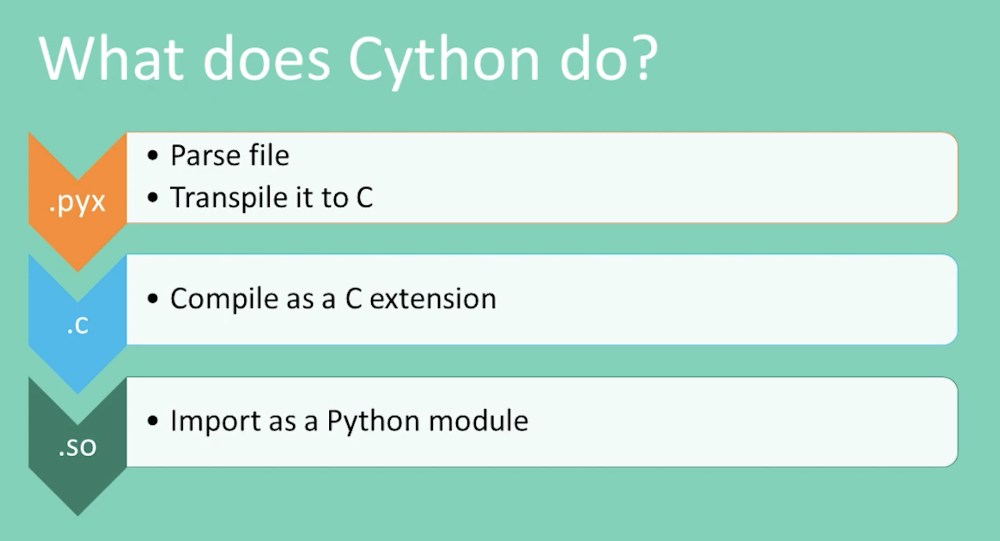

Type Annotation Cython
======================
* https://cython.readthedocs.io/en/latest/src/tutorial/cython_tutorial.html
* https://youtu.be/kFKRbo9tFNw?t=1244

    Cython algorithm [#Langa2022]_

Example
-------
>>> # doctest: +SKIP
... import cython
...
...
... def primes(nb_primes: cython.int):
...     i: cython.int
...     p: cython.int[1000]
...
...     if nb_primes > 1000:
...         nb_primes = 1000
...
...     if not cython.compiled:  # Only if regular Python is running
...         p = [0] * 1000       # Make p work almost like a C array
...
...     len_p: cython.int = 0  # The current number of elements in p.
...     n: cython.int = 2
...     while len_p < nb_primes:
...         # Is n prime?
...         for i in p[:len_p]:
...             if n % i == 0:
...                 break
...
...         # If no break occurred in the loop, we have a prime.
...         else:
...             p[len_p] = n
...             len_p += 1
...         n += 1
...
...     # Let's copy the result into a Python list:
...     result_as_list = [prime for prime in p[:len_p]]
...     return result_as_list

References
----------
.. [#Langa2022] Langa, Ł. Use typing to speed up your apps with mypyc. Year: 2022. Retrieved: 2022-11-03. URL: https://youtu.be/kFKRbo9tFNw?t=1244
