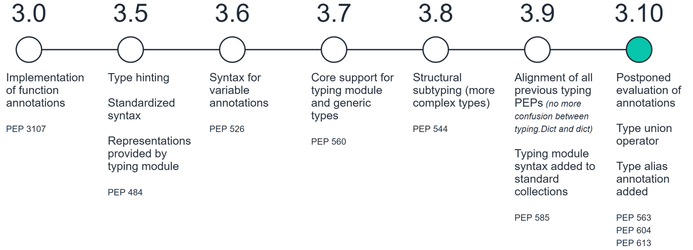

Type Annotation Basics
======================
* Also known as: "type annotations", "type hints", "gradual typing"
* Types are not required, and never will be
* Good IDE will give you hints
* Types are used extensively in system libraries
* More and more books and documentations use types
* Introduced in Python 3.5
* Since Python 3.5: :pep:`484` -- Type Hints
* Since Python 3.6: :pep:`526` -- Syntax for Variable Annotations
* Since Python 3.8: :pep:`544` -- Protocols: Structural subtyping (static duck typing)
* Since Python 3.9: :pep:`585` -- Type Hinting Generics In Standard Collections
* Since Python 3.10: :pep:`604` -- Allow writing union types as X | Y
* To type check use: ``mypy``, ``pyre-check``, ``pytypes``

.. epigraph::

    Types are not required, and never will be.
    -- Guido van Rossum, Python initiator, core developer, former BDFL

.. epigraph::

    It should be emphasized that Python will remain a dynamically typed
    language, and the authors have no desire to ever make type hints
    mandatory, even by convention.
    -- Python Software Foundation

    Timeline of changes to type annotations from Python 3.0 to now [#Briggs2021]_

Int
---
* Used to inform static type checker that the variable should be int

Declaration:

>>> data: int

>>> data: int = 1
>>> data: int = -1

Example:

>>> data: int
>>>
>>> data = 1        # ok
>>> data = -1       # ok
>>> data = 'hello'  # error

Float
-----
* Used to inform static type checker that the variable should be float

Declaration:

>>> data: float

>>> data: float = 0.0
>>> data: float = 1.23
>>> data: float = -1.23

Example:

>>> data: float
>>>
>>> data = 1.0        # ok
>>> data = -1.0       # ok
>>> data = 'hello'    # error

Str
---
* Used to inform static type checker that the variable should be str

Declaration:

>>> data: str

>>> data: str = ''
>>> data: str = 'hello'

Example:

>>> data: str
>>>
>>> data = 'Mark'           # ok
>>> data = 'Watney'         # ok
>>> data = 'Mark Watney'    # ok

Bool
----
* Used to inform static type checker that the variable should be bool

Declaration:

>>> data: bool

>>> data: bool = True
>>> data: bool = False

Example:

>>> data: bool
>>>
>>> data = True     # ok
>>> data = False    # ok
>>> data = None     # error

None
----
* Used to inform static type checker that the variable should be None

Declaration:

>>> data: None

>>> data: None = None

Example:

>>> data: None
>>>
>>> data = True     # error
>>> data = False    # error
>>> data = None     # ok

Errors
------
* Types are not Enforced
* This code will run without any problems
* Types are not required, and never will be
* Although ``mypy``, ``pyre-check`` or ``pytypes`` will throw error

>>> name: int = 'Mark Watney'

Use Case - 0x01
---------------
>>> firstname: str = 'Mark'
>>> lastname: str = 'Watney'
>>> age: int = 40
>>> adult: bool = True

Further Reading
---------------
* More information in `cicd-tools`
* https://www.infoq.com/presentations/dynamic-static-typing/
* https://github.com/pandas-dev/pandas/blob/8fd2d0c1eea04d56ec0a63fae084a66dd482003e/pandas/core/frame.py#L505

References
----------
.. [#Briggs2021] Briggs, J. Type Annotations in Python. Year: 2021. Retrieved: 2022-04-08. URL: https://towardsdatascience.com/type-annotations-in-python-d90990b172dc
