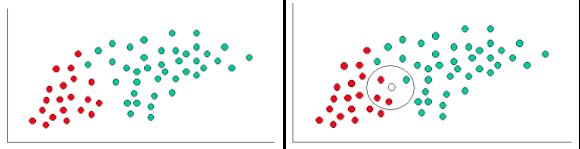

***********
Naive Bayes
***********

What is Naive Bayes methods?
============================
Naive Bayes methods are a set of supervised learning algorithms based on applying Bayes’ theorem with the "naive" assumption of that the presence of a particular feature in a class is unrelated to the presence of any other feature.

Algorytm
========
Bayes' rule expresses the conditional probability of the event :math:`A` given the event :math:`B` in terms of the conditional probability of the event :math:`B` given the event A and the unconditional probability of :math:`A`:

.. math::

    P(outcome|evidence) = \frac{P(Likelihood of Evidence) * Prior prob of outcome{P(Evidence)}

    P(H|D) = \frac{P(D|H)P(H)}{P(D)}

- :math:`P(H|D)`: Probability that the hypothesis is true given the data.
- :math:`P(D|H)`: Probability of the data arising given the hypothesis.
- :math:`P(H)`: Probability that the hypothesis is true, globally.
- :math:`P(D)`: Probability of the data arising, globally.

    Naive Bayes

What are the Pros and Cons of Naive Bayes?
==========================================

Pros
----
- It is easy and fast to predict class of test data set. It also perform well in multi class prediction

- When assumption of independence holds, a Naive Bayes classifier performs better compare to other models like logistic regression and you need less training data.
- It perform well in case of categorical input variables compared to numerical variable(s). For numerical variable, normal distribution is assumed (bell curve, which is a strong assumption).

Cons
----
- If categorical variable has a category (in test data set), which was not observed in training data set, then model will assign a 0 (zero) probability and will be unable to make a prediction. This is often known as “Zero Frequency”. To solve this, we can use the smoothing technique. One of the simplest smoothing techniques is called Laplace estimation.

- On the other side naive Bayes is also known as a bad estimator, so the probability outputs from predict_proba are not to be taken too seriously.

- Another limitation of Naive Bayes is the assumption of independent predictors. In real life, it is almost impossible that we get a set of predictors which are completely independent.

Applications of Naive Bayes Algorithms
======================================
Real time Prediction
    Naive Bayes is an eager learning classifier and it is sure fast. Thus, it could be used for making predictions in real time.

Multi class Prediction
    This algorithm is also well known for multi class prediction feature. Here we can predict the probability of multiple classes of target variable.

Text classification / Spam Filtering / Sentiment Analysis
    Naive Bayes classifiers mostly used in text classification (due to better result in multi class problems and independence rule) have higher success rate as compared to other algorithms. As a result, it is widely used in Spam filtering (identify spam e-mail) and Sentiment Analysis (in social media analysis, to identify positive and negative customer sentiments)

Recommendation System
    Naive Bayes Classifier and Collaborative Filtering together builds a Recommendation System that uses machine learning and data mining techniques to filter unseen information and predict whether a user would like a given resource or not

Przykłady praktyczne
====================

.. code-block:: python

    >>> from sklearn import datasets
    >>> from sklearn.naive_bayes import GaussianNB

    >>> iris = datasets.load_iris()
    >>> features = iris.data
    >>> labels = iris.target

    >>> model = GaussianNB()
    >>> model.fit(features, labels)
    >>> prediction = model.predict(iris.data)
    >>> points = (iris.target != prediction).sum()

    >>> print(f"Number of mislabeled points out of a total {features.shape[0]} points : {points}")
    Number of mislabeled points out of a total 150 points : 6
