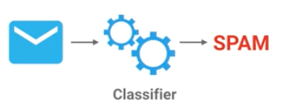

.. _Classifiers:

***********
Classifiers
***********

Co to jest Classifier?
======================
A mapping from unlabeled instances to (discrete) classes. Classifiers have a form (e.g., decision tree) plus an interpretation procedure (including how to handle unknowns, etc.). Some classifiers also provide probability estimates (scores), which can be thresholded to yield a discrete class decision thereby taking into account a utility function.

Schemat działania classifiera
=============================
#. Collect Training Data
#. Train Classifier
#. Make Predictions

    Schemat działania classifiera. Wiadomości email przechodząc przez classifer są oznaczane jako spam, lub nie spam.

Writing Own Classifier
======================

Random Classifier
-----------------

.. code-block:: python

    import random

    class MyClassifier():
        def fit(self, x_train, y_train):
            # Memorize
            self.x_train = x_train
            self.y_train = y_train

        def predict(self, x_test):
            predictions = []

            for row in x_test:
                label = random.choice(self.y_train)
                predictions.append(label)

            return predictions

Accuracy for Iris dataset: 0.346666666667

Zadania praktyczne
==================

Spam Classifier
---------------
#. Stwórz classifier który na podstawie wiadomości email zakwalifikuje je jako SPAM lub nie SPAM.

#. Zakwalifikuj wiadomości jak na przykładzie poniżej:

    ===============================  ========
    Email                            Labels
    ===============================  ========
    Click here to claim your prize!  Spam
    What's new?                      Not Spam
    Hang out later?                  Not Spam
    You have won $1,000,000          Spam
    Enlarge your...                  Spam
    Nigerian prince                  Spam
    ===============================  ========

#. Przygotuj dwie partycje danych:

    - treningową
    - testową

#. Skorzystaj treningowej bazy danych wiadomości spam

