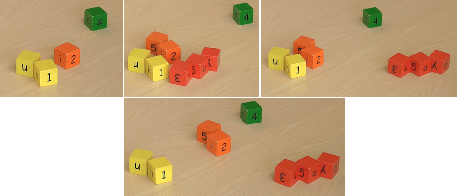

.. _Clustering:

**********
Clustering
**********

* Clustering algorithms are usually unsupervised.
* How many groups (clusters) you want your data to be in?

    Clustering (grouping) data.

* When you sort data in unsupervised learning you quite often ends up with looking good at the beginning.
* When you look at data from different perspective it's not so great.
* Alghorithms only work when you tell them, how many groups you want data in.

Examples
--------
* pixels colors
* patients in hospital: how sick they are
* cars: new, used
* jobs: different kinds

Similarities
------------
* statistical
* algebraical
* geometrical

Flat Clustering
===============

Hierarchical Clustering
=======================

