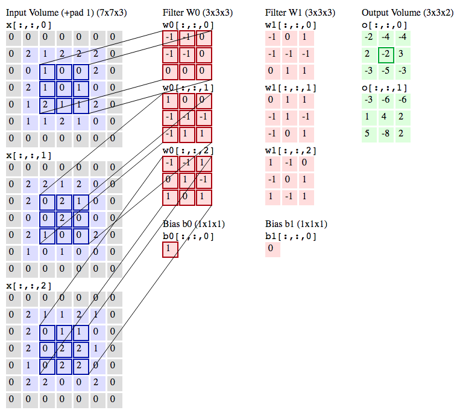

****************************
Convolutional Neural Network
****************************

Combination of:

- Deep Neural Networks
- Kernel Convolutions
- With assumption, that input is image

.. figure:: img/convolutional-neural-network-overview.png
    :scale: 66%
    :align: center

    General overview of Convolutional Neural Network

Problemy z przetwarzaniem obrazów
=================================
* cienie
* nakładające się obrazy
* zmiany kąta i pochyłości kamery
* kąt padania światła
* kolorystyka
* zakrzywienia płaszczyzny
* szumy

What is and Kernel Convolution?
===============================

    Convolutional Neural Network with 3x3 kernel convolutions

What is Convolutional Neural Network (CNN / ConvNet)
====================================================

.. figure:: img/convolutional-neural-network-architecture.jpg
    :scale: 66%
    :align: center

    Architecture of the Convolutional Neural Network

Convolutional Neural Networks are very similar to ordinary Neural Networks from the previous chapter: they are made up of neurons that have learnable weights and biases. Each neuron receives some inputs, performs a dot product and optionally follows it with a non-linearity. The whole network still expresses a single differentiable score function: from the raw image pixels on one end to class scores at the other. And they still have a loss function (e.g. SVM/Softmax) on the last (fully-connected) layer and all the tips/tricks we developed for learning regular Neural Networks still apply.

.. figure:: img/convolutional-neural-network-transformation.png
    :scale: 66%
    :align: center

    Convolutional Neural Network layer pool transformation

So what does change? ConvNet architectures make the explicit assumption that the inputs are images, which allows us to encode certain properties into the architecture. These then make the forward function more efficient to implement and vastly reduce the amount of parameters in the network.

.. figure:: img/convolutional-neural-network-example.jpg
    :scale: 75%
    :align: center

    Convolutional Neural Network example
