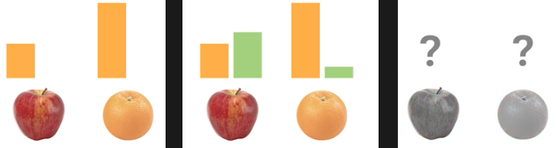
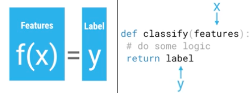
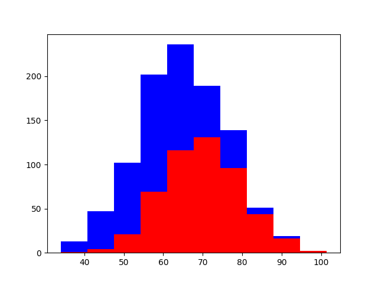

********
Features
********

Czym są features?
=================
Attribute (field, variable, feature):
    A quantity describing an instance. An attribute has a domain defined by the attribute type, which denotes the values that can be taken by an attribute. The following domain types are common:

    Categorical:
        A finite number of discrete values. The type nominal denotes that there is no ordering between the values, such as last names and colors. The type ordinal denotes that there is an ordering, such as in an attribute taking on the values low, medium, or high.

    Continuous (quantitative):
        Commonly, subset of real numbers, where there is a measurable difference between the possible values. Integers are usually treated as continuous in practical problems.

        A feature is the specification of an attribute and its value. For example, color is an attribute. "Color is blue" is a feature of an example. Many transformations to the attribute set leave the feature set unchanged (for example, regrouping attribute values or transforming multi-valued attributes to binary attributes). Some authors use feature as a synonym for attribute (e.g., in feature-subset selection).

Przykład praktyczny
===================

Jak odróżnić jabłko od pomarańczy?

* ilość pixeli pomarańczowych i ich stosunek do zielonych/czerwonych
* co z czarno białymi zdjęciami?
* co ze zdjęciami bez jabłek i pomarańczy

    Apple vs. Oranges classification using orange and green pixel count.

.. code-block:: python

    def detect_colors(image):
        # lots of code

    def detect_edges(image):
        # lots of code

    def analyze_shapes(image):
        # lots of code

    def guess_texture(image):
        # lots of code

    def define_fruit(image):
        # lots of code

    def handle_probability(image):
        # lots of code

======  =======  ======
Weight  Texture  Label
======  =======  ======
170g    Bumpy    Orange
150g    Bumpy    Orange
140g    Smooth   Apple
130g    Smooth   Apple
======  =======  ======

**Training Data table contains features and lables**

.. code-block:: python

    # Imput to the classifier
    features = [
       [170, 'bumpy'],
       [150, 'bumpy'],
       [140, 'smooth'],
       [130, 'smooth'],
    ]

    # Output that we want from classifier
    labels = ['apple', 'apple', 'orange', 'orange']

.. warning:: Scikit-learn uses real-valued features

    .. code-block:: python

        # Imput to the classifier
        # 0: bumpy
        # 1: smooth
        features = [
            [140, 1],
            [130, 1],
            [150, 0],
            [170, 0],
        ]

        # Output that we want from classifier
        # 0: apple
        # 1: orange
        labels = [0, 0, 1, 1]

What Makes a Good Feature?
==========================

    Features and labels. Features are input to classifier and labels are output from it.

* Using one feature?

.. code-block:: python

    import numpy as np
    import matplotlib.pyplot as plt

    greyhounds = 500
    labradors = 500

    # Height in centimeters + 10cm variation
    greyhounds_height = 70 + 10 * np.random.randn(greyhounds)
    labradors_height = 60 + 10 * np.random.randn(labradors)

    plt.hist(
        [greyhounds_height, labradors_height],
        stacked=True,
        color=['red', 'blue']
    )

    plt.show()

    Dogs height Classification Probability

* How many features do you need?
* What features are good?

.. figure:: img/dogs-bad-features.png
    :scale: 35%
    :align: center

    Is this a good feature for classifier? Why?

* Avoid useless features, it might lower classifier accuracy.
* Independent features are the best. Aviod redundant features.
* Dependent features looks like this:

    - Height in inches
    - Height in centimeters

* Easy to understand features.
* Look for informative features.

