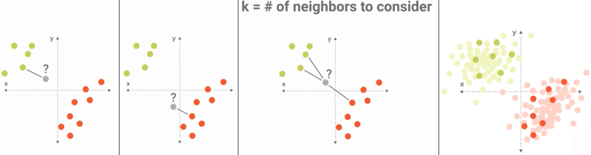

*******************
k Nearest Neighbors
*******************

Jak działa algorytm "K najbliższych sąsiadów"
=============================================
Algorytm polega na:

#. porównaniu wartości zmiennych objaśniających dla obserwacji :math:`C` z wartościami tych zmiennych dla każdej obserwacji w zbiorze uczącym.

#. wyborze :math:`k` (ustalona z góry liczba) najbliższych do :math:`C` obserwacji ze zbioru uczącego.

#. uśrednieniu wartości zmiennej objaśnianej dla wybranych obserwacji, w wyniku czego uzyskujemy prognozę.

.. figure:: img/k-nearest-neighbors-territory.png
    :scale: 75%
    :align: center

    Predykcja obszaru przynależności w algorytmie "K najbliższych sąsiadów".

Przykład praktyczny
===================

Jak to działa na przykładzie Iris
---------------------------------
#. Mamy zbiór 150 obserwacji Iris
#. Wyobraź sobie, że mamy określić nową Iris, która jeszcze nie została zaobserwowana i opisana.
#. Wybieramy wartość :math:`k`
#. Poszukujemy :math:`k` obserwacji, które są najbliższe nieznanemu gatunkowi Iris.
#. Użyj najczęściej pojawiającej się wartości z ":math:`k` najbliższych sąsiadów" jako wartość dla nieznanego Iris.

    - tzn. jeżeli np. dla :math:`k=5` (czyli wśród 5 najbliżyszch Irisów) było 3 Iris Setosa, i po jednym z innych gatunków
    - to naszemu nieznanemu gatunkowi przypiszemy Iris Setosa.

#. Najczęściej stosuje się algorytm Eukleidesa do wyznaczania odległości, ale można również i inne algorytmy.

Wykorzystanie ``sklearn.neighbors.KNeighborsClassifier``
--------------------------------------------------------

.. code-block:: python

    from sklearn import datasets
    from sklearn.metrics import accuracy_score
    from sklearn.model_selection import train_test_split
    from sklearn.neighbors import KNeighborsClassifier

    iris = datasets.load_iris()

    # Split dataset into test and training set in half
    features_train, features_test, labels_train, labels_test = train_test_split(iris.data, iris.target, test_size=0.25)

    # Create classifier
    model = KNeighborsClassifier()

    # Train classifier using training data
    model.fit(features_train, labels_train)

    # Predict
    predictions = model.predict(features_test)

    # How accurate was classifier on testing set
    output = accuracy_score(labels_test, predictions)
    print(output)
    # Output: 0.947368421053

.. note:: Because of some variation for each run, it might give different results.

Własna implementacja
--------------------
.. code-block:: python

    from scipy.spatial import distance
    from sklearn import datasets
    from sklearn.metrics import accuracy_score
    from sklearn.model_selection import train_test_split

    class NearestNeighborClassifier:
        def fit(self, features, labels):
            self.features_train = features
            self.labels_train = labels

        def predict(self, features_test):
            predictions = []

            for row in features_test:
                label = self.closest(row)
                predictions.append(label)

            return predictions

        def closest(self, row):
            best_dist = distance.euclidean(row, self.features_train[0])
            best_index = 0

            for i in range(0, len(self.features_train)):
                dist = distance.euclidean(row, self.features_train[i])
                if dist < best_dist:
                    best_dist = dist
                    best_index = i

            return self.labels_train[best_index]

    iris = datasets.load_iris()

    # Split dataset into test and training set in half
    features_train, features_test, labels_train, labels_test = train_test_split(iris.data, iris.target, test_size=0.5)

    # Create classifier
    model = NearestNeighborClassifier()

    # Train classifier using training data
    model.fit(features_train, labels_train)

    # Predict
    predictions = model.predict(features_test)

    # How accurate was classifier on testing set
    output = accuracy_score(labels_test, predictions)
    print(output)
    # Output: 0.96

.. note:: Because of some variation for each run, it might give different results.

Określanie przynależności do zbioru
===================================

    Przynależność do zbioru

Wyznaczanie równania prostej
============================

.. figure:: img/k-nearest-neighbors-function.png
    :scale: 100%
    :align: center

    Wyznaczanie równania prostej.

.. figure:: img/k-nearest-neighbors-parameters.png
    :scale: 100%
    :align: center

    Manipulowanie parametrami prostej (classifiera) w celu określenia funkcji.

Wyznaczanie odległości
======================

.. figure:: img/k-nearest-neighbors-euclidean-distance.png
    :scale: 100%
    :align: center

    Wyliczanie odległości w celu oszacowania przynależności do zbioru. Zwróć uwagę, że bez względu na ilość wymiarów wzór się niewiele różni.

Zalety i wady
=============

Zalety
------
* Relatywnie prosty
* Dobrze działa dla niektórych problemów

Wady
----
* Wolny i zasobożerny (musi iterować dla każdej predykcji)
* Brak możliwości ważenia features

Zadania kontrolne
=================

Pima Indians Diabetes problem
-----------------------------
Dla Pima Indians Diabetes wykonaj analizę algorytmem KNN z biblioteki ``sklearn``.
