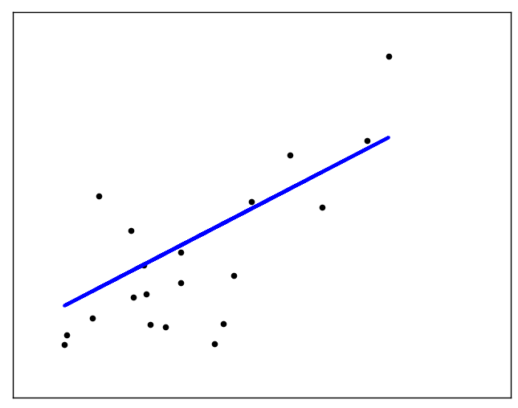
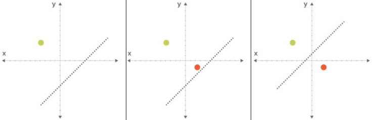
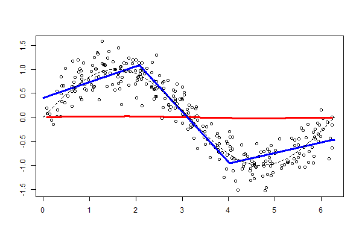

*****************
Linear Regression
*****************

.. todo:: Zrobić aby wykorzystywało szablon ``_template.rst``

Co to jest Linear Regression?
=============================
The straight line can be seen in the plot, showing how linear regression attempts to draw a straight line that will best minimize the residual sum of squares between the observed responses in the dataset, and the responses predicted by the linear approximation.

The coefficients, the residual sum of squares and the variance score are also calculated.

    The straight line can be seen in the plot, showing how linear regression attempts to draw a straight line that will best minimize the residual sum of squares between the observed responses in the dataset, and the responses predicted by the linear approximation.

Przed zastosowaniem
===================
* Trzeba usunac outlayery
* Trzeba sprawdzić czy są osobne klastry danych, tzn. czy linia jest przedziałami ciągła, tzn. gdyby podzielić na segmenty, to można lepiej dostosować regresję

Wyznaczanie równania prostej
============================

    Manipulowanie parametrami prostej (classifiera) w celu określenia funkcji.

.. figure:: img/k-nearest-neighbors-function.png
    :scale: 100%
    :align: center

    Wyznaczanie równania prostej.

.. todo::
    Pojęcia:
    .. glossary::

        Loss Function

        Parameters

        Gradient

        Gradient descent

        Overshoot

        Undershoot

        Goldi Locks

        Chain rule

        Weight

        Computatiion Graph

        Forward Propagation

        Backpropagation

Funkcja przedziałami liniowa
============================

    Funkcja przedziałami liniowa

Przykłady praktyczne
====================

Wykorzystanie biblioteki ``sklearn``

.. code-block:: python

    import matplotlib.pyplot as plt
    import numpy as np
    from sklearn import datasets, linear_model

    # Load the diabetes dataset
    diabetes = datasets.load_diabetes()

    # Use only one feature
    diabetes_features = diabetes.data[:, np.newaxis, 2]

    # Split the data into training/testing sets
    features_train = diabetes_features[:-20]
    features_test = diabetes_features[-20:]

    # Split the targets into training/testing sets
    labels_train = diabetes.target[:-20]
    labels_test = diabetes.target[-20:]

    # Create linear regression object
    model = linear_model.LinearRegression()

    # Train the model using the training sets
    model.fit(features_train, labels_train)

    # The coefficients
    print('Coefficients: \n{model.coef_}')

    # The mean squared error
    print("Mean squared error: %.2f"
          % np.mean((model.predict(features_test) - labels_test) ** 2))

    # Explained variance score: 1 is perfect prediction
    print('Variance score: %.2f' % model.score(features_test, labels_test))

    # Plot outputs
    plt.scatter(features_test, labels_test, color='black')
    plt.plot(features_test, model.predict(features_test), color='blue', linewidth=3)

    plt.xticks(())
    plt.yticks(())

    plt.show()

.. code-block:: text

    Coefficients: [ 938.23786125]
    Mean squared error: 2548.07
    Variance score: 0.4

    The straight line can be seen in the plot, showing how linear regression attempts to draw a straight line that will best minimize the residual sum of squares between the observed responses in the dataset, and the responses predicted by the linear approximation.

Własna implementacja
--------------------

.. code-block:: python

    import pandas as pd
    from math import pow

    def cal_mean(readings):
        """
        Function to calculate the mean value of the input readings
        """
        readings_total = sum(readings)
        number_of_readings = len(readings)
        mean = readings_total / float(number_of_readings)
        return mean

    def cal_variance(readings):
        """
        Calculating the variance of the readings
        """

        # To calculate the variance we need the mean value
        # Calculating the mean value from the cal_mean function
        readings_mean = cal_mean(readings)

        # mean difference squared readings
        mean_difference_squared_readings = [pow((reading - readings_mean), 2) for reading in readings]
        variance = sum(mean_difference_squared_readings)

        return variance / float(len(readings) - 1)

    def cal_covariance(readings_1, readings_2):
        """
        Calculate the covariance between two different list of readings
        """
        readings_1_mean = cal_mean(readings_1)
        readings_2_mean = cal_mean(readings_2)
        readings_size = len(readings_1)
        covariance = 0.0

        for i in range(0, readings_size):
            covariance += (readings_1[i] - readings_1_mean) * (readings_2[i] - readings_2_mean)

        return covariance / float(readings_size - 1)

    def cal_simple_linear_regression_coefficients(x_readings, y_readings):
        """
        Calculating the simple linear regression coefficients (B0, B1)
        """

        # Coefficient B1 = covariance of x_readings and y_readings divided by variance of x_readings
        # Directly calling the implemented covariance and the variance functions
        # To calculate the coefficient B1
        b1 = cal_covariance(x_readings, y_readings) / float(cal_variance(x_readings))

        # Coefficient B0 = mean of y_readings - ( B1 * the mean of the x_readings )
        b0 = cal_mean(y_readings) - (b1 * cal_mean(x_readings))

        return b0, b1

    def predict_target_value(x, b0, b1):
        """
        Calculating the target (y) value using the input x and the coefficients b0, b1
        """
        return b0 + b1 * x

    def cal_rmse(actual_readings, predicted_readings):
        """
        Calculating the root mean square error
        """
        square_error_total = 0.0
        total_readings = len(actual_readings)
        for i in range(0, total_readings):
            error = predicted_readings[i] - actual_readings[i]
            square_error_total += pow(error, 2)
        rmse = square_error_total / float(total_readings)
        return rmse

    def simple_linear_regression(dataset):
        """
        Implementing simple linear regression without using any python library
        """

        # Get the dataset header names
        dataset_headers = dataframe.columns.values(dataset)
        print("Dataset Headers :: ", dataset_headers)

        # Calculating the mean of the square feet and the price readings
        square_feet_mean = cal_mean(dataset[dataset_headers[0]])
        price_mean = cal_mean(dataset[dataset_headers[1]])

        square_feet_variance = cal_variance(dataset[dataset_headers[0]])
        price_variance = cal_variance(dataset[dataset_headers[1]])

        # Calculating the regression
        covariance_of_price_and_square_feet = dataset.cov()[dataset_headers[0]][dataset_headers[1]]
        w1 = covariance_of_price_and_square_feet / float(square_feet_variance)

        w0 = price_mean - (w1 * square_feet_mean)

        # Predictions
        dataset['Predicted_Price'] = w0 + w1 * dataset[dataset_headers[0]]

    if __name__ == "__main__":
        input_path = '../_data/input-data.csv'
        house_price_dataset = pd.read_csv(input_path)
        simple_linear_regression(house_price_dataset)

Assignments
===========

Least square regression 3 points
--------------------------------
* Filename: :download:`solution/linreg_least_square_3pts.py`
* Lines of code to write: 10 lines
* Estimated time of completion: 15 min

#. Consider the following set of points: :math:`{(-2 , -1) , (1 , 1) , (3 , 2)}`
#. Find the least square regression line for the given data points.
#. Plot the given points and the regression line in the same rectangular system of axes.
#. Napisz własny kod implementujący rozwiązanie

Least square regression 4 points
--------------------------------
* Filename: :download:`solution/linreg_least_square_4pts.py`
* Lines of code to write: 10 lines
* Estimated time of completion: 15 min

#. Find the least square regression line for the following set of data: :math:`{(-1 , 0),(0 , 2),(1 , 4),(2 , 5)}`
#. Plot the given points and the regression line in the same rectangular system of axes.
#. Użyj kodu z przykładu własnej implementacji do rozwiązania

Company sales
-------------
* Filename: :download:`solution/linreg_company_sales.py`
* Lines of code to write: 10 lines
* Estimated time of completion: 15 min

The sales of a company (in million dollars) for each year are shown in the table below.

.. todo:: przepisać tabelkę

.. code-block:: text

    x (year)    2005    2006    2007    2008    2009
    y (sales)   12      19      29      37      45

#. Find the least square regression line :math:`y = ax + b` .
#. Use the least squares regression line as a model to estimate the sales of the company in 2012.
#. Użyj biblioteki ``sklearn``
