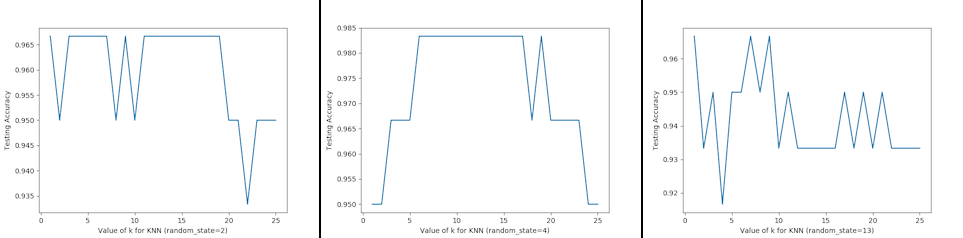

*************
Model Quality
*************

Metody doboru modelu i poprawienia jakości
==========================================
* Walidacje
* Poszukiwanie parametrów
* Regularyzacja
* Ensemble

Model Evaluation Procedure
==========================

.. figure:: img/model-quality-bias-variance.png
    :scale: 75%
    :align: center

    Graphical illustration of bias and variance.

Train and test on entire dataset
--------------------------------

#. Train the model on **entire dataset**
#. Test the model on **the same dataset**, and evaluate how well we did by comparing the **predicted** response value with the **true** response values.

.. code-block:: python

    from sklearn.datasets import load_iris

    iris = load_iris()

    features = iris.data
    labels = iris.target

#. Classification accuracy

    - **Proportion** of correct predictions
    - Common **evaluation metric** for classification problems
    - Known as **training accuracy** when you train and test the model on the same data

#. Problems with training and testing on the same data

    - Goal is to estimate likely performance of a model on **out-of-sample data**
    - But, maximizing training accuracy rewards **overly complex models** that won't necessarily generalize
    - Unnecessarily complex models **overfit** the data
    - Models that **overfit** learns to recognize noise from the signal, than the data
    - ``KNeighborsClassifier(n_neighbors=1)`` memorizes training data and uses test data to check the same places
    - Very low :math:`k` values creates complicated **overfit** model

.. figure:: img/model-quality-overfitting.png
    :scale: 50%
    :align: center

    Models that **overfit** learns to recognize noise from the signal, than the data.
    Black line represents the decision boundary and represents the signal.
    Green line represents overfitted model which learned the noise.

Testing ``LogisticsRegression`` on Iris dataset
^^^^^^^^^^^^^^^^^^^^^^^^^^^^^^^^^^^^^^^^^^^^^^^
.. code-block:: python

    >>> from sklearn.linear_model import LogisticsRegression
    >>> from sklearn import metrics

    >>> model = LogisticsRegression()
    >>> model.fit(features, labels)
    >>> predicted_labels = model.predict(features)

    >>> accuracy = metrics.accuracy_score(labels, predicted_labels)
    0.96

Testing ``KNeighborsClassifier(n_neighbors=1)`` on Iris dataset
^^^^^^^^^^^^^^^^^^^^^^^^^^^^^^^^^^^^^^^^^^^^^^^^^^^^^^^^^^^^^^^^
.. code-block:: python

    >>> from sklearn.neighbors import KNeighborsClassifier
    >>> from sklearn import metrics

    >>> model = KNeighborsClassifier(n_neighbors=1)
    >>> model.fit(features, labels)
    >>> predicted_labels = model.predict(features)

    >>> accuracy = metrics.accuracy_score(labels, predicted_labels)
    1.0

Testing ``KNeighborsClassifier(n_neighbors=5)`` on Iris dataset
^^^^^^^^^^^^^^^^^^^^^^^^^^^^^^^^^^^^^^^^^^^^^^^^^^^^^^^^^^^^^^^^
.. code-block:: python

    >>> from sklearn.neighbors import KNeighborsClassifier
    >>> from sklearn import metrics

    >>> model = KNeighborsClassifier(n_neighbors=5)
    >>> model.fit(features, labels)
    >>> predicted_labels = model.predict(features)

    >>> accuracy = metrics.accuracy_score(labels, predicted_labels)
    0.966666666667

Train/test split
----------------
Also known as:

    - Test set approach
    - Validation set approach

#. Split the dataset into two pieces:

    - a training set
    - a testing set

#. Train the model on a **training set**.
#. Test the model on a **testing set**, and evaluate how well we did.

.. code-block:: python

    >>> from sklearn.model_selection import train_test_split

    # Split the data into training and testing sets
    >>> features_train, features_test, labels_train, labels_test = train_test_split(features, labels, test_size=0.4)

#. If you do not use optional integer parameter ``random_state`` to ``train_test_split`` it will randomize splitting data
#. Models can be trained and tested on **different data**
#. Response values are known for the training set, and thus **predictions can be evaluated**
#. **Testing accuracy** is a better estimate than training accuracy of out-of-sample performance

Testing ``LogisticsRegression`` on Iris dataset
^^^^^^^^^^^^^^^^^^^^^^^^^^^^^^^^^^^^^^^^^^^^^^^
.. code-block:: python

    >>> from sklearn.linear_model import LogisticsRegression
    >>> from sklearn import metrics

    >>> model = LogisticsRegression()
    >>> model.fit(features_train, labels_train)
    >>> predicted_labels = model.predict(features_test)

    >>> accuracy = metrics.accuracy_score(labels_test, predicted_labels)
    0.95

Testing ``KNeighborsClassifier(n_neighbors=1)`` on Iris dataset
^^^^^^^^^^^^^^^^^^^^^^^^^^^^^^^^^^^^^^^^^^^^^^^^^^^^^^^^^^^^^^^^
.. code-block:: python

    >>> from sklearn.neighbors import KNeighborsClassifier
    >>> from sklearn import metrics

    >>> model = KNeighborsClassifier(n_neighbors=1)
    >>> model.fit(features_train, labels_train)
    >>> predicted_labels = model.predict(features_test)

    >>> accuracy = metrics.accuracy_score(labels_test, predicted_labels)
    0.95

Testing ``KNeighborsClassifier(n_neighbors=5)`` on Iris dataset
^^^^^^^^^^^^^^^^^^^^^^^^^^^^^^^^^^^^^^^^^^^^^^^^^^^^^^^^^^^^^^^^
.. code-block:: python

    >>> from sklearn.neighbors import KNeighborsClassifier
    >>> from sklearn import metrics

    >>> model = KNeighborsClassifier(n_neighbors=5)
    >>> model.fit(features_train, labels_train)
    >>> predicted_labels = model.predict(features_test)

    >>> accuracy = metrics.accuracy_score(labels_test, predicted_labels)
    0.966666666667

Can we locate even better value for :math:`k`?
^^^^^^^^^^^^^^^^^^^^^^^^^^^^^^^^^^^^^^^^^^^^^^
#. **Testing accuracy raises** as model complexity increases
#. **Testing accuracy penalizes** models that are too complex or not complex enough
#. For KNN models complexity is determined by the **value of :math:`k`** (lower value = more compelex)

    For KNN models complexity is determined by the **value of :math:`k`** (lower value = more compelex)

.. code-block:: python

    from sklearn.neighbors import KNeighborsClassifier
    from sklearn import metrics
    from sklearn.datasets import load_iris
    from sklearn.model_selection import train_test_split
    import matplotlib.pyplot as plt

    iris = load_iris()

    features = iris.data
    labels = iris.target

    random_state = 4
    k_range = range(1, 26)
    scores = []

    features_train, features_test, labels_train, labels_test = train_test_split(
        features, labels, random_state=random_state, test_size=0.4)

    for k in k_range:
        model = KNeighborsClassifier(n_neighbors=k)
        model.fit(features_train, labels_train)
        predicted_labels = model.predict(features_test)

        accuracy = metrics.accuracy_score(labels_test, predicted_labels)
        scores.append(accuracy)

    plt.plot(k_range, scores)
    plt.xlabel(f'Value of k for KNN (random_state={random_state})')
    plt.ylabel('Testing Accuracy')
    plt.show()

Downsides of train/test split
^^^^^^^^^^^^^^^^^^^^^^^^^^^^^
#. Provides a **high-variance estimate** of out-of-sample accuracy
#. **:math:`K`-fold cross-validation** overcomes the limitation
#. Train/test split is still used because of its flexibility and speed

.. note:: Source: https://www.dataschool.io

Regularyzacja
=============
Regularyzacja – wprowadzenie dodatkowej informacji do rozwiązywanego zagadnienia źle postawionego w celu polepszenia jakości rozwiązania. Regularyzacja jest często wykorzystywana przy rozwiązywaniu problemów odwrotnych. Spośród opracowanych metod regularyzacji można wyliczyć:

* regularyzację Tichonowa
* regularyzację poprzez rozkład według wartości osobliwych
* iteracyjne metody regularyzacji
* regularyzację poprzez dyskretyzację
* regularyzację poprzez filtrowanie

.. figure:: img/model-quality-regularization.png
    :scale: 75%
    :align: center

    Regularization, in mathematics and statistics and particularly in the fields of machine learning and inverse problems, is a process of introducing additional information in order to solve an ill-posed problem or to prevent overfitting.

Ensemble averaging
==================
In machine learning, particularly in the creation of artificial neural networks, ensemble averaging is the process of creating multiple models and combining them to produce a desired output, as opposed to creating just one model. Frequently an ensemble of models performs better than any individual model, because the various errors of the models "average out."

Ensemble averaging is one of the simplest types of committee machines. Along with boosting, it is one of the two major types of static committee machines. In contrast to standard network design in which many networks are generated but only one is kept, ensemble averaging keeps the less satisfactory networks around, but with less weight. The theory of ensemble averaging relies on two properties of artificial neural networks:

    #. In any network, the bias can be reduced at the cost of increased variance
    #. In a group of networks, the variance can be reduced at no cost to bias

In machine learning ensemble refers only to a concrete finite set of alternative models, but typically allows for much more flexible structure to exist among those alternatives.

.. code-block:: python

    import numpy as np
    import urllib
    from sklearn import preprocessing
    from sklearn import metrics
    from sklearn.ensemble import ExtraTreesClassifier

    # download the file and load data
    url = "http://archive.ics.uci.edu/ml/machine-learning-databases/pima-indians-diabetes/pima-indians-diabetes.data"
    raw_data = urllib.urlopen(url)

    # Turn into NumPy matrix and seperate X and Y
    dataset = np.loadtxt(raw_data, delimiter=",")
    X = dataset[:,0:7]
    y = dataset[:,8]

    # Normaize and Standardize the features so that it does not affect the learning algorithm
    preprocessing.normalize(features)
    preprocessing.scale(features)

    # Fit the Tree alogorithm
    model = ExtraTreesClassifier()
    model.fit(X, y)

    # display the relative importance of each attribute
    print(model.feature_importances_)

Benefits
--------
* The resulting committee is almost always less complex than a single network which would achieve the same level of performance
* The resulting committee can be trained more easily on smaller input sets
* The resulting committee often has improved performance over any single network
* The risk of overfitting is lessened, as there are fewer parameters (weights) which need to be set
